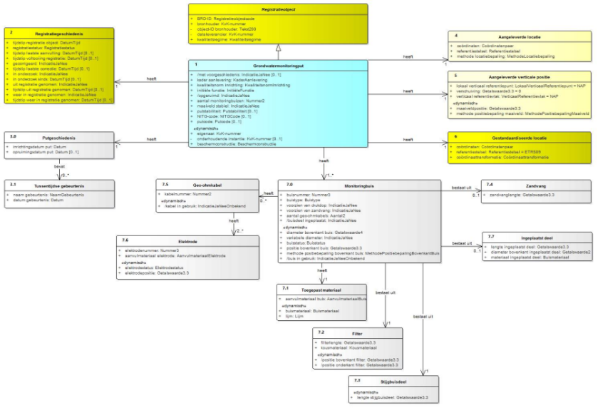
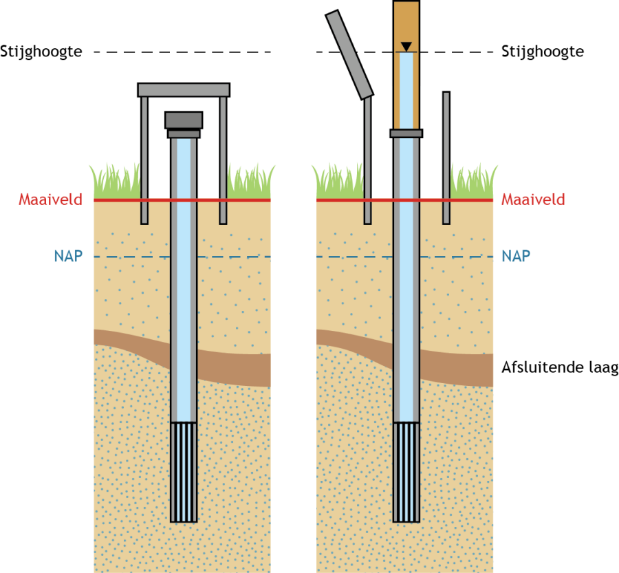
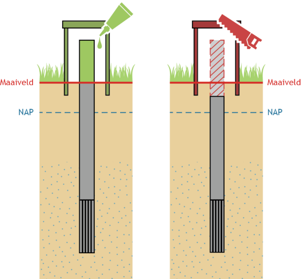

1.  **Inleiding**

2.  **Doel en doelgroep**

In de basisregistratie ondergrond (BRO) wordt een aantal typen gegevens
geregistreerd, de *registratieobjecten*. Een van de registratieobjecten is de
*grondwatermonitoringput*.  
De catalogus is de gegevensdefinitie van de grondwatermonitoringput en
beschrijft welke gegevens over dit registratieobject in de BRO zijn opgeslagen.
Het document is bedoeld voor alle gebruikers van de BRO en moet duidelijk maken
welke gegevens er in het systeem zitten. Aan aanleverende partijen moet het
vertellen welke gegevens in de basisregistratie ondergrond moeten komen, en aan
afnemende partijen welke gegevens zij in de basisregistratie ondergrond mogen
verwachten. Het document is voor een breed publiek bedoeld en de informatie moet
naast precies ook begrijpelijk zijn.

1.  **Samenhang met andere documentatie**

Voor ieder registratieobject worden de volgende beschrijvende documenten
opgesteld:

-   de catalogus;

-   de handboeken voor inname en uitgifte;

-   de koppelvlakbeschrijvingen voor inname en uitgifte.

De catalogus beschrijft de inhoud van de BRO en vormt de basis voor de andere
beschrijvende documenten. In de catalogus staan de definities van de gegevens
van het registratieobject, de entiteiten en attributen, met een beschrijving van
de onderlinge samenhang. Bij de definitie worden de kardinaliteit (het aantal
keer dat de het gegeven voorkomt), de regels die in controles worden gebruikt en
de waarden die zijn toegestaan vermeld.  
Een handboek voor inname of uitgifte beschrijft het proces dat bij inname of
uitgifte van gegevens wordt doorlopen. In een handboek worden ook de gegevens
gedefinieerd die betrekking hebben op het proces van inname of uitgifte. Om te
zien wat er aangeleverd moet worden of wat er uitgeleverd kan worden, heeft men
de catalogus nodig.  
De *koppelvlakbeschrijvingen* zijn geschreven voor softwareontwikkelaars. Op
basis van de twee vorige typen documenten staat hierin beschreven hoe het
registratieobject en de bijbehorende transacties worden vertaald naar het
technische koppelvlak dat is gerealiseerd door middel van webservices. De
koppelvlakbeschrijving gaat dus in op de technische realisatie van de
transacties waarbinnen gegevens van het registratieobject wordt uitgewisseld.  
Deze documenten hangen samen zoals hieronder afgebeeld.

   
*Figuur 1: Samenhang van de documentatie.*

Naast deze documenten is er een document dat het systeem van de BRO als geheel
beschrijft met als titel *BRO-architectuur*. In dat document wordt het ontwerp
en de algemene werking van de BRO beschreven. Het document BRO-architectuur is
alleen nog in een eerste en prille versie beschikbaar.

1.  **Leeswijzer**

Hoofdstuk 1 geeft het doel en de doelgroep, de samenhang met andere documenten
en de versiehistorie van deze catalogus.  
Hoofdstuk 2 behandelt enkele algemene aspecten van het BRO-systeem en begrippen
van algemene aard.  
Hoofdstuk 3 legt uit wat de grondwatermonitoringput is, wat de plaats is van het
object in de gegevenssystematiek van de basisregistratie ondergrond en vertelt
wat de benadering is geweest bij het opstellen van de gegevensdefinitie.  
Hoofdstuk 4 geeft de definitie van het registratieobject, van de delen waaruit
het is opgebouwd, de entiteiten, en van de eigenschappen van die delen, de
attributen.  
Hoofdstuk 5 ten slotte geeft de definitie van de enumeraties en codelijsten
waarnaar in hoofdstuk 4 verwezen wordt.

1.  **Versiehistorie**

| Versie | Datum           | Omschrijving                                                                                                                                                   |
|--------|-----------------|----------------------------------------------------------------------------------------------------------------------------------------------------------------|
| 0.6    | Augustus 2015   | Versie gebruikt voor de pilot GMW.                                                                                                                             |
| 0.7    | 18 oktober 2016 | Versie voor de ketentest en publieke consultatie.                                                                                                              |
| 0.8    | 10 april 2017   | Interne versie waarin het commentaar uit de publieke consultaties van versie 0.7 en de AMvB, en de gevolgen van de consolidatie van het systeem zijn verwerkt. |
| 0.9    | 15 mei 2017     | Versie waarin de gegevens over de beschermconstructie zijn toegevoegd.                                                                                         |
| 0.91   | 23 mei 2017     | Versie waarin het gegeven *putcode* is toegevoegd.                                                                                                             |
| 1.0    | 20 juni 2017    | Versie vastgesteld door het Ministerie van Infrastructuur en Milieu.                                                                                           |

1.  **Contactinformatie**

Algemene informatie en documentatie over de BRO kunt u vinden op
<https://basisregistratieondergrond.nl/>.

Heeft u een vraag over de BRO? Wij staan voor u klaar om u te helpen. Voor
vragen, suggesties of opmerkingen kunt contact opnemen met de BRO Servicedesk
via een mail naar [support@broservicedesk.nl](mailto:support@broservicedesk.nl).

Of bel ons op telefoonnummer **088 - 8664 999**. Wij zijn bereikbaar op
werkdagen van 8.00 tot 17.00 uur.

1.  **Algemene kenmerken en begrippen**

2.  **Opzet van het systeem**

De basisregistratie ondergrond is een systeem dat een schakel vormt in een
informatieketen. Aan het begin van de keten staan bestuursorganen die opdracht
geven tot de productie van gegevens, of zelf gegevens produceren. Die
bestuursorganen worden *bronhouders* genoemd. De geproduceerde gegevens worden
door een *dataleverancier* geleverd aan de beheerder van het systeem, de
*registerbeheerder*. De bronhouder is verantwoordelijk voor de levering van
gegevens. Hij kan besluiten zelf dataleverancier te zijn of andere partijen een
machtiging voor levering te verlenen. De beheerder van de BRO registreert de
aangeleverde gegevens en levert ze voor (her)gebruik door aan allerlei afnemers.

De opzet van het systeem moet begrepen worden vanuit de verantwoordelijkheden
die in de keten zijn belegd. De aangeleverde gegevens vallen onder de
verantwoordelijkheid van de bronhouder en de registerbeheerder mag die gegevens
niet veranderen. De registerbeheerder moet echter wel gegevens toevoegen om het
systeem te kunnen beheren en hij kan gegevens toevoegen om de afnemers goed van
dienst te kunnen zijn.  
Bij wet is geregeld dat de basisregistratie ondergrond zo wordt opgezet dat er
onderscheid bestaat tussen de gegevens die aan de registerbeheerder zijn
aangeleverd en de gegevens die de registerbeheerder aan de afnemers verstrekt.
Het systeem valt uiteen in twee grote deelsystemen, het register *brondocumenten
ondergrond* en de *registratie ondergrond* (zie figuur 2).

  
*Figuur 2: De twee grote deelsystemen van de BRO.*

Een geheel van gegevens dat door of onder verantwoordelijkheid van een
bronhouder wordt aangeleverd, wordt een *brondocument* genoemd. De
brondocumenten worden in het *register brondocumenten ondergrond* opgeslagen. De
gegevens uit de brondocumenten worden samen met de gegevens die de
registerbeheerder toevoegt in de *registratie ondergrond* vastgelegd. De
registratie ondergrond is het deelsysteem dat gebruikt wordt voor uitgifte.  
Met deze opzet verkrijgt het systeem de nodige flexibiliteit. Zo kan een object
in de registratie ondergrond gegevens bevatten die uit meer dan één brondocument
afkomstig zijn en bij uitgifte kunnen gegevens van verschillende objecten met
elkaar gecombineerd worden. Ook is het mogelijk met het brondocument gegevens op
te slaan die alleen voor de bronhouder en de aanleverende partij van belang
zijn.  
De gegevensdefinitie dekt alle gegevens die opgenomen zijn in de registratie
ondergrond. Verreweg de meeste gegevens komen uit de brondocumenten die de
dataleverancier aanlevert en een paar gegevens komen voort uit de overdracht van
een brondocument aan de registerbeheerder. Aan de aangeleverde gegevens worden
enkele gegevens door de registerbeheerder toegevoegd. Als een gegeven is
toegevoegd door de BRO wordt dat in de beschrijving expliciet vermeld.  
Alle gegevens in de registratie ondergrond worden uitgegeven, maar niet alle
afnemers kunnen alle gegevens geleverd krijgen. De gegevens die niet aan alle
afnemers worden uitgeleverd zijn de gegevens die alleen nodig zijn in de
communicatie tussen de registerbeheerder enerzijds en de dataleveranciers en
bronhouders anderzijds.

1.  **Registratieobject**

Het *registratieobject* is dé eenheid in de data-architectuur van de
basisregistratie ondergrond. Voor de registerbeheerder is het de elementaire
bouwsteen van het systeem dat hij moet beheren.  
Een *registratieobject* verwijst naar een eenheid van informatie die onder de
verantwoordelijkheid van één bronhouder valt en die met een bepaald doel is of
wordt gemaakt. Het is in directe of indirecte zin gedefinieerd in de ruimte en
dat wil zeggen dat een registratieobject een plaats op het aardoppervlak heeft
of dat het gekoppeld is aan een ander type registratieobject met een plaats op
het aardoppervlak.  
Een *registratieobject* is niet alleen in de ruimte maar ook in de tijd
gedefinieerd. Het leven van een registratieobject begint op het moment dat de
gegevens zijn geregistreerd en dat is zo kort mogelijk nadat de gegevens zijn
geproduceerd. De levensduur van een registratieobject, en de veranderlijkheid
van de gegevens verschilt van object tot object. Een grondwatermonitoringput kan
tientallen jaren gebruikt worden voor het meten van grondwaterstanden en in de
periode kunnen er nieuwe gegevens ontstaan. Dat betekent dat de gegevens van de
put in de registratie ondergrond gedurende zijn hele levensduur bijgewerkt
moeten kunnen worden. Aan de andere kant van het spectrum staan de objecten
waarvan alle gegevens in een keer worden vastgelegd. Geotechnisch
sondeeronderzoek is daar een voorbeeld van. Sondeeronderzoek is eenmalig
onderzoek en het resultaat ervan kan al na een of enkele dagen aan de bronhouder
worden overhandigd.

1.  **Registratiedomein**

Registratieobjecten worden in de basisregistratie ondergrond gegroepeerd in
domeinen. Vooralsnog worden zes domeinen onderscheiden:

-   bodem- en grondonderzoek

-   bodemkwaliteit

-   grondwatermonitoring

-   grondwatergebruik

-   mijnbouwwet

-   modellen.

De domeinen zijn vanuit het oogpunt van beheer van belang voor de ordening van
het systeem. Daarnaast zijn zij nuttig in de communicatie met de partijen die
bij de realisatie van het systeem betrokken zijn.

1.  **Kwaliteitsregime**

In de basisregistratie ondergrond worden niet alleen gegevens geregistreerd die
dateren van na de datum waarop de wet van kracht is geworden. Ook oudere
gegevens zullen in de basisregistratie ondergrond worden opgenomen. De noodzaak
daartoe ligt in de wet verankerd. Die schrijft voor dat de gegevens uit de
eerder bestaande systemen DINO en BIS zo veel mogelijk naar de BRO moeten worden
overgezet. Verder staat de wet toe dat bronhouders tot vijf jaar na de
inwerkingtreding van de wet historische gegevens ter registratie mogen
aanbieden.  
Historische gegevens kunnen niet altijd voldoen aan de strikte regels die de BRO
stelt. Zo kan het voorkomen dat voor gegevens die volgens de strikte regels van
de BRO verplicht zijn, geen waarde bekend is. Om de verwerking van de twee
categorieën gegevens naast elkaar mogelijk te maken, worden twee
kwaliteitsregimes gehanteerd. Voor de aanlevering van gegevens volgens de
strikte regels geldt het IMBRO-regime. Bij de aanlevering van historische
gegevens wordt geaccepteerd dat een aantal formeel verplichte gegevens geen
waarde heeft. Voor deze gegevens wordt het IMBRO/A-regime gehanteerd en dat kent
dus minder strikte regels.  
De introductie van de twee kwaliteitsregimes geeft de bronhouder gedurende een
bepaalde periode een zekere mate van vrijheid. Het kan bijvoorbeeld praktisch
blijken het IMBRO/A-regime te hanteren voor gegevens die weliswaar pas na de
datum waarop de wet in werking is getreden zijn geproduceerd maar die voortkomen
uit opdrachten die al voor die datum zijn gegeven. Ook kan het voorkomen dat
historische gegevens wel aan alle strikte voorwaarden voldoen en dan is het
wenselijk de gegevens onder IMBRO-regime aan te leveren.  
De periode waarin de bronhouders die vrijheid hebben wordt de *transitieperiode*
genoemd. Over de duur van de transitieperiode zijn nog geen afspraken gemaakt.
Na afloop van de transitieperiode kan alleen onder het strikte IMBRO-regime
worden aangeleverd.

1.  **Formele en materiële geschiedenis**

De basisregistratie ondergrond maakt deel uit van een stelsel van
basisregistraties. Binnen het stelsel maakt men onderscheid tussen de materiële
geschiedenis en de formele geschiedenis van een object.  
Het begrip *materiële geschiedenis* wordt gebruikt om de veranderingen van
eigenschappen van een object in de werkelijkheid aan te duiden. De materiële
geschiedenis van een object wordt, voor zover relevant, in de registratie
ondergrond vastgelegd. Niet alle registratieobjecten hebben een materiële
geschiedenis, alleen de objecten met een levensduur, zoals de
grondwatermonitoringput.  
Het begrip *formele geschiedenis* wordt gebruikt voor de veranderingen van
eigenschappen van een object in de registratie zelf. De meeste van die
veranderingen gaan terug op een verandering van eigenschappen in de
werkelijkheid, en de formele geschiedenis geeft aan wanneer de veranderingen in
het systeem geregistreerd zijn. De formele geschiedenis kent ook gebeurtenissen
die niet het gevolg zijn van een verandering in de werkelijke eigenschappen van
een object. Die gebeurtenissen hebben betrekking op correcties. Het kan gebeuren
dat een bronhouder erachter komt dat er een onjuiste waarde was geregistreerd en
dan zorgt hij ervoor dat die verbeterd wordt. De registratie van de verbetering
is een formele gebeurtenis.  
Alle registratieobjecten hebben een formele geschiedenis en die wordt in de
registratie ondergrond globaal vastgelegd in de *registratiegeschiedenis* van
het object. Globaal wil zeggen dat de registratie ondergrond alleen een
overzicht van de formele geschiedenis geeft. Voor de details moet het register
brondocumenten ondergrond worden geraadpleegd.  
Bij correctie wordt het betreffende gegeven in de registratie ondergrond
overschreven en is de oude waarde van het gegeven niet meer direct beschikbaar
voor de afnemers.  
Zou een afnemer toch willen weten wat de eerdere foute waarde was, dan moet hij
het register brondocumenten ondergrond raadplegen.

1.  **Coördinaten en referentiestelsels**

De registratieobjecten van de basisregistratie ondergrond zijn gedefinieerd in
de ruimte en dat wil zeggen dat een object zelf een plaats op het aardoppervlak,
een locatie, heeft, of dat het gekoppeld is aan een ander type registratieobject
met een locatie. Afhankelijk van het type registratieobject, wordt de locatie
geregistreerd als een punt, een lijn of een vlak.  
De locatie is de horizontale positie van een object. Voor bepaalde objecten is
het voldoende dat alleen die horizontale positie wordt vastgelegd, maar voor
veel objecten is ook de verticale positie van belang.  
Posities worden vastgelegd in coördinaten en die zijn gedefinieerd in een
bepaald referentiestelsel.  
Er zijn verschillende typen referentiestelsels. Zo spreekt men van horizontale
referentiestelsels (2D), verticale referentiestelsels (1D), gecombineerde
referentiestelsels (2D, 1D) en werkelijke 3D referentiestelsels. In Nederland
worden de horizontale en de verticale component van een positie in een
afzonderlijk stelsel uitgedrukt. Het is vandaag de dag mogelijk met gps een
positie in een 3D-referentiestelsel vast te leggen, maar de wens over te stappen
op het gebruik van 3D is nog door geen van de partijen die betrokken zijn bij de
basisregistratie ondergrond naar voren gebracht.

**R eferentie stelsels voor de horizontale positie**

In Nederland zijn traditioneel verschillende referentiestelsels voor de
horizontale positie in gebruik. In 2009, bij de eerste voorbereidingen voor de
totstandkoming van de basisregistratie ondergrond, is al vastgesteld dat de
verscheidenheid aan referentiestelsels de basisregistratie ondergrond voor
problemen stelt omdat de registratie dan niet gemakkelijk op een eenduidige
manier bevraagd kan worden. In de registratie ondergrond worden namelijk zowel
gegevens met een locatie op land als gegevens met een locatie op zee
geregistreerd. In de toenmalige praktijk werden op land en op zee verschillende
stelsels gebruikt. Op land werd RD gebruikt en op zee waren verschillende
stelsels in gebruik, waarvan WGS84 de belangrijkste was.  
In 2009 was ook al bekend dat de Europese kaderrichtlijn INSPIRE de lidstaten
vraagt de gegevens in Europa in één referentiestelsel uit te gaan wisselen, te
weten in ETRS89. Met dat in gedachten, is het besluit genomen het BRO-systeem zo
in te richten dat de registratie bevraagd gaat worden in ETRS89.  
Het besluit wordt ondersteund door ontwikkelingen in Nederland. Sinds 2013 wordt
er door de drie belangrijkste autoriteiten in Nederland op het gebied van
referentiestelsels, het Kadaster, de Dienst der Hydrografie en Rijkswaterstaat,
gewerkt aan de totstandkoming van nieuwe afspraken. Die afspraken moeten in lijn
zijn met Europese afspraken en leiden tot heldere en eenduidige
transformatieprocedures tussen referentiestelsels. Concreet betekent dit dat in
Nederland op termijn het ETRS89-stelsel als standaard zal worden gehanteerd voor
het uitwisselen van geo-informatie.  
Het besluit betekent niet dat de gegevens ook in ETRS89 aangeleverd moeten
worden. De basisregistratie ondergrond voorziet een periode van transitie waarin
de aanleverende partijen zelf bepalen wanneer zij overstappen op ETRS89. Die
periode zal naar verwachting jaren duren. Om de transitie te ondersteunen
hanteert de basisregistratie ondergrond de volgende spelregels:

-   Gegevens mogen in een beperkt aantal referentiestelsels worden aangeleverd
    (RD, WGS84 en ETRS89).

-   Voor locaties op land wordt alleen RD of ETRS89 toegestaan.

-   Voor locaties op zee wordt alleen WGS84 of ETRS89 toegestaan.

-   De aangeleverde coördinaten worden in de registratie opgeslagen.

-   De aangeleverde coördinaten worden door de basisregistratie ondergrond
    getransformeerd naar het ETRS89 referentiestelsel.

-   De getransformeerde coördinaten worden naast de aangeleverde coördinaten
    opgeslagen.

-   Bij de getransformeerde coördinaten wordt ook een identificatie van de
    gebruikte transformatiemethode opgeslagen.

-   Als de coördinaten in ETRS89 zijn aangeleverd, dan staat bij aangeleverde en
    getransformeerde positie dezelfde informatie. Voor de locatie worden de
    getransformeerde coördinaten en de aangeleverde coördinaten beide aan de
    afnemers verstrekt.

**R eferentie stelsels voor de verticale positie**

In Nederland zijn voor verticale posities op land en zee verschillende
referentiestelsels in gebruik. Op land wordt NAP gebruikt. Op zee is het in de
voor de BRO relevante werkvelden gebruikelijk posities uit te drukken t.o.v. het
gemiddeld zeeniveau (MSL, Mean Sea Level), maar posities t.o.v. LAT komen ook
voor (Lowest Astronomical Tide). Dit laatstgenoemde stelsel wordt in de
kaderrichtlijn INSPIRE genoemd als het stelsel van voorkeur voor het uitdrukken
van verticale posities op zee. De basisregistratie ondergrond staat daarom op
zee het gebruik van LAT naast MSL toe. Aangeleverde verticale posities worden
door de BRO niet getransformeerd.

1.  **Gegevens op land en op zee**

De basisregistratie ondergrond bevat gegevens over de ondergrond van Nederland
en zijn zgn. Exclusieve Economische Zone (EEZ). De EEZ is het gebied op de
Noordzee waar Nederland economische rechten heeft. Voor de referentiestelsels
die bij aanlevering worden toegestaan, is het van belang te weten of de locatie
van een object op zee of op land ligt.  
Als scheidingslijn tussen land en zee wordt in de basisregistratie ondergrond de
UNCLOS-basislijn gehanteerd. Het beheer van de basislijn valt onder de
verantwoordelijkheid van de Dienst der Hydrografie van het ministerie van
Defensie. Deze dienst voert die taak uit op basis van het Zeerechtverdrag van de
Verenigde Naties uit 1982, dat in het Engels de United Nations Convention on the
Law of the Sea (UNCLOS) heet.  
De basislijn is opgebouwd uit de nulmeterdieptelijn zoals weergegeven op de
zeekaarten en enkele rechte basislijnen die onder meer de monding van de
Westerschelde en de wateren tussen de Waddeneilanden afsluiten.  
De grens tussen land en zee is veranderlijk. De Dienst der Hydrografie stelt de
grens opnieuw vast wanneer daartoe voldoende aanleiding is. De BRO hanteert bij
inname de meest recente versie van de UNCLOS-basislijn en controleert daarmee of
de juiste referentiestelsels gebruikt worden.  
Tussen het moment waarop de locatie van een object wordt bepaald en het moment
waarop het gegeven in de basisregistratie ondergrond wordt vastgelegd verloopt
enige tijd. In die periode kan de positie van de UNCLOS-basislijn opnieuw zijn
vastgesteld, en dan ontstaat er een discrepantie die bij het aanleveren van
gegevens tot problemen kan leiden. Wanneer een dergelijk probleem zich voordoet,
wordt de dataleverancier gevraagd contact op te nemen met de
registratiebeheerder om gezamenlijk tot een oplossing te komen.  
Een soortgelijk probleem doet zich voor met betrekking tot de begrenzing van
Nederland, met name van het Nederlands territoir. De grenzen van Nederland
worden ieder jaar op 1 januari vastgesteld door het Kadaster en vastgelegd in de
basisregistratie kadaster. De BRO controleert bij inname of een object in het
gebied ligt dat Nederland en zijn Exclusieve Economische Zone omvat, en hanteert
daarbij de actuele grenzen. Ook bij problemen die te herleiden zijn tot een
verandering in de begrenzing van Nederland, wordt de dataleverancier gevraagd
contact op te nemen met de registratiebeheerder om gezamenlijk tot een oplossing
te komen.

1.  **Nauwkeurigheid van getalswaarden**

Voor zinvol gebruik van gegevens met een getalswaarde is het noodzakelijk dat de
nauwkeurigheid van die gegevens bekend is.  
Het begrip nauwkeurigheid laat zich in deze context het best omschrijven als de
juistheid van een gemeten of berekende waarde. In de meeste processen waarin de
waarde van een gegeven wordt bepaald, kan de afwijking van de daadwerkelijke
waarde slechts via een kalibratie- of statistisch proces worden verkregen. Het
resultaat omvat dan niet alleen een van de mogelijke realisaties van een
meetwaarde maar ook informatie over de mogelijke spreiding van de meetwaarden.  
De basisregistratie ondergrond gaat ervan uit dat de producenten van gegevens de
metingen en berekeningen uitvoeren binnen een stelsel van afspraken dat binnen
het desbetreffende werkveld is vastgelegd. Uitgangspunt is dat ook de eisen
waaraan de gegevens op het gebied van nauwkeurigheid moeten voldoen in afspraken
zijn vastgelegd. Dat kunnen praktische werkafspraken zijn, maar ook afspraken
die vertaald zijn naar ISO- en NEN-normen. In de gegevensdefinitie wordt in
beginsel verwezen naar die normen. Waar deze normen niet voorzien in afspraken
over de nauwkeurigheid, stelt de basisregistratie ondergrond hieraan specifieke
eisen. Deze zijn dan vermeld in de gegevensdefinitie.

1.  **Authentiek gegeven**

In de wet is een aantal gegevens expliciet als authentiek aangeduid. Dit wordt
in de gegevensdefinitie nader uitgewerkt; verreweg de meeste gegevens zijn
authentiek.  
Met de aanduiding *authentiek* wordt, zoals geformuleerd in de memorie van
toelichting op de wet, tot uitdrukking gebracht dat:

1.  Het gegeven in samenhang met andere gegevens door een groot aantal
    bestuursorganen in verschillende processen wordt gebruikt en derhalve
    bestemd is voor informatie-uitwisseling tussen bestuursorganen;

2.  de verantwoordelijkheid voor betrouwbaarheid van het gegeven eenduidig
    geregeld is;

3.  het gegeven onderworpen is aan intern en extern kwaliteitsonderzoek, en

4.  het gegeven zich leent voor verplicht gebruik door bestuursorganen en
    eenmalige verstrekking door burgers en bedrijven aan de overheid.

In de praktijk mag een gebruiker van de gegevens ervan uitgaan dat alle gegevens
correct zijn. De gegevensdefinitie moet de gebruiker alle informatie geven die
voor een goed begrip daarvan nodig is.  
Heeft een gebruiker echter gerede twijfel over de juistheid van een *authentiek*
gegeven dan wordt verwacht dat hij de registerbeheerder daarvan op de hoogte
brengt. Bestuursorganen zijn, bij gerede twijfel over de juistheid van een
authentiek gegeven (of het ontbreken ervan), zelfs verplicht daarvan melding te
maken.  
Voor alle gegevens is aangegeven of ze authentiek zijn. Ook is voor alle
gegevens aangegeven of ze een waarde moeten hebben. Dat laat zien dat er
gegevens kunnen zijn die authentiek zijn maar geen waarde hoeven te hebben.
Juist omdat er verplichtingen gelden t.a.v. authentieke gegevens, vraagt dit om
een korte toelichting.  
Wanneer een authentiek gegeven geen waarde heeft moet de gebruiker ervan uitgaan
dat het gegeven niet is geproduceerd. Dat geval kan zich uiteraard alleen
voordoen wanneer er vrijheid van beslissen bestaat bij de bronhouder of de
producent.  
Voor de duidelijkheid, als er wel een waarde is dan moet die ook in de BRO
worden opgenomen. Bij gerede twijfel over het ontbreken van een waarde, moet een
bestuursorgaan dat melden.

1.  **Grondwatermonitoringput**

2.  **Grondwatermonitoring**

De grondwatermonitoringput is een van de registratieobjecten in het domein
*grondwatermonitoring*. In dit domein staan de monitoringnetten centraal die
zijn ingesteld om het grondwater in Nederland te kunnen beheren. Grondwater is
een belangrijke bestaansbron, en het beheer van het grondwater richt zich op de
hoeveelheid bruikbaar grondwater en de kwaliteit ervan. Het doel waarvoor een
monitoringnet is ingesteld, het monitoringsdoel, beperkt zich in veel gevallen
tot kwantiteit of kwaliteit, maar het komt ook voor dat beide aspecten door
hetzelfde net worden gedekt.  
Monitoring houdt in dat de toestand van het grondwater in een bepaald gebied, of
eigenlijk in een bepaald deel van de ondergrond, over langere tijd gevolgd
wordt. De uitgestrektheid van het gebied en de diepte van monitoring verschillen
per monitoringnet. Ook de duur van monitoring wisselt sterk.  
In het besluit basisregistratie ondergrond is omschreven welke vormen van
monitoring onder deze basisregistratie vallen. Het belangrijkste criterium is
het type organisatie dat verantwoordelijk is voor het beheer van het grondwater.
De grondwatermonitoring moet door of in opdracht van een bestuursorgaan, de
bronhouder, worden uitgevoerd. Verder is er een beperking aan de tijdschaal
gesteld. Wanneer een monitoringnet is ingesteld om de toestand van het
grondwater over een periode van ten minste één jaar te volgen, valt het altijd
onder de basisregistratie ondergrond. Voor monitoringsnetten met een kortere
duur maakt het bestuursorgaan zelf de afweging of het in de basisregistratie
moet worden opgenomen. De periode van een jaar is lang genoeg voor het
uitfilteren van de effecten van kleinschalige en kortdurende invloeden, zodat de
informatie die in de basisregistratie wordt vastgelegd blijvende gebruikswaarde
heeft. Aan de ruimtelijke schaal van monitoring zijn voor de basisregistratie
ondergrond geen grenzen gesteld.  
Ieder grondwatermonitoringnet omvat een aantal meetpunten. Bijna alle meetpunten
zijn gekoppeld aan putten, de grondwatermonitoringputten. Naast putten kunnen
ook bronnen gebruikt worden in de grondwatermonitoring. Een bron is een locatie
waar het grondwater spontaan uittreedt aan het maaiveld. Wat er in de punten
gemeten wordt hangt af van het monitoringdoel. Wanneer het om kwantiteit gaat,
worden grondwaterstanden gemeten, bij kwaliteit gaat het om de samenstelling van
het grondwater.  
Een grondwatermonitoringput wordt gewoonlijk gerealiseerd door een gat in de
ondergrond te boren om het grondwater te ontsluiten. In het gat wordt een
constructie aangebracht die voor het meetdoel is ingericht. Grondwaterstanden
worden werkelijk in de put gemeten, bij grondwatersamenstelling is het meetpunt
eerder een bemonsteringspunt. Er worden grondwatermonsters genomen die
vervolgens in een laboratorium worden geanalyseerd.  
De grondwaterstanden en de analysegegevens van de laboratoria vormen ieder een
registratieobject. Zij vormen het onderzoek dat de basis legt voor alle
monitoring. Uit de basisgegevens kunnen interpretaties, *syntheses*, worden
afgeleid die weer nieuwe typen registratieobjecten zijn.  
Samenvattend omvat het domein grondwatermonitoring de volgende zes
registratieobjecten:

-   grondwatermonitoringnet

-   grondwatermonitoringput

-   grondwatersamenstellingsonderzoek

-   grondwaterstandonderzoek

-   synthese grondwaterkwaliteit

-   synthese grondwaterkwantiteit.

De registratieobjecten hebben in de registratie ondergrond relaties met elkaar
(figuur 3). Alleen het grondwatermonitoringnet en de grondwatermonitoringput
hebben eigen locaties. De vier andere objecten zijn aan de twee andere objecten
gekoppeld en daarmee aan een locatie.

  
*Figuur 3:Relaties tussen registratieobjecten, met binnen het rode kader de
grondwatermonitoringput. De relaties tussen syntheses en de overige
registratieobjecten zijn nog onvoldoende uitgewerkt en daarom niet weergegeven.*

1.  **Registratieobject Grondwatermonitoringput**

Een registratieobject is de belangrijkste eenheid van informatie in de
basisregistratie ondergrond. Een registratieobject bestaat uit delen
(*entiteiten*), en de delen hebben eigenschappen (*attributen*). Om de
grondwatermonitoringput als informatieobject te definiëren is een bepaalde
benadering gevolgd en die wordt kort toegelicht.  
Gewoonlijk bestaat een put uit een samenstel van buizen dat aan het oppervlak
wordt beschermd tegen invloeden van buitenaf (figuur 4). Via de buizen wordt het
grondwater dat zich op een bepaalde diepte bevindt ontsloten. Het deel van de
buis waardoor het grondwater binnen kan komen is het filter. Een filter fungeert
als meetpunt in een grondwatermonitoringnet. Aan een buis kunnen een of meer
geo-ohmkabels zijn bevestigd. Dat zijn kabels die voorzien zijn van elektroden
die gebruikt worden om bijvoorbeeld het zoutgehalte van het water te kunnen
bepalen.  
Een grondwatermonitoringput wordt in de basisregistratie ondergrond opgenomen
wanneer ten minste een van de filters of elektroden een meetpunt is in een
grondwatermonitoringnet dat onder de basisregistratie ondergrond valt.

  
*Figuur 4: Schematische weergave van een grondwatermonitoringput met twee
monitoringbuizen; de verticaal gearceerde delen zijn de filters.*

De grondwatermonitoringput is een object dat vanuit het gebruik van de
informatie twee verschillende gezichtspunten kent. Voor sommige gebruikers is
een put een constructie in de ondergrond. Het feit dat de constructie bestaat en
de eigenschappen van de constructie zijn gegevens die van betekenis zijn bij
bijvoorbeeld het ontwerpen van nieuwe monitoringnetten of bij het plannen van
infrastructurele projecten. Vanuit het gezichtspunt van andere gebruikers
vertegenwoordigt een put alleen een aantal meetpunten in een monitoringnet. Voor
hen is vooral de positie van het meetpunt van belang.  
De definitie van het registratieobject grondwatermonitoringput is vanuit de
combinatie van deze twee perspectieven gemaakt. Het doel is daarbij geweest het
tweede gezichtspunt volledig te dekken en de put als constructie tot zijn
essentie terug te brengen.

1.  **Putten met voorgeschiedenis**

De grondwatermonitoringput is een registratieobject met materiële geschiedenis.
Voordat de put in de registratie ondergrond is opgenomen kan hij al een zekere
geschiedenis achter de rug hebben. Een dergelijke grondwatermonitoringput wordt
een put *met voorgeschiedenis* genoemd.  
Er gelden bijzondere regels voor een put met voorgeschiedenis en die vallen niet
samen met het kwaliteitsregime IMBRO/A.  
De bijzondere regels hebben betrekking op de opbouw van de materiële
geschiedenis. De geschiedenis van een grondwater-monitoringput is een reeks van
gebeurtenissen die elkaar netjes moeten opvolgen in de tijd. Vanaf het moment
dat de wet in werking treedt geldt de eis dat de precieze datum van een
gebeurtenis bij registratie moet worden meegegeven, ongeacht het
kwaliteitsregime van het brondocument. Die eis kan niet met terugwerkende kracht
gelden. Wanneer een gebeurtenis in het verleden ligt, moet de basisregistratie
er rekening mee houden dat de datum niet precies is vastgelegd en bijvoorbeeld
alleen het jaar bekend is. Het deel van de geschiedenis die dateert van voor de
registratie, de voorgeschiedenis, mag daarom een zekere onvolledigheid kennen.  
De registratie van putten met voorgeschiedenis is nauw verbonden met de
conversie van gegevens uit bestaande systemen. Op het moment dat de wet in
werking treedt zullen de grondwatermonitoringputten uit het systeem DINO in de
BRO geregistreerd zijn als putten met voorgeschiedenis. Aan de DINO naar
BRO-conversie gaat een proces van zorgvuldige voorbereiding vooraf. De
basisregistratie ondergrond is erop ingericht dat dergelijke projecten ook
zullen worden uitgevoerd met andere dataleveranciers.

1.  **Het registreren van gegevens**

Het leven van een put begint op het moment dat de constructie voltooid is en
eindigt op het moment dat de put is opgeruimd. Tijdens zijn bestaan kan de put
veranderingen ondergaan, bijvoorbeeld doordat er onderhoud wordt gepleegd aan de
constructie. Ook kan de positie van de delen van de put die als meetpunt
fungeren in de loop van de tijd veranderen, bijvoorbeeld als gevolg van
bodemdaling.  
De gegevens over de gebeurtenissen in het leven van een grondwatermonitoringput,
worden zo snel mogelijk in de registratie ondergrond geregistreerd. Welke
gegevens dat zijn hangt af van de gebeurtenis.  
Zodra de constructie van de put voltooid is en de gegevens door of voor de
bronhouder zijn vastgelegd, kan het registreren van gegevens beginnen. Bij het
*starten van de registratie* biedt de dataleverancier een brondocument aan dat
alle gegevens bevat die de put beschrijven; dat brondocument heet
*GMW-Inrichten*. Wanneer het proces van registratie vervolgd wordt omdat zich in
de werkelijkheid een bepaalde gebeurtenis heeft voorgedaan, biedt de
dataleverancier de nieuwe gegevens ter registratie aan. Dit wordt het *aanvullen
van de registratie* genoemd, tenzij de gebeurtenis het opruimen van de put
betreft. Is dat laatste het geval dan wordt het begrip *beëindigen van de
registratie* gebruikt. Bij aanvullen heeft de dataleverancier de keuze uit elf
verschillende brondocumenten. Het brondocument dat bij het opruimen van de put
hoort heet *GMW-Opruimen*. Na het beëindigen van de registratie kunnen geen
nieuwe gegevens meer worden aangeleverd. Wel kunnen er fouten worden hersteld.
De inhoud van de brondocumenten wordt uitgebreid behandeld in het
innamehandboek.

1.  **Domeinmodel**

Modellering van informatie kent verschillende invalshoeken. In een catalogus
wordt het inhoudelijke perspectief gekozen omdat dat met name waarde heeft in de
communicatie tussen mensen. Een dergelijk model wordt in de basisregistratie
ondergrond een *domeinmodel* genoemd. Uit het domeinmodel wordt een technisch
model afgeleid dat ook meeweegt dat informatiesystemen efficiënt met elkaar
moeten kunnen communiceren. Het meer technische model heet *productmodel* en dat
staat aan de basis van de technische documentatie.  
Een domeinmodel is een hulpmiddel dat het makkelijker maakt de informatie-inhoud
te definiëren. Het geeft ook een goed overzicht van het geheel aan gegevens en
om die reden is het domeinmodel opgenomen in de gegevensdefinitie van een
registratieobject. Voor het domeinmodel wordt de UML-notatie gebruikt. Met
kennis van de gebruikte symbolen is het gemakkelijk te lezen. In hoofdstuk 4
worden de gegevens in het model nader beschreven.  
Het domeinmodel (figuur 5) beschrijft het object grondwatermonitoringput zoals
dat in de registratie ondergrond is vastgelegd. Het model beschrijft een object
dat voldoet aan het strikte kwaliteitsregime (IMBRO). Eventuele bijzonderheden
voor IMBRO/A zijn niet in het domeinmodel zichtbaar, maar worden bij de
uitwerking in hoofdstuk 4 wel expliciet beschreven. Het domeinmodel laat ook
zien welke gegevens alleen aan de dataleverancier en de bronhouder worden
uitgeleverd.  
In het domeinmodel wordt de kardinaliteit van attributen en entiteiten gegeven.
De kardinaliteit geeft aan hoe vaak een gegeven voorkomt. De meeste gegevens
hebben kardinaliteit 1 en dat betekent dat een gegeven precies een keer
voorkomt. Sommige gegevens mogen een of meer keer voorkomen, die hebben
kardinaliteit 1..**, in een geval 2..**. Een derde categorie vormen de gegevens
die kardinaliteit 0..1 hebben. Een dergelijk gegeven komt 1 keer voor of niet.
De laatste categorie heeft kardinaliteit

*Figuur 5:* *Domeinmodel* *Grondwatermonitoringput.*

| **Leeswijzer**    |                                                          |
|-------------------|----------------------------------------------------------|
| **Attribuut**     |                                                          |
| +                 | wordt uitgeleverd aan alle afnemers                      |
| -                 | wordt alleen uitgeleverd aan bronhouder/ dataleverancier |
| **Kardinaliteit** |                                                          |
| [1]               | komt 1 keer voor                                         |
| [1..\*]           | komt 1 of meer keer voor                                 |
| [0..1]            | komt 1 keer of niet voor                                 |
| [0..\*]           | komt 1 keer, meer keer, of niet voor                     |

0..\*, en een dergelijk gegeven kan 0, 1 of meer keren voorkomen.  
In het domeinmodel is de kardinaliteit van entiteiten consequent opgenomen; alle
varianten komen voor. Bij attributen komen maar twee varianten voor,
kardinaliteit 1 en kardinaliteit 0..1. Om het geheel overzichtelijk te houden is
de standaardwaarde kardinaliteit 1 niet opgenomen, en wordt  
alleen kardinaliteit 0..1 vermeld.  
De kardinaliteit in het domeinmodel moet overigens altijd in samenhang met de
regels die in de definitie van het gegeven zijn opgenomen worden begrepen. De
kardinaliteit en de regels bepalen samen of een gegeven al dan niet aanwezig is.
Eigenschappen waarvan de waarde in de loop van de tijd kan veranderen en waarvan
voor iedere waarde de periode van geldigheid in de registratie wordt vastgelegd,
worden in de basisregistratie ondergrond *dynamische* eigenschappen genoemd.
Wanneer de waarde van een dynamische eigenschap verandert als gevolg van een
bepaalde gebeurtenis, bouwt zich in de registratie ondergrond een tijdreeks op.
In het domeinmodel worden de dynamische eigenschappen als een aparte categorie
getoond.  
Om het model makkelijker te kunnen lezen wordt hier een globale beschrijving van
het registratieobject en de belangrijkste entiteiten gegeven.

**Grondwatermonitoringput**

Een grondwatermonitoringput is een constructie die op een specifieke locatie in
Nederland is ingericht als onderdeel van een monitoringnet. De opbouw van een
put varieert en de monitoringdiepte is daarbij een factor van belang. Wordt de
put gebruikt voor de monitoring van het grondwater in het bovenste deel van de
ondergrond, dan bestaat hij vaak uit niet meer dan een buis die aan de
bovenzijde met een dop is afgesloten.  
Voor het ontsluiten van diep grondwater worden soms honderden meters diepe gaten
geboord en dat is een relatief kostbare operatie. Dergelijke putten kunnen
tientallen monitoringbuizen bevatten. Elk van die buizen ontsluit grondwater op
een andere diepte. De ruimte tussen de buizen is met een bepaald materiaal
opgevuld om het geheel te verstevigen en aan de bovenzijde wordt de put
afgesloten met een beschermconstructie (figuur 4). Zoals de naam al aangeeft
dient de beschermconstructie om de put te beschermen tegen beschadiging of
andere ongewenste invloeden. De constructie is kan boven het maaiveld uitsteken,
zoals in figuur 4, maar ook min of meer samenvallen met het maaiveld. Voor het
laatste wordt in de gebouwde omgeving vaak gekozen.

**Monitoringbuis**

De constructie van een put is in de basisregistratie ondergrond teruggebracht
tot haar essentie, en dat geldt ook voor de monitoringbuis. In werkelijkheid kan
een buis bestaan uit een heleboel delen die wat materiaal, diameter en functie
betreft verschillen. Het model dat de basisregistratie hanteert is simpel en
beschrijft de buis als opgebouwd uit maximaal drie functionele delen (figuur 6).

  
*Figuur 6: Voorbeeld van een put met één buis in het veld (links) en hoe die in
de BRO (rechts) wordt vastgelegd.*

In de meeste gevallen bestaat een buis uit een *filter* met daarboven een
*stijgbuisdeel*; in sommige gevallen zit onder het filter nog een derde deel, de
*zandvang*. Ieder deel van de buis heeft een bepaalde lengte.  
Het filter is het belangrijkste onderdeel van de buis en fungeert als meetpunt
in een grondwatermonitoringnet. Via het filter kan het grondwater de buis in
stromen. In het stijgbuisdeel kan het grondwater vrijelijk bewegen tenzij de
buis is afgesloten met een *drukdop* (figuur 7). Een drukdop wordt gebruikt
wanneer de buis zou kunnen overstromen doordat het water onder druk staat.
Wanneer de grondwaterstand bepaald moet worden, wordt in die gevallen vaak een
opzetstuk gebruikt.  
De zandvang dient om sediment op te vangen dat door het filter naar binnen komt.

  
*Figuur 7: Monitoringbuis voorzien van een drukdop (links), en gebruik van een
opzetstuk voor het uitvoeren van een grondwaterstandmeting (rechts)*

Voor de monitoring van ondiep grondwater zijn buizen met een afwijkende opbouw
in gebruik, en in gebruik geweest.  
In het verleden zijn monitoringbuizen gebruikt die uit beton bestonden en geen
filteropeningen hadden. Een dergelijke buis was eigenlijk alleen een stijgbuis
en werd zo in het boorgat gehangen dat het water aan de onderzijde kon
instromen. Zulke buizen zijn niet meer in gebruik. Ook waren er buizen in
gebruik die over de gehele lengte uit filter bestaan. Dergelijke buizen worden
nog steeds gebruikt.  
Om de twee afwijkende buizen in het model te passen wordt toegestaan dat het
filter, resp. de stijgbuis de lengte nul heeft.  
De aard van het materiaal waaruit een buis bestaat en het materiaal dat gebruikt
is om de buis in de put op zijn plaats te houden, het *toegepast materiaal*,
worden vastgelegd omdat het van belang kan zijn bij het beoordelen van de
bruikbaarheid van de meetpunten in de put voor de monitoring van de kwaliteit
van het grondwater.

**Geo-ohmkabel**

In bepaalde delen van Nederland worden bij inrichting van de put soms
geo-ohmkabels aan een buis bevestigd. Dat zijn kabels die voorzien zijn van
elektroden en een meetkastje. De kabels worden traditioneel gebruikt om het
zoutgehalte van het water te kunnen monitoren. Vroeger werden zij daarom wel
*zoutwachters* genoemd. De elektroden vormen per paar een meetpunt.

**Ingeplaatst deel**

Wanneer een stijgbuisdeel lekkage vertoont kan de eigenaar van de put ervoor
kiezen een nieuw stijgbuisdeel in de bestaande buis te plaatsen; dat nieuwe deel
wordt kortweg *ingeplaatst* *deel* genoemd.

  
*Figuur 8: Inplaatsen van een stijgbuisdeel.*

**Put geschiedenis**

De putgeschiedenis geeft aan wanneer de put is ingericht, wanneer die is
opgeruimd en welke gebeurtenissen er tussentijds hebben plaatsgevonden. Er zijn
elf gebeurtenissen geïdentificeerd die van belang zijn voor het
registratieobject en dat zijn:

-   Het eigendom van de put is op een andere organisatie overgegaan.

-   Het uitvoeren van het onderhoud van de put is op een andere organisatie
    overgegaan.

-   In een bestaande monitoringbuis is een nieuw stijgbuisdeel geplaatst (figuur
    8).

-   De put wordt voorzien van een beschermconstructie of de bestaande
    beschermconstructie wordt vervangen door een ander type.

-   De toestand die aangeeft of de monitoringbuis gebruikt kan worden voor
    monitoring, is veranderd.

-   De toestand die aangeeft of de elektrode gebruikt kan worden voor
    monitoring, is veranderd.

-   Een monitoringbuis is korter gemaakt (figuur 9); deze verandering kan
    gepaard gaan met het aanbrengen of vervangen van een beschermconstructie.

-   Een monitoringbuis is langer gemaakt (figuur 9); deze verandering kan
    gepaard gaan met het aanbrengen of vervangen van een beschermconstructie.

  
*Figuur 9: Het oplengen (links) en inkorten (rechts) van een monitoringbuis.*

-   De positie van het maaiveld is opnieuw bepaald omdat de mens ter plekke
    heeft ingegrepen (figuur 10), bijvoorbeeld door het bovenste deel van de
    bodem weg te graven.

  
*Figuur 10: Verandering van maaiveldpositie door direct ingrijpen van de mens.*

-   De positie van het maaiveld is opnieuw bepaald, omdat de put in een gebied
    ligt waar de positie van het maaiveld aan verandering onderhevig is; het is
    echter niet nodig de posities van de buizen opnieuw te bepalen omdat de put
    is verankerd (figuur 11).

  
*Figuur 11: Het maaiveld in het gebied daalt, maar de positie van de put t.o.v.
NAP verandert niet.*

-   De posities van het maaiveld en de posities van de buizen zijn opnieuw
    bepaald, omdat de put in een gebied ligt waar de positie van het maaiveld
    veranderlijk is en de put meebeweegt (figuur 12).

  
*Figuur 12: Het maaiveld in het gebied daalt en de positie van de put t.o.v. NAP
daalt mee*

**R egistratiegeschiedenis**

De registratiegeschiedenis van een grondwatermonitoringput geeft de essentie van
de geschiedenis van het object in de registratie ondergrond, de zgn. formele
geschiedenis. De registratiegeschiedenis vertelt bijvoorbeeld wanneer voor het
eerst gegevens van het object zijn geregistreerd en of er na de start van de
registratie correcties zijn doorgevoerd.

1.  **Definitie van registratieobject, entiteiten en attributen**

2.  **Inleiding**

Dit hoofdstuk vormt het hart van de catalogus, de definitie van de gegevens van
de grondwatermonitoringput. In paragraaf 4.4 wordt de formele definitie van het
registratieobject gegeven en in paragraaf 4.5 de definities van de entiteiten
waaruit het object is opgebouwd en van de eigenschappen van die entiteiten, de
attributen. De entiteiten worden op volgorde van de nummers in het domeinmodel
behandeld. De volgende gegevens zijn vastgelegd:

-   De Nederlandse naam van de entiteit of het attribuut (naam).

-   De definitie van de entiteit of het attribuut (definitie).

-   De kardinaliteit van de entiteit of het attribuut (kardinaliteit).

-   De aanduiding of een attribuut authentiek is of niet (authentiek).

-   De aanduiding of een attribuut dynamisch is (dynamisch).

-   De naam van het domein voor de waarden van het attribuut (domein), met
    afhankelijk van het type domein nadere informatie over de waarden.

-   Eventueel de naam van het domein van het attribuut voor IMBRO/A (domein
    IMBRO/A), wanneer het uitzonderlijke geval zich voordoet dat er voor IMBRO/A
    een ander domein geldt dan voor IMBRO.

-   Eventueel de regels die in aanvulling op de kardinaliteit en de bepalingen
    van het domein gelden en door de basisregistratie ondergrond in controles
    zijn opgenomen, bijvoorbeeld om de consistentie van het brondocument vast te
    stellen (regels).

-   Eventueel de regels die voor IMBRO/A gelden, wanneer het uitzonderlijke
    geval zich voordoet dat er voor IMBRO/A aanvullende regels gelden (regels
    IMBRO/A).

-   Eventueel een toelichting om aanvullende informatie te geven over de
    herkomst van het gegeven, de reden waarom het is opgenomen of de betekenis
    van het gegeven (toelichting).

Voorafgaand aan de definities wordt een toelichting gegeven die voor een goed
begrip nodig is. Eerst wordt de typering van domeinen behandeld en vervolgens de
relatie tussen kardinaliteit en regels.

1.  **Type domeinen**

Een domein beschrijft welke waarden een attribuut mag hebben. Domeinen zijn van
een bepaald type en de typen die in de registratie ondergrond worden gebruikt
worden hieronder toegelicht.

**Enumeratie**

Een domein van het type *enumeratie* is een limitatieve opsomming van waarden.
Het is een keuzelijst met een bepaalde naam. Er wordt voor een enumeratie
gekozen wanneer alle waarden bekend zijn en uitbreiding niet mogelijk is.
Wanneer een attribuut een domein van het type enumeratie heeft, wordt bij de
beschrijving van het attribuut de naam van de lijst opgenomen. De inhoud van de
lijst zelf wordt in hoofdstuk 5 beschreven. In het domeinmodel wordt het domein
aangeduid met zijn naam.

**Codelijst**

Een domein van het type *codelijst* is een uitbreidbare opsomming van waarden.
Het is een keuzelijst met een bepaalde naam. Er wordt voor een codelijst gekozen
wanneer niet alle waarden bekend zijn en uitbreiding mogelijk moet zijn. De
inhoud van een codelijst kan voor IMBRO anders zijn dan voor IMBRO/A . Wanneer
een attribuut een domein van het type codelijst heeft, wordt bij de beschrijving
van het attribuut de naam van de lijst opgenomen. De inhoud van de codelijst
zelf wordt in hoofdstuk 5 beschreven. In het domeinmodel wordt het domein
aangeduid met zijn naam.

**Tekst**

Een domein van het type *tekst* bestaat uit een stuk tekst van een bepaalde
maximale lengte. De tekst mag alleen bestaan uit de tekens die voorkomen in de
MES-1 set. De MES-1 set omvat 335 tekens en wordt gebruikt binnen de landen van
de Europese Unie die een Latijns schrift kennen.  
Een domein van het type tekst wordt volledig gespecificeerd door met de
aanduiding tekst ook de maximale lengte mee te geven. In het domeinmodel wordt
het domein aangeduid als TekstN, waarbij N de maximale lengte aangeeft.

**Aantal**

Een domein van het type aantal is een natuurlijk getal met een bepaalde maximale
lengte. Het wordt gebruikt voor een telbare hoeveelheid. Een domein wordt
volledig gespecificeerd door met de aanduiding ook de maximale lengte mee te
geven. In het domeinmodel is de algemene aanduiding AantalN, waarbij N de
maximale lengte aangeeft.

**Nummer**

Een domein van het type *nummer* is een opeenvolging van cijfers met een
bepaalde maximale lengte. Een nummer heeft geen rekenkundige betekenis, maar
heeft een betekenisvolle volgorde.  
Een domein van het type nummer wordt volledig gespecificeerd door met de
aanduiding nummer ook de maximale lengte mee te geven. In het domeinmodel is de
algemene aanduiding NummerN, waarbij N de maximale lengte aangeeft.

**Code**

Een domein van het type *code* is een opeenvolging van cijfers, van letters of
van cijfers en letters met een bepaalde opbouw en met een specifieke betekenis.
Een code heeft gewoonlijk een betekenis die ook buiten de basisregistratie
ondergrond geldt. Een code wordt uitgegeven door een verantwoordelijke
instantie. Om de opbouw van een code weer te geven wordt gebruik gemaakt van de
letters C en N. De letter C staat voor character (Eng.) en duidt een letter aan,
de letter N staat voor number (Eng.) en duidt een cijfer aan.  
Wanneer een attribuut een domein van het type code heeft, wordt bij de
beschrijving van het attribuut de naam van het domein en de opbouw opgenomen.
Uit de definitie van het attribuut zelf moet blijken wat de specifieke betekenis
is van de code. In het domeinmodel wordt het domein aangeduid met zijn naam.

**Getalswaarde**

Het domein van het type *getalswaarde* omvat een aantal typen, *subdomeinen*.
Ieder van die subdomeinen staat voor een bepaalde verzameling getallen. In de
basisregistratie ondergrond zijn drie verzamelingen van belang: die van de
natuurlijke getallen, die van de gehele getallen, en die van de rationale
getallen. Ieder van die drie verzamelingen heeft een eigen karakteristiek.  
De *natuurlijke getallen* omvatten de positieve gehele getallen inclusief de
nul. Natuurlijke getallen hebben een maximale lengte.  
De *gehele getallen* omvatten de positieve en negatieve gehele getallen
inclusief de nul. Gehele getallen hebben een maximale lengte.  
De *rationale getallen* omvatten de getallen die het quotiënt zijn van twee
gehele getallen, en daarbij geldt dat de deler geen nul mag zijn. Rationale
getallen hebben een decimaal scheidingsteken en daarmee een opbouw. Het aantal
cijfers voor het scheidingsteken is variabel maar begrensd. Het aantal cijfers
achter het scheidingsteken ligt vast.  
Gewoonlijk wordt niet alleen de verzameling benoemd, maar wordt het domein
verder ingeperkt door een bereik te specificeren. Het bereik geeft de minimale
en de maximale waarde aan die een attribuut kan hebben.  
Het domein getalswaarde wordt in de basisregistratie ondergrond gebruikt voor
gegevens die gemeten, berekend of anderszins bepaald zijn. Bij de getalswaarde
hoort daarom een eenheid. De basisregistratie ondergrond gebruikt voor de
eenheden de codes uit het UCUM (Unified Code for Units of Measure)-systeem. In
bijzondere gevallen is de eenheid dimensieloos.  
Wanneer een attribuut een domein van het type getalswaarde heeft wordt het
subdomein aangegeven, de maximale lengte of de opbouw, de eenheid en indien van
toepassing het bereik. In het domeinmodel wordt het domein voor een natuurlijk
of een geheel getal aangeduid als GetalswaardeN, waarde N staat voor het maximum
aantal cijfers. Het domein voor een rationaal getal wordt aangegeven als
GetalswaardeN.N, waarbij de tweede N het vaste aantal cijfers achter het
scheidingsteken aangeeft.  
*Inname van getalswaarden*  
In de praktijk is het moeilijk een getalswaarde zonder verandering van het ene
systeem aan het andere door te geven, met name als het getallen met decimalen
betreft. De basisregistratie ondergrond hanteert de definities binnen het
systeem en bij uitgifte strikt om te borgen dat een getalswaarde zonder
verandering kan worden doorgegeven.  
Bij het vastleggen van eigenschappen is het niet altijd nodig getallen zo strikt
te definiëren als de basisregistratie vraagt. De uitvoerders weten wel wat een
getal zou moeten voorstellen en kunnen bijvoorbeeld accepteren dat een geheel
getal er een decimale nul bij krijgt of dat een rationaal getal een onbepaald
aantal decimalen heeft. Om de uitvoeringspraktijk niet nodeloos te frustreren
door getallen die niet aan de strikte definitie te voldoen af te wijzen,
hanteert de basisregistratie ondergrond bij het innemen van getalswaarden de
volgende praktische regels.  
Voor rationale getallen geldt:

-   Er zijn meer cijfers achter het scheidingsteken aanwezig dan gespecificeerd:
    het getal wordt afgekapt op het aantal dat in de gegevensdefinitie is
    gespecificeerd.

-   Er zijn minder cijfers achter het scheidingsteken aanwezig dan
    gespecificeerd: het getal wordt aangevuld met nullen tot het aantal dat in
    de gegevensdefinitie is gespecificeerd.

-   Er is geen scheidingsteken aanwezig: het scheidingsteken wordt toegevoegd en
    het getal wordt aangevuld met nullen tot het aantal dat in de
    gegevensdefinitie is gespecificeerd.

-   Het getal voor het scheidingsteken begint met een of meer nullen: de nullen
    worden genegeerd.

-   Er zijn meer cijfers vóór het scheidingsteken aanwezig dan gespecificeerd:
    de waarde wordt geweigerd.

Voor natuurlijke en gehele getallen geldt:

-   Er zijn meer cijfers aanwezig dan gespecificeerd: de waarde wordt geweigerd.

-   Er is scheidingsteken aanwezig: de waarde wordt geweigerd.

**Domeinen voor datum en tijd**

Voor gegevens die over tijd gaan, de temporele gegevens, worden drie domeinen
gebruikt. Een voor de tijd tot op de seconde nauwkeurig (DatumTijd), een voor de
tijd tot op de dag nauwkeurig (Datum), en als derde een domein dat een aantal
mogelijkheden geeft om de tijd minder nauwkeurig dan tot op de dag aan te geven
(OnvolledigeDatum).  
In ieder domein gaat het om de tijd gemeten volgens de Gregoriaanse kalender.
Indien het domein DatumTijd wordt gebruikt moet ook de tijdzone worden
meegegeven. Voor de tijdzone is UTC de referentie. UTC is de mondiaal
geaccepteerde standaardtijd en de opvolger van GMT (Greenwich Mean Time); de
drie letters staan voor Coordinated Universal Time.  
Door de tijdzone mee te geven kan lokale tijd worden omgezet naar UTC.  
De opbouw van de drie domeinen volgt dezelfde conventies. Het eerste element in
de opbouw staat voor het jaar, dan volgt de maand, enz., en het laatste element
staat voor de tijdzone. Om de verschillende elementen aan te geven worden
letters gebruikt: jaar (J), maand (M), dag (D), uur (U), minuut (M)en seconde
(S), gevolgd door de tijdzone. Het aantal letters geeft de lengte aan.  
Voor de meest uitgebreide variant van de opbouw, die van DatumTijd, wordt dit
JJJJ-MM-DDTUU:MM:SS**+**UU:MM. De T is het teken dat de datum en het tijdstip op
die datum scheidt. De + is het scheidingteken tussen het tijdstip en de
tijdzone. Zoals uit de opbouw blijkt wordt de tijdzone in uren en minuten
gegeven. De meeste tijdzones zijn overigens uitgedrukt in gehele uren (UU:00).
In Nederland geldt Centraal Europese Tijd (UTC+1:00) of Centraal Europese
Zomertijd (UTC+2.00).  
*DatumTijd*  
Het domein DatumTijd geeft een tijdstip volgens de Gregoriaanse kalender tot op
de seconde nauwkeurig. De opbouw is JJJJ-MM-DDTUU:MM:SS+UU:MM.  
Wanneer een attribuut een domein van het type DatumTijd heeft is het voldoende
de naam te geven, omdat de opbouw altijd hetzelfde is.  
*Datum* Het domein Datum geeft een datum volgens de Gregoriaanse kalender tot op
de dag nauwkeurig. De opbouw is JJJJ-MM-DD.  
Wanneer een attribuut een domein van het type Datum heeft is het voldoende de
naam te geven, omdat de opbouw altijd hetzelfde is.  
*OnvolledigeDatum* Voor gegevens die onder het kwaliteitsregime IMBRO/A
aangeleverd worden, geldt een derde domein met vier keuzemogelijkheden.

-   De datum tot op de dag nauwkeurig, met als opbouw JJJJ-MM-DD

-   De datum tot op de maand nauwkeurig, met als opbouw JJJJ-MM

-   De datum tot op het jaar nauwkeurig, met als opbouw JJJJ

-   Geen datum bekend, met als vaste waarde *onbekend*.

De keuze die gemaakt wordt is gebaseerd op de beschikbaarheid van gegevens. De
gebruiker moet ervan uit gaan dat de informatie zo nauwkeurig mogelijk is
opgenomen.  
Wanneer een attribuut een domein van het type OnvolledigeDatum heeft is het
voldoende de naam te geven, omdat de opbouw en de vier keuzen altijd hetzelfde
zijn.  
Bij inname wordt gewoonlijk gecontroleerd of een temporeel gegeven in een
brondocument in een logische opeenvolging van gebeurtenissen past. Daartoe wordt
de waarde vergeleken met een ander temporeel gegeven, de referentiedatum of het
referentietijdstip. Er zijn twee uitwerkingen van de controle, en die worden als
regel in de gegevensdefinitie benoemd.  
In het ene geval wordt gecontroleerd of het desbetreffende temporele gegeven
**niet na** de referentiedatum of het referentietijdstip valt. Het
desbetreffende gegeven moet dus altijd voor de referentie liggen of ermee
samenvallen.  
In het andere geval wordt gecontroleerd of het desbetreffende temporele gegeven
**niet voor** de referentiedatum of het referentietijdstip valt. Het
desbetreffende gegeven moet dus altijd na de referentie liggen of ermee
samenvallen.  
De waarden van de attributen zijn normaliter direct vergelijkbaar. Maar onder
het kwaliteitsregime IMBRO/A is veelal het domein OnvolledigeDatum van
toepassing en dan kan het voorkomen dat de waarden niet direct vergelijkbaar
zijn. Een voorbeeld moet duidelijk maken wat dat betekent.  
We nemen het geval dat de regel **niet na** geldt en een temporeel attribuut een
waarde heeft tot op het jaar nauwkeurig (domein OnvolledigeDatum), terwijl de
referentie een waarde heeft uit het domein Datum en dus op de dag nauwkeurig is.
Wanneer de waarden van de attributen niet direct vergelijkbaar zijn, moet de
regel zo begrepen worden dat de vergelijking zich beperkt tot de elementen die
beide gemeenschappelijk hebben. In het gegeven voorbeeld is dat alleen het jaar.
Het jaar van het te beoordelen temporele attribuut mag dus niet na het jaar van
de referentiedatum liggen.

**Coördinatenpaar**

Het domein coördinatenpaar wordt gebruikt om de positie van een punt op het
aardoppervlak vast te leggen. De positie wordt bepaald in een specifiek
referentiestelsel en uitgedrukt in twee coördinaten. Ieder van de coördinaten
heeft een getalswaarde en de notatie voor het paar is (coördinaat 1, coördinaat
2).  
In de basisregistratie ondergrond worden drie referentiestelsels voor
horizontale posities gebruikt. Het referentiestelsel bepaalt hoe de
tweedimensionale ruimte wordt beschreven en daarmee wat de coördinaten
voorstellen en wat de karakteristiek van de twee getalswaarden is.  
Voor het referentiestelsel RD zijn de coördinaten cartesisch en is de notatie
(x,y). De eerste coördinaat (x) heeft betrekking op de positie op een west-oost
georiënteerde as, de tweede coördinaat (y) op een zuid-noord georiënteerde as.
Een positie oostelijk van de oorsprong, resp. noordelijk van de oorsprong heeft
een positieve waarde.  
Voor WGS84 (ongeprojecteerd) en ETRS89 (ongeprojecteerd) zijn de coördinaten
geografisch en is de notatie (φ,λ). De eerste coördinaat heeft betrekking op de
geografische breedte, de tweede op de geografische lengte. Een positie oostelijk
van de Greenwich-meridiaan, resp. noordelijk van de evenaar heeft een positieve
waarde.

| **Coördinatenpaar voor RD (x,y)**     |              |          |                         |
|---------------------------------------|--------------|----------|-------------------------|
|                                       | Getalswaarde | 6.3      |                         |
|                                       |              | Eenheid  | m (meter)               |
|                                       |              | Bereik x | van -7000 tot 289000    |
|                                       |              | Bereik y | tussen 289000 en 629000 |
| **Coördinatenpaar voor WGS84 (φ,λ)**  |              |          |                         |
|                                       | Getalswaarde | 2.9      |                         |
|                                       |              | Eenheid  | ° (graden, decimaal)    |
|                                       |              | Bereik φ | tussen 51.3 en 56       |
|                                       |              | Bereik λ | tussen 2.4 en 6.8       |
| **Coördinatenpaar voor ETRS89 (φ,λ)** |              |          |                         |
|                                       | Getalswaarde | 2.9      |                         |
|                                       |              | Eenheid  | ° (graden, decimaal)    |
|                                       |              | Bereik φ | tussen 50.6 en 56       |
|                                       |              | Bereik λ | tussen 2.4 en 7.4       |

1.  **Verplichte gegevens, verplichte waarden**

Bij de bespreking van het domeinmodel (zie par. 3.5) is gesteld dat de
kardinaliteit en de regels samen bepalen of een gegeven al dan niet aanwezig is.
Voor een goed begrip van de gegevensdefinitie is dat nog niet zorgvuldig genoeg
geformuleerd. In de praktijk van gegevensuitwisseling is het namelijk mogelijk
een attribuut op te nemen zonder waarde.  
Verbijzonderd voor attributen is de juiste formulering daarom dat de
kardinaliteit en de regels samen bepalen of een attribuut al dan niet aanwezig
is en of een attribuut al dan niet een waarde heeft.  
Uitgangspunt is dat een attribuut dat aanwezig is een waarde heeft. Een
attribuut wordt alleen bij uitzondering zonder waarde in de berichten opgenomen.
Het onderstaande overzicht geeft de vier mogelijkheden die voorkomen.

-   

    De kardinaliteit= [1] en er is geen aanvullende regel opgenomen. Dit
    betekent dat het gegeven altijd aanwezig is en altijd een waarde heeft.

-   

    De kardinaliteit= [1] en er is een aanvullende regel opgenomen die aangeeft
    waarom een waarde toch mag ontbreken. Dit betekent dat het gegeven altijd
    aanwezig is maar bij uitzondering en om een specifieke reden geen waarde kan
    hebben.

-   

    De kardinaliteit= [0..1] en er zijn 1 of meer aanvullende regels opgenomen.
    Dit betekent dat de regels bepalen of het gegeven wel of niet voorkomt en
    bepalen of het gegeven wel of geen waarde heeft.

-   

    De kardinaliteit= [0..1] en er is geen aanvullende regel opgenomen. Dit
    betekent dat het gegeven alleen aanwezig is als het een waarde heeft.

1.  **Registratieobject**

| Naam              | Grondwatermonitoringput                                                                                                                                                                                                                                                                                                                                                                                                           |   |
|-------------------|-----------------------------------------------------------------------------------------------------------------------------------------------------------------------------------------------------------------------------------------------------------------------------------------------------------------------------------------------------------------------------------------------------------------------------------|---|
| Code              | GMW                                                                                                                                                                                                                                                                                                                                                                                                                               |   |
| Definitie         | Het geheel van gegevens dat betrekking heeft op een put die op een bepaald moment op een bepaalde locatie in Nederland is ingericht om gedurende langere tijd waarnemingen aan het grondwater te kunnen doen en dat door of onder de verantwoordelijkheid van een bepaald bestuursorgaan aan de registerbeheerder van de basisregistratie ondergrond is aangeleverd en door de laatste in de registratie ondergrond is opgenomen. |   |
| Unieke aanduiding | BRO-ID                                                                                                                                                                                                                                                                                                                                                                                                                            |   |
| Populatie         | De populatie grondwatermonitoringputten in de registratie ondergrond omvat de putten die gebruikt worden of gaan worden in grondwatermonitoringnetten die door of in opdracht van een bestuursorgaan zijn ingesteld en die voldoen aan de criteria die in het besluit basisregistratie ondergrond zijn vastgelegd, alsook de putten die in soortgelijke historische netten zijn gebruikt.                                         |   |

1.  **Entiteiten en attributen**

**1 Grondwatermonitoringput**

| Naam entiteit                       | Grondwatermonitoringput                                                                                                                                                                                                                                                                                                                                                                                                                                                                                                                                                                                                                                                                                                                                                                                                                   |
|-------------------------------------|-------------------------------------------------------------------------------------------------------------------------------------------------------------------------------------------------------------------------------------------------------------------------------------------------------------------------------------------------------------------------------------------------------------------------------------------------------------------------------------------------------------------------------------------------------------------------------------------------------------------------------------------------------------------------------------------------------------------------------------------------------------------------------------------------------------------------------------------|
| Definitie                           | De gegevens die de grondwatermonitoringput identificeren en inzicht geven in de geschiedenis van het object voorafgaand aan opname in de registratie ondergrond, met een aantal eigenschappen die de put als geheel karakteriseren.                                                                                                                                                                                                                                                                                                                                                                                                                                                                                                                                                                                                       |
| Toelichting                         | De gegevens die alle registratieobjecten gemeenschappelijk hebben zijn in het domeinmodel gegroepeerd in de entiteit *Registratieobject*.                                                                                                                                                                                                                                                                                                                                                                                                                                                                                                                                                                                                                                                                                                 |
|                                     |                                                                                                                                                                                                                                                                                                                                                                                                                                                                                                                                                                                                                                                                                                                                                                                                                                           |
| *1.1* **BRO-ID**                    |                                                                                                                                                                                                                                                                                                                                                                                                                                                                                                                                                                                                                                                                                                                                                                                                                                           |
| Naam attribuut                      | BRO-ID                                                                                                                                                                                                                                                                                                                                                                                                                                                                                                                                                                                                                                                                                                                                                                                                                                    |
| Definitie                           | De identificatie van de grondwatermonitoringput in de registratie ondergrond.                                                                                                                                                                                                                                                                                                                                                                                                                                                                                                                                                                                                                                                                                                                                                             |
| Kardinaliteit                       | 1                                                                                                                                                                                                                                                                                                                                                                                                                                                                                                                                                                                                                                                                                                                                                                                                                                         |
| Authentiek                          | Ja                                                                                                                                                                                                                                                                                                                                                                                                                                                                                                                                                                                                                                                                                                                                                                                                                                        |
| Dynamisch                           | Nee                                                                                                                                                                                                                                                                                                                                                                                                                                                                                                                                                                                                                                                                                                                                                                                                                                       |
| Domein                              | Registratieobjectcode                                                                                                                                                                                                                                                                                                                                                                                                                                                                                                                                                                                                                                                                                                                                                                                                                     |
| Type                                | Code                                                                                                                                                                                                                                                                                                                                                                                                                                                                                                                                                                                                                                                                                                                                                                                                                                      |
| Opbouw                              | GMWNNNNNNNNNNNN                                                                                                                                                                                                                                                                                                                                                                                                                                                                                                                                                                                                                                                                                                                                                                                                                           |
| Toelichting                         | De basisregistratie ondergrond kent bij registratie automatisch de juiste waarde aan het attribuut toe.                                                                                                                                                                                                                                                                                                                                                                                                                                                                                                                                                                                                                                                                                                                                   |
| *1.2* **bronhouder**                |                                                                                                                                                                                                                                                                                                                                                                                                                                                                                                                                                                                                                                                                                                                                                                                                                                           |
| Naam attribuut                      | bronhouder                                                                                                                                                                                                                                                                                                                                                                                                                                                                                                                                                                                                                                                                                                                                                                                                                                |
| Definitie                           | De identificatie die de organisatie die bronhouder is van de gegevens in de basisregistratie ondergrond, als onderneming in het Handelsregister heeft.                                                                                                                                                                                                                                                                                                                                                                                                                                                                                                                                                                                                                                                                                    |
| Kardinaliteit                       | 1                                                                                                                                                                                                                                                                                                                                                                                                                                                                                                                                                                                                                                                                                                                                                                                                                                         |
| Authentiek                          | Ja                                                                                                                                                                                                                                                                                                                                                                                                                                                                                                                                                                                                                                                                                                                                                                                                                                        |
| Dynamisch                           | Nee                                                                                                                                                                                                                                                                                                                                                                                                                                                                                                                                                                                                                                                                                                                                                                                                                                       |
| Domein                              | KvK-nummer                                                                                                                                                                                                                                                                                                                                                                                                                                                                                                                                                                                                                                                                                                                                                                                                                                |
| Type                                | Code                                                                                                                                                                                                                                                                                                                                                                                                                                                                                                                                                                                                                                                                                                                                                                                                                                      |
| Opbouw                              | NNNNNNNN                                                                                                                                                                                                                                                                                                                                                                                                                                                                                                                                                                                                                                                                                                                                                                                                                                  |
| Regels                              | De organisatie moet binnen de BRO als bronhouder van grondwatermonitoringputten bekend zijn.                                                                                                                                                                                                                                                                                                                                                                                                                                                                                                                                                                                                                                                                                                                                              |
| Toelichting                         | Het gegeven is door de dataleverancier bij de overdracht meegegeven in het geval de dataleverancier niet de bronhouder is. Voor historische grondwatermonitoringputten die afkomstig zijn uit DINO, is het Ministerie van Infrastructuur en Milieu bronhouder.                                                                                                                                                                                                                                                                                                                                                                                                                                                                                                                                                                            |
| *1.3* **object-ID bronhouder**      |                                                                                                                                                                                                                                                                                                                                                                                                                                                                                                                                                                                                                                                                                                                                                                                                                                           |
| Naam attribuut                      | object-ID bronhouder                                                                                                                                                                                                                                                                                                                                                                                                                                                                                                                                                                                                                                                                                                                                                                                                                      |
| Definitie                           | De identificatie die door of voor de bronhouder is gebruikt om het object in de eigen administratie te kunnen vinden, voordat het was geregistreerd in de basisregistratie ondergrond.                                                                                                                                                                                                                                                                                                                                                                                                                                                                                                                                                                                                                                                    |
| Kardinaliteit                       | 1                                                                                                                                                                                                                                                                                                                                                                                                                                                                                                                                                                                                                                                                                                                                                                                                                                         |
| Authentiek                          | Nee                                                                                                                                                                                                                                                                                                                                                                                                                                                                                                                                                                                                                                                                                                                                                                                                                                       |
| Dynamisch                           | Nee                                                                                                                                                                                                                                                                                                                                                                                                                                                                                                                                                                                                                                                                                                                                                                                                                                       |
| Domein                              | Tekst                                                                                                                                                                                                                                                                                                                                                                                                                                                                                                                                                                                                                                                                                                                                                                                                                                     |
| Maximale lengte                     | 200                                                                                                                                                                                                                                                                                                                                                                                                                                                                                                                                                                                                                                                                                                                                                                                                                                       |
| Toelichting                         | Het gegeven wordt alleen uitgeleverd aan de dataleverancier en de bronhouder. Het is in de registratie opgenomen om de communicatie tussen de registerbeheerder en de bronhouder of dataleverancier te vergemakkelijken.                                                                                                                                                                                                                                                                                                                                                                                                                                                                                                                                                                                                                  |
| *1.4* **dataleverancier**           |                                                                                                                                                                                                                                                                                                                                                                                                                                                                                                                                                                                                                                                                                                                                                                                                                                           |
| Naam attribuut                      | dataleverancier                                                                                                                                                                                                                                                                                                                                                                                                                                                                                                                                                                                                                                                                                                                                                                                                                           |
| Definitie                           | De identificatie die de organisatie die gegevens van het object aan de basisregistratie ondergrond levert, als onderneming in het Handelsregister heeft.                                                                                                                                                                                                                                                                                                                                                                                                                                                                                                                                                                                                                                                                                  |
| Kardinaliteit                       | 1                                                                                                                                                                                                                                                                                                                                                                                                                                                                                                                                                                                                                                                                                                                                                                                                                                         |
| Authentiek                          | Nee                                                                                                                                                                                                                                                                                                                                                                                                                                                                                                                                                                                                                                                                                                                                                                                                                                       |
| Dynamisch                           | Nee                                                                                                                                                                                                                                                                                                                                                                                                                                                                                                                                                                                                                                                                                                                                                                                                                                       |
| Domein                              | KvK-nummer                                                                                                                                                                                                                                                                                                                                                                                                                                                                                                                                                                                                                                                                                                                                                                                                                                |
| Type                                | Code                                                                                                                                                                                                                                                                                                                                                                                                                                                                                                                                                                                                                                                                                                                                                                                                                                      |
| Opbouw                              | NNNNNNNN                                                                                                                                                                                                                                                                                                                                                                                                                                                                                                                                                                                                                                                                                                                                                                                                                                  |
| Regels                              | De organisatie moet binnen de basisregistratie ondergrond als dataleverancier van grondwatermonitoringputten bekend zijn.                                                                                                                                                                                                                                                                                                                                                                                                                                                                                                                                                                                                                                                                                                                 |
| Toelichting                         | Het gegeven is door de dataleverancier bij de overdracht meegegeven. Het wordt alleen uitgeleverd aan de dataleverancier en de bronhouder.                                                                                                                                                                                                                                                                                                                                                                                                                                                                                                                                                                                                                                                                                                |
| *1.5* **kwaliteitsregime**          |                                                                                                                                                                                                                                                                                                                                                                                                                                                                                                                                                                                                                                                                                                                                                                                                                                           |
| Naam attribuut                      | kwaliteitsregime                                                                                                                                                                                                                                                                                                                                                                                                                                                                                                                                                                                                                                                                                                                                                                                                                          |
| Definitie                           | De aanduiding van de kwaliteitseis waaraan de gegevens van het object voldoen.                                                                                                                                                                                                                                                                                                                                                                                                                                                                                                                                                                                                                                                                                                                                                            |
| Kardinaliteit                       | 1                                                                                                                                                                                                                                                                                                                                                                                                                                                                                                                                                                                                                                                                                                                                                                                                                                         |
| Authentiek                          | Ja                                                                                                                                                                                                                                                                                                                                                                                                                                                                                                                                                                                                                                                                                                                                                                                                                                        |
| Dynamisch                           | Nee                                                                                                                                                                                                                                                                                                                                                                                                                                                                                                                                                                                                                                                                                                                                                                                                                                       |
| Domein                              | Kwaliteitsregime                                                                                                                                                                                                                                                                                                                                                                                                                                                                                                                                                                                                                                                                                                                                                                                                                          |
| Type                                | Enumeratie                                                                                                                                                                                                                                                                                                                                                                                                                                                                                                                                                                                                                                                                                                                                                                                                                                |
| Toelichting                         | Het gegeven is door de dataleverancier meegegeven met het brondocument dat hij bij het starten van de registratie heeft overgedragen.                                                                                                                                                                                                                                                                                                                                                                                                                                                                                                                                                                                                                                                                                                     |
| *1.6* **met voorgeschiedenis**      |                                                                                                                                                                                                                                                                                                                                                                                                                                                                                                                                                                                                                                                                                                                                                                                                                                           |
| Naam attribuut                      | met voorgeschiedenis                                                                                                                                                                                                                                                                                                                                                                                                                                                                                                                                                                                                                                                                                                                                                                                                                      |
| Definitie                           | De aanduiding die aangeeft of alle datums in de putgeschiedenis tot op de dag nauwkeurig bekend zijn.                                                                                                                                                                                                                                                                                                                                                                                                                                                                                                                                                                                                                                                                                                                                     |
| Kardinaliteit                       | 1                                                                                                                                                                                                                                                                                                                                                                                                                                                                                                                                                                                                                                                                                                                                                                                                                                         |
| Authentiek                          | Ja                                                                                                                                                                                                                                                                                                                                                                                                                                                                                                                                                                                                                                                                                                                                                                                                                                        |
| Dynamisch                           | Nee                                                                                                                                                                                                                                                                                                                                                                                                                                                                                                                                                                                                                                                                                                                                                                                                                                       |
| Domein                              | IndicatieJaNee                                                                                                                                                                                                                                                                                                                                                                                                                                                                                                                                                                                                                                                                                                                                                                                                                            |
| Type                                | Enumeratie                                                                                                                                                                                                                                                                                                                                                                                                                                                                                                                                                                                                                                                                                                                                                                                                                                |
| Toelichting                         | Het gegeven staat niet in een brondocument. De basisregistratie ondergrond kent bij het starten van de registratie automatisch de juiste waarde toe. Sturend daarbij is het bijzondere recht dat een dataleverancier gedurende beperkte tijd kan hebben om putten met voorgeschiedenis aan te bieden. Dat recht is gekoppeld aan conversietrajecten die doorlopen moeten worden om putten met al bestaande geschiedenis aan te leveren. Een put met voorgeschiedenis heeft als bijzonderheid dat de datums in *Putgeschiedenis* het domein *OnvolledigeDatum* mogen hebben.                                                                                                                                                                                                                                                               |
| *1.7* **kader aanlevering**         |                                                                                                                                                                                                                                                                                                                                                                                                                                                                                                                                                                                                                                                                                                                                                                                                                                           |
| Naam attribuut                      | kader aanlevering                                                                                                                                                                                                                                                                                                                                                                                                                                                                                                                                                                                                                                                                                                                                                                                                                         |
| Definitie                           | De rechtsgrond op basis waarvan, of bij afwezigheid daarvan, de activiteit naar aanleiding waarvan, het object is aangeleverd aan de basisregistratie ondergrond.                                                                                                                                                                                                                                                                                                                                                                                                                                                                                                                                                                                                                                                                         |
| Kardinaliteit                       | 1                                                                                                                                                                                                                                                                                                                                                                                                                                                                                                                                                                                                                                                                                                                                                                                                                                         |
| Authentiek                          | Ja                                                                                                                                                                                                                                                                                                                                                                                                                                                                                                                                                                                                                                                                                                                                                                                                                                        |
| Dynamisch                           | Nee                                                                                                                                                                                                                                                                                                                                                                                                                                                                                                                                                                                                                                                                                                                                                                                                                                       |
| Domein                              | KaderAanlevering                                                                                                                                                                                                                                                                                                                                                                                                                                                                                                                                                                                                                                                                                                                                                                                                                          |
| Type                                | Codelijst                                                                                                                                                                                                                                                                                                                                                                                                                                                                                                                                                                                                                                                                                                                                                                                                                                 |
| Toelichting                         | De wetgever stipuleert dat het gegeven moet zijn vastgelegd om inzicht te geven in de plaats die het object heeft in de taken van een bestuursorgaan. Het gegeven geeft inzicht in de maatschappelijke betekenis van de informatie.                                                                                                                                                                                                                                                                                                                                                                                                                                                                                                                                                                                                       |
| *1.8* **kwaliteitsnorm inrichting** |                                                                                                                                                                                                                                                                                                                                                                                                                                                                                                                                                                                                                                                                                                                                                                                                                                           |
| Naam attribuut                      | kwaliteitsnorm inrichting                                                                                                                                                                                                                                                                                                                                                                                                                                                                                                                                                                                                                                                                                                                                                                                                                 |
| Definitie                           | De norm of verzameling normen die omschrijft volgens welke afspraken of specificaties de grondwatermonitoringput is ingericht.                                                                                                                                                                                                                                                                                                                                                                                                                                                                                                                                                                                                                                                                                                            |
| Kardinaliteit                       | 1                                                                                                                                                                                                                                                                                                                                                                                                                                                                                                                                                                                                                                                                                                                                                                                                                                         |
| Authentiek                          | Ja                                                                                                                                                                                                                                                                                                                                                                                                                                                                                                                                                                                                                                                                                                                                                                                                                                        |
| Dynamisch                           | Nee                                                                                                                                                                                                                                                                                                                                                                                                                                                                                                                                                                                                                                                                                                                                                                                                                                       |
| Domein                              | KwaliteitsnormInrichting                                                                                                                                                                                                                                                                                                                                                                                                                                                                                                                                                                                                                                                                                                                                                                                                                  |
| Type                                | Codelijst                                                                                                                                                                                                                                                                                                                                                                                                                                                                                                                                                                                                                                                                                                                                                                                                                                 |
| Toelichting                         | Het inrichten van grondwatermonitoringputten is in het algemeen nog weinig geformaliseerd. Er bestaan voorschriften en richtlijnen gebruikt, maar het gebruik ervan is niet of alleen binnen de eigen organisatie verplicht. Het werkveld wil toewerken naar een meer gestandaardiseerde werkwijze. Om dat streven te ondersteunen is het gegeven opgenomen. De codelijst is echter nog toegespitst op de huidige situatie.                                                                                                                                                                                                                                                                                                                                                                                                               |
| *1.9* **initiële functie**          |                                                                                                                                                                                                                                                                                                                                                                                                                                                                                                                                                                                                                                                                                                                                                                                                                                           |
| Naam attribuut                      | initiële functie                                                                                                                                                                                                                                                                                                                                                                                                                                                                                                                                                                                                                                                                                                                                                                                                                          |
| Definitie                           | De functie van de grondwatermonitoringput op de datum van inrichting.                                                                                                                                                                                                                                                                                                                                                                                                                                                                                                                                                                                                                                                                                                                                                                     |
| Kardinaliteit                       | 1                                                                                                                                                                                                                                                                                                                                                                                                                                                                                                                                                                                                                                                                                                                                                                                                                                         |
| Authentiek                          | Ja                                                                                                                                                                                                                                                                                                                                                                                                                                                                                                                                                                                                                                                                                                                                                                                                                                        |
| Dynamisch                           | Nee                                                                                                                                                                                                                                                                                                                                                                                                                                                                                                                                                                                                                                                                                                                                                                                                                                       |
| Domein                              | InitiëleFunctie                                                                                                                                                                                                                                                                                                                                                                                                                                                                                                                                                                                                                                                                                                                                                                                                                           |
| Type                                | Codelijst                                                                                                                                                                                                                                                                                                                                                                                                                                                                                                                                                                                                                                                                                                                                                                                                                                 |
| Toelichting                         | Niet alle grondwatermonitoringputten zijn als zodanig ontworpen. Een put kan ook pas na verloop van tijd voor monitoring in gebruik zijn genomen. Dit geldt met name voor putten met een inrichtingsdatum in een ver verleden. Bij de inrichting van de put kunnen buizen of materialen gebruikt zijn die de put minder geschikt maken voor bepaalde vormen van monitoring.                                                                                                                                                                                                                                                                                                                                                                                                                                                               |
| *1.10* **opgeruimd**                |                                                                                                                                                                                                                                                                                                                                                                                                                                                                                                                                                                                                                                                                                                                                                                                                                                           |
| Naam attribuut                      | opgeruimd                                                                                                                                                                                                                                                                                                                                                                                                                                                                                                                                                                                                                                                                                                                                                                                                                                 |
| Definitie                           | De aanduiding die aangeeft of de grondwatermonitoringput geheel of gedeeltelijk uit de ondergrond is verwijderd.                                                                                                                                                                                                                                                                                                                                                                                                                                                                                                                                                                                                                                                                                                                          |
| Kardinaliteit                       | 1                                                                                                                                                                                                                                                                                                                                                                                                                                                                                                                                                                                                                                                                                                                                                                                                                                         |
| Authentiek                          | Ja                                                                                                                                                                                                                                                                                                                                                                                                                                                                                                                                                                                                                                                                                                                                                                                                                                        |
| Dynamisch                           | Nee                                                                                                                                                                                                                                                                                                                                                                                                                                                                                                                                                                                                                                                                                                                                                                                                                                       |
| Domein                              | IndicatieJaNee                                                                                                                                                                                                                                                                                                                                                                                                                                                                                                                                                                                                                                                                                                                                                                                                                            |
| Type                                | Enumeratie                                                                                                                                                                                                                                                                                                                                                                                                                                                                                                                                                                                                                                                                                                                                                                                                                                |
| Toelichting                         | Het gegeven staat niet in een brondocument. De basisregistratie ondergrond kent automatisch de juiste waarde aan het attribuut toe op basis van het type brondocument. Bij het starten van de registratie (GMW-Inrichten) krijgt het de waarde *nee*, bij het beëindigen (GMW-Opruimen) de waarde *ja*.  Vaak wordt de put in zijn geheel uit de ondergrond verwijderd, maar niet altijd. Bij diepe putten kan het opruimen zich beperken tot het verwijderen van de beschermconstructie en het bovenste deel van de buizen en worden de achterblijvende delen volgestort.Wanneer het om een put met voorgeschiedenis gaat die niet meer gebruikt wordt voor monitoring, zal niet altijd bekend zijn of de put is opgeruimd. Zolang er geen duidelijkheid bestaat, wordt er in de registratie vanuit gegaan dat de put niet is opgeruimd. |
| *1.11* **aantal monitoringbuizen**  |                                                                                                                                                                                                                                                                                                                                                                                                                                                                                                                                                                                                                                                                                                                                                                                                                                           |
| Naam attribuut                      | aantal monitoringbuizen                                                                                                                                                                                                                                                                                                                                                                                                                                                                                                                                                                                                                                                                                                                                                                                                                   |
| Definitie                           | Het aantal monitoringbuizen dat de grondwatermonitoringput heeft.                                                                                                                                                                                                                                                                                                                                                                                                                                                                                                                                                                                                                                                                                                                                                                         |
| Kardinaliteit                       | 1                                                                                                                                                                                                                                                                                                                                                                                                                                                                                                                                                                                                                                                                                                                                                                                                                                         |
| Authentiek                          | Ja                                                                                                                                                                                                                                                                                                                                                                                                                                                                                                                                                                                                                                                                                                                                                                                                                                        |
| Dynamisch                           | Nee                                                                                                                                                                                                                                                                                                                                                                                                                                                                                                                                                                                                                                                                                                                                                                                                                                       |
| Domein                              | Aantal                                                                                                                                                                                                                                                                                                                                                                                                                                                                                                                                                                                                                                                                                                                                                                                                                                    |
| Maximale lengte                     | 2                                                                                                                                                                                                                                                                                                                                                                                                                                                                                                                                                                                                                                                                                                                                                                                                                                         |
| Waardebereik                        | 1 tot 50                                                                                                                                                                                                                                                                                                                                                                                                                                                                                                                                                                                                                                                                                                                                                                                                                                  |
| *1.12* **maaiveld stabiel**         |                                                                                                                                                                                                                                                                                                                                                                                                                                                                                                                                                                                                                                                                                                                                                                                                                                           |
| Naam attribuut                      | maaiveld stabiel                                                                                                                                                                                                                                                                                                                                                                                                                                                                                                                                                                                                                                                                                                                                                                                                                          |
| Definitie                           | De aanduiding die aangeeft of de grondwatermonitoringput, naar het oordeel van de bronhouder, in een gebied ligt waar de positie van het maaiveld veranderlijk is.                                                                                                                                                                                                                                                                                                                                                                                                                                                                                                                                                                                                                                                                        |
| Kardinaliteit                       | 1                                                                                                                                                                                                                                                                                                                                                                                                                                                                                                                                                                                                                                                                                                                                                                                                                                         |
| Authentiek                          | Nee                                                                                                                                                                                                                                                                                                                                                                                                                                                                                                                                                                                                                                                                                                                                                                                                                                       |
| Dynamisch                           | Nee                                                                                                                                                                                                                                                                                                                                                                                                                                                                                                                                                                                                                                                                                                                                                                                                                                       |
| Domein                              | IndicatieJaNee                                                                                                                                                                                                                                                                                                                                                                                                                                                                                                                                                                                                                                                                                                                                                                                                                            |
| Domein IMBRO/A                      | IndicatieJaNeeOnbekend                                                                                                                                                                                                                                                                                                                                                                                                                                                                                                                                                                                                                                                                                                                                                                                                                    |
| Type                                | Enumeratie                                                                                                                                                                                                                                                                                                                                                                                                                                                                                                                                                                                                                                                                                                                                                                                                                                |
| Toelichting                         | Een verandering in de positie van het maaiveld kan gevolgen hebben voor de positie van de meetpunten in een grondwatermonitoringput.  Het gegeven is niet authentiek, omdat de bronhouder een zekere vrijheid heeft te bepalen of hij de positie van het maaiveld als veranderlijk wil beschouwen. Die vrijheid valt pas weg wanneer de bronhouder nieuwe gegevens over de positie van het maaiveld moet (doen) registreren, omdat hij geconstateerd heeft dat de positie is veranderd.                                                                                                                                                                                                                                                                                                                                                   |
| *1.13* **putstabiliteit**           |                                                                                                                                                                                                                                                                                                                                                                                                                                                                                                                                                                                                                                                                                                                                                                                                                                           |
| Naam attribuut                      | putstabiliteit                                                                                                                                                                                                                                                                                                                                                                                                                                                                                                                                                                                                                                                                                                                                                                                                                            |
| Kardinaliteit                       | 0..1                                                                                                                                                                                                                                                                                                                                                                                                                                                                                                                                                                                                                                                                                                                                                                                                                                      |
| Definitie                           | Aanduiding van de stabiliteit van de put bij maaiveldveranderingen die het gevolg zijn van processen in de ondergrond.                                                                                                                                                                                                                                                                                                                                                                                                                                                                                                                                                                                                                                                                                                                    |
| Authentiek                          | Ja                                                                                                                                                                                                                                                                                                                                                                                                                                                                                                                                                                                                                                                                                                                                                                                                                                        |
| Dynamisch                           | Nee                                                                                                                                                                                                                                                                                                                                                                                                                                                                                                                                                                                                                                                                                                                                                                                                                                       |
| Domein                              | Putstabiliteit                                                                                                                                                                                                                                                                                                                                                                                                                                                                                                                                                                                                                                                                                                                                                                                                                            |
| Type                                | Codelijst                                                                                                                                                                                                                                                                                                                                                                                                                                                                                                                                                                                                                                                                                                                                                                                                                                 |
| Regels                              | Wanneer het attribuut *maaiveld stabiel* de waarde *nee* heeft, is het gegeven aanwezig; in het andere geval ontbreekt het.                                                                                                                                                                                                                                                                                                                                                                                                                                                                                                                                                                                                                                                                                                               |
| Regels IMBRO/A                      | Wanneer het attribuut *maaiveld stabiel* de waarde *onbekend* heeft, is het gegeven aanwezig en heeft het de waarde *onbekend*.                                                                                                                                                                                                                                                                                                                                                                                                                                                                                                                                                                                                                                                                                                           |
| Toelichting                         | In gebieden waar de positie van het maaiveld, door ingrijpen van de mens of als direct gevolg van natuurlijke processen, onderhevig is aan veranderingen, is het van belang te weten in hoeverre de put met het maaiveld meebeweegt. Er zijn organisaties die in dergelijke gebieden de putten laten verankeren zodat zij niet meebewegen wanneer het maaiveld daalt of stijgt. Daling komt het meest voor en de oorzaak van daling is divers. Men kan denken aan natuurlijke zetting, veenoxidatie, zetting als gevolg van de verlaging van het polderpeil en compactie van gesteente op grote diepte als gevolg van delfstofwinning. Stijging is uitzonderlijk en meestal een gevolg van wateropname door veen.                                                                                                                         |
| *1.14* **NITG-code**                |                                                                                                                                                                                                                                                                                                                                                                                                                                                                                                                                                                                                                                                                                                                                                                                                                                           |
| Naam attribuut                      | NITG-code                                                                                                                                                                                                                                                                                                                                                                                                                                                                                                                                                                                                                                                                                                                                                                                                                                 |
| Definitie                           | De identificatie die de put in de registratie DINO had.                                                                                                                                                                                                                                                                                                                                                                                                                                                                                                                                                                                                                                                                                                                                                                                   |
| Kardinaliteit                       | 0..1                                                                                                                                                                                                                                                                                                                                                                                                                                                                                                                                                                                                                                                                                                                                                                                                                                      |
| Authentiek                          | Ja                                                                                                                                                                                                                                                                                                                                                                                                                                                                                                                                                                                                                                                                                                                                                                                                                                        |
| Dynamisch                           | Nee                                                                                                                                                                                                                                                                                                                                                                                                                                                                                                                                                                                                                                                                                                                                                                                                                                       |
| Domein                              | NITGCode                                                                                                                                                                                                                                                                                                                                                                                                                                                                                                                                                                                                                                                                                                                                                                                                                                  |
| Type                                | Code                                                                                                                                                                                                                                                                                                                                                                                                                                                                                                                                                                                                                                                                                                                                                                                                                                      |
| Opbouw                              | CNNCNNNN                                                                                                                                                                                                                                                                                                                                                                                                                                                                                                                                                                                                                                                                                                                                                                                                                                  |
| Regels                              | Het gegeven is alleen aanwezig wanneer de put geregistreerd was in de registratie DINO.                                                                                                                                                                                                                                                                                                                                                                                                                                                                                                                                                                                                                                                                                                                                                   |
| Toelichting                         | Het NITG-nummer is de algemeen gebruikte identificatie die een put voor invoering van de basisregisitratie ondergrond had. De eerste letter is een *B,* dan volgt het nummer van het kaartblad waarop de locatie ligt gevolgd door de letter die het kaartblad nader specificeert, en dan een volgnummer voor de locatie op het kaartblad. De gebruikte kaartbladindeling is die van de Topografische Kaart van Nederland 1:25.000, versie 1961. De NITG-code kan gelijk zijn aan het *object-ID bronhouder*. Anders dan het *object-ID bronhouder* wordt de NITG-code standaard uitgeleverd.                                                                                                                                                                                                                                             |
| *1.15* **putcode**                  |                                                                                                                                                                                                                                                                                                                                                                                                                                                                                                                                                                                                                                                                                                                                                                                                                                           |
| Naam attribuut                      | putcode                                                                                                                                                                                                                                                                                                                                                                                                                                                                                                                                                                                                                                                                                                                                                                                                                                   |
| Definitie                           | De voor de gemiddelde gebruiker gemakkelijk herkenbare aanduiding van de put die geen NITG-code heeft.                                                                                                                                                                                                                                                                                                                                                                                                                                                                                                                                                                                                                                                                                                                                    |
| Kardinaliteit                       | 0..1                                                                                                                                                                                                                                                                                                                                                                                                                                                                                                                                                                                                                                                                                                                                                                                                                                      |
| Authentiek                          | Ja                                                                                                                                                                                                                                                                                                                                                                                                                                                                                                                                                                                                                                                                                                                                                                                                                                        |
| Dynamisch                           | Nee                                                                                                                                                                                                                                                                                                                                                                                                                                                                                                                                                                                                                                                                                                                                                                                                                                       |
| Domein                              | Putcode                                                                                                                                                                                                                                                                                                                                                                                                                                                                                                                                                                                                                                                                                                                                                                                                                                   |
| Type                                | Code                                                                                                                                                                                                                                                                                                                                                                                                                                                                                                                                                                                                                                                                                                                                                                                                                                      |
| Opbouw                              | CCCNNCNNNNNN                                                                                                                                                                                                                                                                                                                                                                                                                                                                                                                                                                                                                                                                                                                                                                                                                              |
| Regels                              | Het gegeven is alleen aanwezig wanneer de put geen *NITG-code* heeft.                                                                                                                                                                                                                                                                                                                                                                                                                                                                                                                                                                                                                                                                                                                                                                     |
| Toelichting                         | De putcode wordt samengesteld uit de drie letters die het type registratieobject aangeven (*GMW*), dan volgt het nummer van het kaartblad waarop de locatie ligt gevolgd door de letter die het kaartbladonderdeel specificeert, en dan een volgnummer. De gebruikte kaartbladindeling is die van de Topografische Kaart van Nederland 1:25.000, versie juni 2016. De code wordt door de basisregistratie ondergrond gegenereerd op basis van het bij inname aangeleverde kaartbladnummer (NNC).                                                                                                                                                                                                                                                                                                                                          |
|  *1.16* **eigenaar**                |                                                                                                                                                                                                                                                                                                                                                                                                                                                                                                                                                                                                                                                                                                                                                                                                                                           |
| Naam attribuut                      | eigenaar                                                                                                                                                                                                                                                                                                                                                                                                                                                                                                                                                                                                                                                                                                                                                                                                                                  |
| Definitie                           | De identificatie die de organisatie die eigenaar is van de grondwatermonitoringput, als onderneming in het Handelsregister heeft.                                                                                                                                                                                                                                                                                                                                                                                                                                                                                                                                                                                                                                                                                                         |
| Kardinaliteit                       | 1                                                                                                                                                                                                                                                                                                                                                                                                                                                                                                                                                                                                                                                                                                                                                                                                                                         |
| Authentiek                          | Ja                                                                                                                                                                                                                                                                                                                                                                                                                                                                                                                                                                                                                                                                                                                                                                                                                                        |
| Dynamisch                           | Ja                                                                                                                                                                                                                                                                                                                                                                                                                                                                                                                                                                                                                                                                                                                                                                                                                                        |
| Domein                              | KvK-nummer                                                                                                                                                                                                                                                                                                                                                                                                                                                                                                                                                                                                                                                                                                                                                                                                                                |
| Type                                | Code                                                                                                                                                                                                                                                                                                                                                                                                                                                                                                                                                                                                                                                                                                                                                                                                                                      |
| Opbouw                              | NNNNNNNN                                                                                                                                                                                                                                                                                                                                                                                                                                                                                                                                                                                                                                                                                                                                                                                                                                  |
| Regels                              | In het geval de eigenaar geen identificatie als onderneming in het Handelsregister heeft, heeft het gegeven geen waarde.  De organisatie moet binnen de BRO als eigenaar van grondwatermonitoringputten bekend zijn.                                                                                                                                                                                                                                                                                                                                                                                                                                                                                                                                                                                                                      |
| Regels IMBRO /A                     | Onder IMBRO/A kan het voorkomen dat de waarde van het gegeven niet bekend is; ook in dat geval heeft het gegeven geen waarde.                                                                                                                                                                                                                                                                                                                                                                                                                                                                                                                                                                                                                                                                                                             |
| Toelichting                         | In het uitzonderlijke geval dat de eigenaar van een grondwatermonitoringput een persoon is en geen onderneming, wordt de eigenaar niet in de BRO vastgelegd.                                                                                                                                                                                                                                                                                                                                                                                                                                                                                                                                                                                                                                                                              |
| *1.17* **onderhoudende instantie**  |                                                                                                                                                                                                                                                                                                                                                                                                                                                                                                                                                                                                                                                                                                                                                                                                                                           |
| Naam attribuut                      | onderhoudende instantie                                                                                                                                                                                                                                                                                                                                                                                                                                                                                                                                                                                                                                                                                                                                                                                                                   |
| Definitie                           | De identificatie die de organisatie die verantwoordelijk is voor het onderhoud van de grondwatermonitoringput, als onderneming in het Handelsregister heeft.                                                                                                                                                                                                                                                                                                                                                                                                                                                                                                                                                                                                                                                                              |
| Kardinaliteit                       | 0..1                                                                                                                                                                                                                                                                                                                                                                                                                                                                                                                                                                                                                                                                                                                                                                                                                                      |
| Authentiek                          | Nee                                                                                                                                                                                                                                                                                                                                                                                                                                                                                                                                                                                                                                                                                                                                                                                                                                       |
| Dynamisch                           | Ja                                                                                                                                                                                                                                                                                                                                                                                                                                                                                                                                                                                                                                                                                                                                                                                                                                        |
| Domein                              | KvK-nummer                                                                                                                                                                                                                                                                                                                                                                                                                                                                                                                                                                                                                                                                                                                                                                                                                                |
| Type                                | Code                                                                                                                                                                                                                                                                                                                                                                                                                                                                                                                                                                                                                                                                                                                                                                                                                                      |
| Opbouw                              | NNNNNNNN                                                                                                                                                                                                                                                                                                                                                                                                                                                                                                                                                                                                                                                                                                                                                                                                                                  |
| Regels                              | De organisatie moet binnen de BRO als onderhoudende instantie van grondwatermonitoringputten bekend zijn.                                                                                                                                                                                                                                                                                                                                                                                                                                                                                                                                                                                                                                                                                                                                 |
| Toelichting                         | Het gegeven wordt alleen uitgeleverd aan de dataleverancier en de bronhouder.                                                                                                                                                                                                                                                                                                                                                                                                                                                                                                                                                                                                                                                                                                                                                             |
| *1.18* **beschermconstructie**      |                                                                                                                                                                                                                                                                                                                                                                                                                                                                                                                                                                                                                                                                                                                                                                                                                                           |
| Naam attribuut                      | beschermconstructie                                                                                                                                                                                                                                                                                                                                                                                                                                                                                                                                                                                                                                                                                                                                                                                                                       |
| Definitie                           | De typering van het onderdeel dat de constructie aan de bovenkant afsluit om de buis of buizen te beschermen tegen invloeden van buitenaf.                                                                                                                                                                                                                                                                                                                                                                                                                                                                                                                                                                                                                                                                                                |
| Kardinaliteit                       | 1                                                                                                                                                                                                                                                                                                                                                                                                                                                                                                                                                                                                                                                                                                                                                                                                                                         |
| Authentiek                          | Ja                                                                                                                                                                                                                                                                                                                                                                                                                                                                                                                                                                                                                                                                                                                                                                                                                                        |
| Dynamisch                           | Ja                                                                                                                                                                                                                                                                                                                                                                                                                                                                                                                                                                                                                                                                                                                                                                                                                                        |
| Domein                              | Beschermconstructie                                                                                                                                                                                                                                                                                                                                                                                                                                                                                                                                                                                                                                                                                                                                                                                                                       |
| Type                                | Codelijst                                                                                                                                                                                                                                                                                                                                                                                                                                                                                                                                                                                                                                                                                                                                                                                                                                 |
| Toelichting                         | Een beschermconstructie kan om uiteenlopende redenen worden aangebracht. Bijvoorbeeld om te voorkomen dat er water of vuil van bovenaf in de put terechtkomt, maar ook om de put te beschermen tegen beschadiging. Soms wordt een beschermconstructie aangebracht om de put makkelijk te kunnen vinden. Het gegeven is voor afnemers van belang om te bepalen of de put voor hen geschikt is voor monitoring.                                                                                                                                                                                                                                                                                                                                                                                                                             |

**2 Registratiegeschiedenis**

| Naam entiteit                                   | Registratiegeschiedenis                                                                                                                                                                                                                                                                                                                                                                                                                                                              |
|-------------------------------------------------|--------------------------------------------------------------------------------------------------------------------------------------------------------------------------------------------------------------------------------------------------------------------------------------------------------------------------------------------------------------------------------------------------------------------------------------------------------------------------------------|
| Definitie                                       | De gegevens die de geschiedenis van het object in de registratie ondergrond markeren.                                                                                                                                                                                                                                                                                                                                                                                                |
| Kardinaliteit                                   | 1                                                                                                                                                                                                                                                                                                                                                                                                                                                                                    |
| Toelichting                                     | De gegevens staan niet in een brondocument, maar worden automatisch door de basisregistratie ondergrond gegenereerd.                                                                                                                                                                                                                                                                                                                                                                 |
| *2.1* **tijdstip registratie object**           |                                                                                                                                                                                                                                                                                                                                                                                                                                                                                      |
| Naam attribuut                                  | tijdstip registratie object                                                                                                                                                                                                                                                                                                                                                                                                                                                          |
| Definitie                                       | De datum en het tijdstip waarop voor het eerst gegevens van het object in de registratie ondergrond zijn opgenomen.                                                                                                                                                                                                                                                                                                                                                                  |
| Kardinaliteit                                   | 1                                                                                                                                                                                                                                                                                                                                                                                                                                                                                    |
| Authentiek                                      | Ja                                                                                                                                                                                                                                                                                                                                                                                                                                                                                   |
| Dynamisch                                       | Nee                                                                                                                                                                                                                                                                                                                                                                                                                                                                                  |
| Domein                                          | DatumTijd                                                                                                                                                                                                                                                                                                                                                                                                                                                                            |
| *2.2* **registratiestatus**                     |                                                                                                                                                                                                                                                                                                                                                                                                                                                                                      |
| Naam attribuut                                  | registratiestatus                                                                                                                                                                                                                                                                                                                                                                                                                                                                    |
| Definitie                                       | De actuele fase van registratie waarin het object zich bevindt.                                                                                                                                                                                                                                                                                                                                                                                                                      |
| Kardinaliteit                                   | 1                                                                                                                                                                                                                                                                                                                                                                                                                                                                                    |
| Authentiek                                      | Ja                                                                                                                                                                                                                                                                                                                                                                                                                                                                                   |
| Dynamisch                                       | Nee                                                                                                                                                                                                                                                                                                                                                                                                                                                                                  |
| Domein                                          | Registratiestatus                                                                                                                                                                                                                                                                                                                                                                                                                                                                    |
| Type                                            | Codelijst                                                                                                                                                                                                                                                                                                                                                                                                                                                                            |
| *2.3* **tijdstip laatste aanvulling**           |                                                                                                                                                                                                                                                                                                                                                                                                                                                                                      |
| Naam attribuut                                  | tijdstip laatste aanvulling                                                                                                                                                                                                                                                                                                                                                                                                                                                          |
| Definitie                                       | De datum en het tijdstip waarop de laatste aanvulling op de gegevens in de registratie ondergrond is doorgevoerd.                                                                                                                                                                                                                                                                                                                                                                    |
| Kardinaliteit                                   | 0..1                                                                                                                                                                                                                                                                                                                                                                                                                                                                                 |
| Authentiek                                      | Ja                                                                                                                                                                                                                                                                                                                                                                                                                                                                                   |
| Domein                                          | DatumTijd                                                                                                                                                                                                                                                                                                                                                                                                                                                                            |
| Toelichting                                     | Het gegeven is alleen aanwezig wanneer na de start van de registratie van de grondwatermonitoringput aanvullende gegevens zijn vastgelegd.                                                                                                                                                                                                                                                                                                                                           |
| *2.4* **tijdstip voltooiing registratie**       |                                                                                                                                                                                                                                                                                                                                                                                                                                                                                      |
| Naam attribuut                                  | tijdstip voltooiing registratie                                                                                                                                                                                                                                                                                                                                                                                                                                                      |
| Definitie                                       | De datum en het tijdstip waarop alle gegevens van het object in de registratie ondergrond zijn opgenomen.                                                                                                                                                                                                                                                                                                                                                                            |
| Kardinaliteit                                   | 0..1                                                                                                                                                                                                                                                                                                                                                                                                                                                                                 |
| Authentiek                                      | Ja                                                                                                                                                                                                                                                                                                                                                                                                                                                                                   |
| Domein                                          | DatumTijd                                                                                                                                                                                                                                                                                                                                                                                                                                                                            |
| Regels                                          | Het gegeven is alleen aanwezig wanneer de *registratiestatus* de waarde *voltooid* heeft.                                                                                                                                                                                                                                                                                                                                                                                            |
| Toelichting                                     | Het gegeven is alleen aanwezig als alle aan te leveren gegevens zijn geregistreerd. Na dit tijdstip kunnen geen nieuwe gegevens meer ter registratie worden aangeboden. Wel kunnen fouten in de registratie worden verbeterd.                                                                                                                                                                                                                                                        |
| *2.5* **gecorrigeerd**                          |                                                                                                                                                                                                                                                                                                                                                                                                                                                                                      |
| *Naam attribuut*                                | *gecorrigeerd*                                                                                                                                                                                                                                                                                                                                                                                                                                                                       |
| Definitie                                       | De aanduiding die aangeeft of er een verbetering in de gegevens van het object in de registratie ondergrond heeft plaatsgevonden.                                                                                                                                                                                                                                                                                                                                                    |
| Kardinaliteit                                   | 1                                                                                                                                                                                                                                                                                                                                                                                                                                                                                    |
| Authentiek                                      | Ja                                                                                                                                                                                                                                                                                                                                                                                                                                                                                   |
| Dynamisch                                       | Nee                                                                                                                                                                                                                                                                                                                                                                                                                                                                                  |
| Domein                                          | IndicatieJaNee                                                                                                                                                                                                                                                                                                                                                                                                                                                                       |
| Type                                            | Enumeratie                                                                                                                                                                                                                                                                                                                                                                                                                                                                           |
| *2.6* **tijdstip laatste** **correctie**        |                                                                                                                                                                                                                                                                                                                                                                                                                                                                                      |
| Naam attribuut                                  | tijdstip laatste correctie                                                                                                                                                                                                                                                                                                                                                                                                                                                           |
| Definitie                                       | De datum en het tijdstip waarop de laatste verbetering in de gegevens van het object is doorgevoerd.                                                                                                                                                                                                                                                                                                                                                                                 |
| Kardinaliteit                                   | 0..1                                                                                                                                                                                                                                                                                                                                                                                                                                                                                 |
| Authentiek                                      | Ja                                                                                                                                                                                                                                                                                                                                                                                                                                                                                   |
| Dynamisch                                       | Nee                                                                                                                                                                                                                                                                                                                                                                                                                                                                                  |
| Domein                                          | DatumTijd                                                                                                                                                                                                                                                                                                                                                                                                                                                                            |
| Regels                                          | Het al dan niet aanwezig zijn van het gegeven wordt bepaald door de waarde van het attribuut *gecorrigeerd*.                                                                                                                                                                                                                                                                                                                                                                         |
| *2.7* **in onderzoek**                          |                                                                                                                                                                                                                                                                                                                                                                                                                                                                                      |
| Naam attribuut                                  | in onderzoek                                                                                                                                                                                                                                                                                                                                                                                                                                                                         |
| Definitie                                       | De aanduiding die aangeeft of het object door de registerbeheerder in onderzoek is genomen.                                                                                                                                                                                                                                                                                                                                                                                          |
| Kardinaliteit                                   | 1                                                                                                                                                                                                                                                                                                                                                                                                                                                                                    |
| Authentiek                                      | Ja                                                                                                                                                                                                                                                                                                                                                                                                                                                                                   |
| Dynamisch                                       | Nee                                                                                                                                                                                                                                                                                                                                                                                                                                                                                  |
| Domein                                          | IndicatieJaNee                                                                                                                                                                                                                                                                                                                                                                                                                                                                       |
| Type                                            | Enumeratie                                                                                                                                                                                                                                                                                                                                                                                                                                                                           |
| Toelichting                                     | Wanneer een object in onderzoek is genomen betekent dit dat er bij de registerbeheerder gerede twijfel bestaat over de juistheid van de geregistreerde gegevens en dat er een onderzoek is gestart om vast te stellen wat de juiste gegevens zijn. Normaliter gaat hieraan een melding van derden vooraf.                                                                                                                                                                            |
| *2.8* **in onderzoek sinds**                    |                                                                                                                                                                                                                                                                                                                                                                                                                                                                                      |
| Naam attribuut                                  | in onderzoek sinds                                                                                                                                                                                                                                                                                                                                                                                                                                                                   |
| Definitie                                       | De datum en het tijdstip waarop de registerbeheerder het object in onderzoek heeft genomen.                                                                                                                                                                                                                                                                                                                                                                                          |
| Kardinaliteit                                   | 0..1                                                                                                                                                                                                                                                                                                                                                                                                                                                                                 |
| Authentiek                                      | Ja                                                                                                                                                                                                                                                                                                                                                                                                                                                                                   |
| Dynamisch                                       | Nee                                                                                                                                                                                                                                                                                                                                                                                                                                                                                  |
| Domein                                          | DatumTijd                                                                                                                                                                                                                                                                                                                                                                                                                                                                            |
| Regels                                          | Het al dan niet aanwezig zijn van het gegeven wordt bepaald door de waarde van het attribuut *in onderzoek*.                                                                                                                                                                                                                                                                                                                                                                         |
| *2.9* **uit registratie genomen**               |                                                                                                                                                                                                                                                                                                                                                                                                                                                                                      |
| Naam attribuut                                  | uit registratie genomen                                                                                                                                                                                                                                                                                                                                                                                                                                                              |
| Definitie                                       | De aanduiding die aangeeft of de gegevens van het object door de registerbeheerder uit registratie zijn genomen.                                                                                                                                                                                                                                                                                                                                                                     |
| Kardinaliteit                                   | 1                                                                                                                                                                                                                                                                                                                                                                                                                                                                                    |
| Authentiek                                      | Ja                                                                                                                                                                                                                                                                                                                                                                                                                                                                                   |
| Domein                                          | IndicatieJaNee                                                                                                                                                                                                                                                                                                                                                                                                                                                                       |
| Type                                            | Enumeratie                                                                                                                                                                                                                                                                                                                                                                                                                                                                           |
| Toelichting                                     | Wanneer de registerbeheerder een object uit registratie heeft genomen, zijn de gegevens niet langer beschikbaar voor andere afnemers dan bronhouder en dataleverancier. De registerbeheerder zal een object alleen bij hoge uitzondering uit registratie nemen en alleen na akkoord van de bronhouder. Aan de beslissing gaat een proces van zorgvuldige afweging vooraf en dat komt tot uitdrukking in de regel dat een object slechts een keer uit registratie kan worden genomen. |
| *2.10* **tijdstip uit registratie genomen**     |                                                                                                                                                                                                                                                                                                                                                                                                                                                                                      |
| Naam attribuut                                  | tijdstip uit registratie genomen                                                                                                                                                                                                                                                                                                                                                                                                                                                     |
| Definitie                                       | De datum en het tijdstip waarop het object uit registratie is genomen.                                                                                                                                                                                                                                                                                                                                                                                                               |
| Kardinaliteit                                   | 0..1                                                                                                                                                                                                                                                                                                                                                                                                                                                                                 |
| Authentiek                                      | Ja                                                                                                                                                                                                                                                                                                                                                                                                                                                                                   |
| Domein                                          | DatumTijd                                                                                                                                                                                                                                                                                                                                                                                                                                                                            |
| Regels                                          | Het al dan niet aanwezig zijn van het gegeven wordt bepaald door de waarde van het attribuut *uit registratie genomen*.                                                                                                                                                                                                                                                                                                                                                              |
| *2.11* **weer in registratie genomen**          |                                                                                                                                                                                                                                                                                                                                                                                                                                                                                      |
| Naam attribuut                                  | weer in registratie genomen                                                                                                                                                                                                                                                                                                                                                                                                                                                          |
| Definitie                                       | De aanduiding die aangeeft of het object in de registratie ondergrond is opgenomen, nadat het eerder uit registratie was genomen.                                                                                                                                                                                                                                                                                                                                                    |
| Kardinaliteit                                   | 1                                                                                                                                                                                                                                                                                                                                                                                                                                                                                    |
| Authentiek                                      | Ja                                                                                                                                                                                                                                                                                                                                                                                                                                                                                   |
| Domein                                          | IndicatieJaNee                                                                                                                                                                                                                                                                                                                                                                                                                                                                       |
| Type                                            | Enumeratie                                                                                                                                                                                                                                                                                                                                                                                                                                                                           |
| Toelichting                                     | De registerbeheerder kan een object eenmalig uit registratie nemen, en die actie kan hij eenmalig ongedaan maken. Ook hiervoor geldt dat akkoord van de bronhouder vereist is.                                                                                                                                                                                                                                                                                                       |
| *2.12* **tijdstip weer in registratie genomen** |                                                                                                                                                                                                                                                                                                                                                                                                                                                                                      |
| Naam attribuut                                  | tijdstip weer in registratie genomen                                                                                                                                                                                                                                                                                                                                                                                                                                                 |
| Definitie                                       | De datum en het tijdstip waarop het object in de registratie ondergrond is opgenomen, nadat het uit registratie was genomen.                                                                                                                                                                                                                                                                                                                                                         |
| Kardinaliteit                                   | 0..1                                                                                                                                                                                                                                                                                                                                                                                                                                                                                 |
| Authentiek                                      | Ja                                                                                                                                                                                                                                                                                                                                                                                                                                                                                   |
| Domein                                          | DatumTijd                                                                                                                                                                                                                                                                                                                                                                                                                                                                            |
| Regels                                          | Het al dan niet aanwezig zijn van het gegeven wordt bepaald door de waarde van het attribuut *weer in registratie genomen*.                                                                                                                                                                                                                                                                                                                                                          |

**3.0 Putgeschiedenis**

| Naam entiteit                    | Putgeschiedenis                                                                                                                                                                                                                       |
|----------------------------------|---------------------------------------------------------------------------------------------------------------------------------------------------------------------------------------------------------------------------------------|
| Definitie                        | Het geheel van gebeurtenissen dat de geschiedenis van de grondwatermonitoringput in de werkelijkheid beschrijft.                                                                                                                      |
| Kardinaliteit                    | 1                                                                                                                                                                                                                                     |
| *3.0.1* **inrichtingsdatum put** |                                                                                                                                                                                                                                       |
| Naam attribuut                   | inrichtingsdatum put                                                                                                                                                                                                                  |
| Definitie                        | De datum waarop de inrichting van de grondwatermonitoringput is voltooid.                                                                                                                                                             |
| Kardinaliteit                    | 1                                                                                                                                                                                                                                     |
| Authentiek                       | Ja                                                                                                                                                                                                                                    |
| Dynamisch                        | Nee                                                                                                                                                                                                                                   |
| Domein                           | Datum of OnvolledigeDatum                                                                                                                                                                                                             |
| Waardebereik                     | 1 januari 1889 tot heden                                                                                                                                                                                                              |
| Regels                           | Als het gegeven *met voorgeschiedenis* de waarde *ja* heeft, mag een waarde uit het domein OnvolledigeDatum worden aangeleverd. De datum ligt niet na het *tijdstip registratie object*.                                              |
| Toelichting                      | Het gegeven komt uit het brondocument dat bij het starten van de registratie is aangeleverd (GMW-Inrichten).                                                                                                                          |
| *3.0.2* **opruimingsdatum put**  |                                                                                                                                                                                                                                       |
| Naam attribuut                   | opruimingsdatum put                                                                                                                                                                                                                   |
| Definitie                        | De datum waarop de grondwatermonitoringput geheel of gedeeltelijk uit de ondergrond is verwijderd.                                                                                                                                    |
| Kardinaliteit                    | 0..1                                                                                                                                                                                                                                  |
| Authentiek                       | Ja                                                                                                                                                                                                                                    |
| Dynamisch                        | Nee                                                                                                                                                                                                                                   |
| Domein                           | Datum of OnvolledigeDatum                                                                                                                                                                                                             |
| Waardebereik                     | 1 januari 1889 tot heden                                                                                                                                                                                                              |
| Regels                           | Alleen wanneer het attribuut *met voorgeschiedenis* de waarde *ja* heeft, kan het domein OnvolledigeDatum worden gebruikt. De datum ligt na de *inrichtingsdatum put*. De datum ligt niet na het *tijdstip* *voltooiing registratie*. |
| Toelichting                      | Het gegeven komt uit het brondocument dat bij het beëindigen van de registratie is aangeleverd (GMW-Opruimen).                                                                                                                        |

**3.1 Tussentijdse gebeurtenis**

| Naam entiteit                 | Tussentijdse gebeurtenis                                                                                                                                                                                                                                                                                                       |
|-------------------------------|--------------------------------------------------------------------------------------------------------------------------------------------------------------------------------------------------------------------------------------------------------------------------------------------------------------------------------|
| Definitie                     | Een gebeurtenis die na inrichting maar voor opruiming van de grondwatermonitoringput heeft plaatsgevonden.                                                                                                                                                                                                                     |
| Kardinaliteit                 | 0..\*                                                                                                                                                                                                                                                                                                                          |
| Toelichting                   | Het gegeven komt uit een brondocument dat bij het aanvullen van de registratie is aangeleverd (zie paragraaf 3.4 en het innamehandboek).                                                                                                                                                                                       |
| *3.1.1* **naam gebeurtenis**  |                                                                                                                                                                                                                                                                                                                                |
| Naam attribuut                | naam gebeurtenis                                                                                                                                                                                                                                                                                                               |
| Definitie                     | De benaming van de tussentijdse gebeurtenis.                                                                                                                                                                                                                                                                                   |
| Kardinaliteit                 | 1                                                                                                                                                                                                                                                                                                                              |
| Authentiek                    | Ja                                                                                                                                                                                                                                                                                                                             |
| Dynamisch                     | Nee                                                                                                                                                                                                                                                                                                                            |
| Domein                        | NaamGebeurtenis                                                                                                                                                                                                                                                                                                                |
| Type                          | Codelijst                                                                                                                                                                                                                                                                                                                      |
| *3.1.2* **datum gebeurtenis** |                                                                                                                                                                                                                                                                                                                                |
| Naam attribuut                | datum gebeurtenis                                                                                                                                                                                                                                                                                                              |
| Definitie                     | De datum waarop de tussentijdse gebeurtenis heeft plaatsgevonden.                                                                                                                                                                                                                                                              |
| Kardinaliteit                 | 1                                                                                                                                                                                                                                                                                                                              |
| Authentiek                    | Ja                                                                                                                                                                                                                                                                                                                             |
| Dynamisch                     | Nee                                                                                                                                                                                                                                                                                                                            |
| Domein                        | Datum of OnvolledigeDatum                                                                                                                                                                                                                                                                                                      |
| Waardebereik                  | 1 januari 1889 tot heden                                                                                                                                                                                                                                                                                                       |
| Regels                        | Alleen wanneer het attribuut *met voorgeschiedenis* de waarde *ja* heeft, mag het domein OnvolledigeDatum worden gebruikt, maar de waarde mag niet gelijk zijn aan *onbekend*. De datum ligt niet voor de *inrichtingsdatum put* en niet na de *opruimingsdatum put*. De datum ligt niet na het *tijdstip laatste aanvulling*. |

**4 Aangeleverde locatie**

| Naam entiteit                     | Aangeleverde locatie                                                                                                                                                                                                                                                                                                                                                              |
|-----------------------------------|-----------------------------------------------------------------------------------------------------------------------------------------------------------------------------------------------------------------------------------------------------------------------------------------------------------------------------------------------------------------------------------|
| Definitie                         | De gegevens over de plaats van de grondwatermonitoringput op het aardoppervlak, zoals die zijn aangeleverd aan de registratie ondergrond.                                                                                                                                                                                                                                         |
| Kardinaliteit                     | 1                                                                                                                                                                                                                                                                                                                                                                                 |
| Toelichting                       | De locatie van een grondwatermonitoringput is gedefinieerd als een punt.                                                                                                                                                                                                                                                                                                          |
| *4.1* **coördinaten**             |                                                                                                                                                                                                                                                                                                                                                                                   |
| Naam attribuut                    | coördinaten                                                                                                                                                                                                                                                                                                                                                                       |
| Definitie                         | De coördinaten die zijn aangeleverd.                                                                                                                                                                                                                                                                                                                                              |
| Kardinaliteit                     | 1                                                                                                                                                                                                                                                                                                                                                                                 |
| Authentiek                        | Ja                                                                                                                                                                                                                                                                                                                                                                                |
| Dynamisch                         | Nee                                                                                                                                                                                                                                                                                                                                                                               |
| Domein                            | Coördinatenpaar                                                                                                                                                                                                                                                                                                                                                                   |
| Regels                            | De locatie ligt in Nederland en aan de landzijde van de UNCLOS-basislijn.                                                                                                                                                                                                                                                                                                         |
| *4.2* **referentiestelsel**       |                                                                                                                                                                                                                                                                                                                                                                                   |
| Naam attribuut                    | referentiestelsel                                                                                                                                                                                                                                                                                                                                                                 |
| Definitie                         | Het referentiestelsel van de aangeleverde coördinaten.                                                                                                                                                                                                                                                                                                                            |
| Kardinaliteit                     | 1                                                                                                                                                                                                                                                                                                                                                                                 |
| Authentiek                        | Ja                                                                                                                                                                                                                                                                                                                                                                                |
| Dynamisch                         | Nee                                                                                                                                                                                                                                                                                                                                                                               |
| Domein                            | Referentiestelsel                                                                                                                                                                                                                                                                                                                                                                 |
| Type                              | Codelijst                                                                                                                                                                                                                                                                                                                                                                         |
| Toelichting                       | Omdat de locatie aan de landzijde van de UNCLOS-basislijn ligt zijn de coördinaten gedefinieerd in RD of ETRS89.                                                                                                                                                                                                                                                                  |
|                                   |                                                                                                                                                                                                                                                                                                                                                                                   |
| *4.3* **methode locatiebepaling** |                                                                                                                                                                                                                                                                                                                                                                                   |
| Naam attribuut                    | methode locatiebepaling                                                                                                                                                                                                                                                                                                                                                           |
| Definitie                         | De werkwijze die is gevolgd voor de bepaling van de plaats op het aardoppervlak.                                                                                                                                                                                                                                                                                                  |
| Kardinaliteit                     | 1                                                                                                                                                                                                                                                                                                                                                                                 |
| Authentiek                        | Ja                                                                                                                                                                                                                                                                                                                                                                                |
| Dynamisch                         | Nee                                                                                                                                                                                                                                                                                                                                                                               |
| Domein                            | MethodeLocatiebepaling                                                                                                                                                                                                                                                                                                                                                            |
| Type                              | Codelijst                                                                                                                                                                                                                                                                                                                                                                         |
| Toelichting                       | Het gegeven geeft enig inzicht in de nauwkeurigheid waarmee de plaats van de grondwatermonitoringput op het aardoppervlak is bepaald. Aan de waarden in de codelijst is een nauwkeurigheidsklasse gekoppeld die aangeeft binnen welke marges de bepaalde waarde hoort te vallen. De koppeling tussen methode en klasse is gebaseerd op de praktijk die binnen het werkveld geldt. |

**5 Aangeleverde verticale positie**

| Naam entiteit                              | Aangeleverde verticale positie                                                                                                                                                                                                                                                                                                                                                                                                                                                  |
|--------------------------------------------|---------------------------------------------------------------------------------------------------------------------------------------------------------------------------------------------------------------------------------------------------------------------------------------------------------------------------------------------------------------------------------------------------------------------------------------------------------------------------------|
| Definitie                                  | De gegevens over de verticale positie van de grondwatermonitoringput.                                                                                                                                                                                                                                                                                                                                                                                                           |
| Kardinaliteit                              | 1                                                                                                                                                                                                                                                                                                                                                                                                                                                                               |
| *5.1* **lokaal verticaal referentiepunt**  |                                                                                                                                                                                                                                                                                                                                                                                                                                                                                 |
| Naam attribuut                             | lokaal verticaal referentiepunt                                                                                                                                                                                                                                                                                                                                                                                                                                                 |
| Definitie                                  | Het punt dat voor de grondwatermonitoringput gebruikt is als nulpunt voor verticale posities.                                                                                                                                                                                                                                                                                                                                                                                   |
| Kardinaliteit                              | 1                                                                                                                                                                                                                                                                                                                                                                                                                                                                               |
| Authentiek                                 | Ja                                                                                                                                                                                                                                                                                                                                                                                                                                                                              |
| Dynamisch                                  | Nee                                                                                                                                                                                                                                                                                                                                                                                                                                                                             |
| Domein                                     | LokaalVerticaalReferentiepunt = NAP                                                                                                                                                                                                                                                                                                                                                                                                                                             |
| Type                                       | Codelijst                                                                                                                                                                                                                                                                                                                                                                                                                                                                       |
| Toelichting                                | Binnen het werkveld is er niet voor gekozen het maaiveld of een vast punt in de constructie te gebruiken als nulpunt voor de verticale positie. In plaats daarvan wordt de positie in het verticale vlak gestandaardiseerd op NAP. Vanuit pragmatisch gezichtspunt zou het gegeven als overbodig kunnen worden ervaren. De reden het op te nemen komt voort uit de overweging in de basisregistratie ondergrond te streven naar een uniforme benadering van verticale posities. |
| *5.2* **verschuiving**                     |                                                                                                                                                                                                                                                                                                                                                                                                                                                                                 |
| Naam attribuut                             | verschuiving                                                                                                                                                                                                                                                                                                                                                                                                                                                                    |
| Definitie                                  | De verticale positie van het lokaal verticaal referentiepunt t.o.v. het verticaal referentievlak.                                                                                                                                                                                                                                                                                                                                                                               |
| Kardinaliteit                              | 1                                                                                                                                                                                                                                                                                                                                                                                                                                                                               |
| Authentiek                                 | Ja                                                                                                                                                                                                                                                                                                                                                                                                                                                                              |
| Dynamisch                                  | Nee                                                                                                                                                                                                                                                                                                                                                                                                                                                                             |
| Domein                                     | Rationaal getal= 0.000                                                                                                                                                                                                                                                                                                                                                                                                                                                          |
| Maximale lengte                            | 3.3                                                                                                                                                                                                                                                                                                                                                                                                                                                                             |
| Eenheid                                    | m (meter)                                                                                                                                                                                                                                                                                                                                                                                                                                                                       |
| *5.3* **verticaal referentievlak**         |                                                                                                                                                                                                                                                                                                                                                                                                                                                                                 |
| Naam attribuut                             | verticaal referentievlak                                                                                                                                                                                                                                                                                                                                                                                                                                                        |
| Definitie                                  | Het referentieniveau voor de verticale positie van het lokaal verticaal referentiepunt.                                                                                                                                                                                                                                                                                                                                                                                         |
| Kardinaliteit                              | 1                                                                                                                                                                                                                                                                                                                                                                                                                                                                               |
| Authentiek                                 | Ja                                                                                                                                                                                                                                                                                                                                                                                                                                                                              |
| Dynamisch                                  | Nee                                                                                                                                                                                                                                                                                                                                                                                                                                                                             |
| Domein                                     | VerticaalReferentievlak= NAP                                                                                                                                                                                                                                                                                                                                                                                                                                                    |
| Type                                       | Codelijst                                                                                                                                                                                                                                                                                                                                                                                                                                                                       |
| *5.4* **maaiveldpositie**                  |                                                                                                                                                                                                                                                                                                                                                                                                                                                                                 |
| Naam attribuut                             | maaiveldpositie                                                                                                                                                                                                                                                                                                                                                                                                                                                                 |
| Definitie                                  | De positie van het maaiveld ten opzichte van het verticaal referentievlak.                                                                                                                                                                                                                                                                                                                                                                                                      |
| Kardinaliteit                              | 1                                                                                                                                                                                                                                                                                                                                                                                                                                                                               |
| Authentiek                                 | Ja                                                                                                                                                                                                                                                                                                                                                                                                                                                                              |
| Dynamisch                                  | Ja                                                                                                                                                                                                                                                                                                                                                                                                                                                                              |
| Domein                                     | Rationaal getal                                                                                                                                                                                                                                                                                                                                                                                                                                                                 |
| Maximale lengte                            | 3.3                                                                                                                                                                                                                                                                                                                                                                                                                                                                             |
| Eenheid                                    | m (meter)                                                                                                                                                                                                                                                                                                                                                                                                                                                                       |
| Waardebereik                               | -10 tot 325                                                                                                                                                                                                                                                                                                                                                                                                                                                                     |
| Regels IMBRO /A                            | Onder IMBRO/A kan het voorkomen dat de waarde van het gegeven niet bepaald is; in dat geval en alleen in dat geval heeft het gegeven geen waarde.                                                                                                                                                                                                                                                                                                                               |
| Toelichting                                | De positie van het maaiveld is van belang om de meetpunten in de grondwatermonitoringput in de juiste ruimtelijke context te kunnen plaatsen.                                                                                                                                                                                                                                                                                                                                   |
| *5.5* **methode positiebepaling maaiveld** |                                                                                                                                                                                                                                                                                                                                                                                                                                                                                 |
| Naam attribuut                             | methode positiebepaling maaiveld                                                                                                                                                                                                                                                                                                                                                                                                                                                |
| Definitie                                  | De werkwijze die is gevolgd bij de bepaling van de positie van het maaiveld.                                                                                                                                                                                                                                                                                                                                                                                                    |
| Kardinaliteit                              | 1                                                                                                                                                                                                                                                                                                                                                                                                                                                                               |
| Authentiek                                 | Ja                                                                                                                                                                                                                                                                                                                                                                                                                                                                              |
| Dynamisch                                  | Ja                                                                                                                                                                                                                                                                                                                                                                                                                                                                              |
| Domein                                     | MethodePositiebepalingMaaiveld                                                                                                                                                                                                                                                                                                                                                                                                                                                  |
| Type                                       | Codelijst                                                                                                                                                                                                                                                                                                                                                                                                                                                                       |
| Regels IMBRO /A                            | Onder IMBRO/A kan het voorkomen dat de *maaiveldpositie* niet bepaald is; in dat geval en alleen in dat geval heeft dit gegeven de waarde *geen*.                                                                                                                                                                                                                                                                                                                               |
| Toelichting                                | Het gegeven geeft niet meer dan een globaal inzicht in de nauwkeurigheid van de maaiveldpositie. De reden is dat in de huidige praktijk niet is vastgelegd waar de positie bepaald hoort te worden. Sommige uitvoerders meten op één punt direct naast de put, anderen doen een aantal metingen rond de put en bepalen het gemiddelde.                                                                                                                                          |

**6 Gestandaardiseerde locatie**

| Naam entiteit                     | Gestandaardiseerde locatie                                                                                                                                                                                                                                                                                                                            |
|-----------------------------------|-------------------------------------------------------------------------------------------------------------------------------------------------------------------------------------------------------------------------------------------------------------------------------------------------------------------------------------------------------|
| Definitie                         | De gegevens over de plaats van de grondwatermonitoringput op het aardoppervlak zoals die door de basisregistratie ondergrond zijn getransformeerd.                                                                                                                                                                                                    |
| Kardinaliteit                     | 1                                                                                                                                                                                                                                                                                                                                                     |
| Toelichting                       | De gegevens staan niet in een brondocument. De gestandaardiseerde locatie wordt door de basisregistratie ondergrond berekend ten behoeve van afnemers. Het maakt het mogelijk alle gegevens in de registratie ondergrond in een en hetzelfde referentiestelsel te ontsluiten. De locatie van de grondwatermonitoringput is gedefinieerd als een punt. |
| *6.1* **coördinaten**             |                                                                                                                                                                                                                                                                                                                                                       |
| Naam attribuut                    | coördinaten                                                                                                                                                                                                                                                                                                                                           |
| Definitie                         | De coördinaten in het standaard referentiestelsel.                                                                                                                                                                                                                                                                                                    |
| Kardinaliteit                     | 1                                                                                                                                                                                                                                                                                                                                                     |
| Authentiek                        | Ja                                                                                                                                                                                                                                                                                                                                                    |
| Dynamisch                         | Nee                                                                                                                                                                                                                                                                                                                                                   |
| Domein                            | Coördinatenpaar                                                                                                                                                                                                                                                                                                                                       |
| *6.2* **referentiestelsel**       |                                                                                                                                                                                                                                                                                                                                                       |
| Naam attribuut                    | referentiestelsel                                                                                                                                                                                                                                                                                                                                     |
| Definitie                         | Het referentiestelsel van de gestandaardiseerde coördinaten.                                                                                                                                                                                                                                                                                          |
| Kardinaliteit                     | 1                                                                                                                                                                                                                                                                                                                                                     |
| Authentiek                        | Ja                                                                                                                                                                                                                                                                                                                                                    |
| Dynamisch                         | Nee                                                                                                                                                                                                                                                                                                                                                   |
| Domein                            | Referentiestelsel= ETRS89                                                                                                                                                                                                                                                                                                                             |
| Type                              | Codelijst                                                                                                                                                                                                                                                                                                                                             |
| *6.3* **coördinaattransformatie** |                                                                                                                                                                                                                                                                                                                                                       |
| Naam attribuut                    | coördinaattransformatie                                                                                                                                                                                                                                                                                                                               |
| Definitie                         | De methode die de basisregistratie ondergrond heeft gebruikt voor het omzetten van de aangeleverde coördinaten.                                                                                                                                                                                                                                       |
| Kardinaliteit                     | 1                                                                                                                                                                                                                                                                                                                                                     |
| Authentiek                        | Ja                                                                                                                                                                                                                                                                                                                                                    |
| Dynamisch                         | Nee                                                                                                                                                                                                                                                                                                                                                   |
| Domein                            | Coördinaattransformatie                                                                                                                                                                                                                                                                                                                               |
| Type                              | Codelijst                                                                                                                                                                                                                                                                                                                                             |

**7.0 Monitoringbuis**

| Naam entiteit                                       | Monitoringbuis                                                                                                                                                                                                                                                                                                                                                                                                                                                                                                                                                                                                                                                                                                                           |
|-----------------------------------------------------|------------------------------------------------------------------------------------------------------------------------------------------------------------------------------------------------------------------------------------------------------------------------------------------------------------------------------------------------------------------------------------------------------------------------------------------------------------------------------------------------------------------------------------------------------------------------------------------------------------------------------------------------------------------------------------------------------------------------------------------|
| Definitie                                           | Een buis die is aangebracht om het grondwater uit een specifiek deel van de ondergrond te ontsluiten.                                                                                                                                                                                                                                                                                                                                                                                                                                                                                                                                                                                                                                    |
| Kardinaliteit                                       | 1..\*                                                                                                                                                                                                                                                                                                                                                                                                                                                                                                                                                                                                                                                                                                                                    |
| Regels                                              | Het aantal keren dat de entiteit voorkomt wordt bepaald door het gegeven *aantal monitoringbuizen.*                                                                                                                                                                                                                                                                                                                                                                                                                                                                                                                                                                                                                                      |
| Toelichting                                         | In het geval monitoring zich richt op het meest ondiepe, het *freatische* grondwater, bevat een put over het algemeen maar één buis.                                                                                                                                                                                                                                                                                                                                                                                                                                                                                                                                                                                                     |
| *7.0.1* **buisnummer**                              |                                                                                                                                                                                                                                                                                                                                                                                                                                                                                                                                                                                                                                                                                                                                          |
| Naam attribuut                                      | buisnummer                                                                                                                                                                                                                                                                                                                                                                                                                                                                                                                                                                                                                                                                                                                               |
| Definitie                                           | Het nummer dat door of voor de bronhouder wordt gebruikt om de monitoringbuis in de grondwatermonitoringput te identificeren.                                                                                                                                                                                                                                                                                                                                                                                                                                                                                                                                                                                                            |
| Kardinaliteit                                       | 1                                                                                                                                                                                                                                                                                                                                                                                                                                                                                                                                                                                                                                                                                                                                        |
| Authentiek                                          | Ja                                                                                                                                                                                                                                                                                                                                                                                                                                                                                                                                                                                                                                                                                                                                       |
| Dynamisch                                           | Nee                                                                                                                                                                                                                                                                                                                                                                                                                                                                                                                                                                                                                                                                                                                                      |
| Domein                                              | Nummer                                                                                                                                                                                                                                                                                                                                                                                                                                                                                                                                                                                                                                                                                                                                   |
| Maximale lengte                                     | 3                                                                                                                                                                                                                                                                                                                                                                                                                                                                                                                                                                                                                                                                                                                                        |
| Regels                                              | Het buisnummer is uniek binnen de grondwatermonitoringput.                                                                                                                                                                                                                                                                                                                                                                                                                                                                                                                                                                                                                                                                               |
| Toelichting                                         | Binnen het werkveld is het gebruikelijk het buisnummer te laten oplopen met de verticale positie van het filter: hoe dieper het filter des te hoger het nummer. Afwijkingen op de regel komen voor, bijvoorbeeld wanneer bepaalde nummers toegewezen zijn aan reservebuizen.                                                                                                                                                                                                                                                                                                                                                                                                                                                             |
| *7.0.2* **buistype**                                |                                                                                                                                                                                                                                                                                                                                                                                                                                                                                                                                                                                                                                                                                                                                          |
| Naam attribuut                                      | buistype                                                                                                                                                                                                                                                                                                                                                                                                                                                                                                                                                                                                                                                                                                                                 |
| Definitie                                           | De binnen het werkveld gebruikelijke naam voor de categorie waartoe de buis op grond van zijn eigenschappen hoort.                                                                                                                                                                                                                                                                                                                                                                                                                                                                                                                                                                                                                       |
| Kardinaliteit                                       | 1                                                                                                                                                                                                                                                                                                                                                                                                                                                                                                                                                                                                                                                                                                                                        |
| Authentiek                                          | Ja                                                                                                                                                                                                                                                                                                                                                                                                                                                                                                                                                                                                                                                                                                                                       |
| Dynamisch                                           | Nee                                                                                                                                                                                                                                                                                                                                                                                                                                                                                                                                                                                                                                                                                                                                      |
| Domein                                              | Buistype                                                                                                                                                                                                                                                                                                                                                                                                                                                                                                                                                                                                                                                                                                                                 |
| Type                                                | Codelijst                                                                                                                                                                                                                                                                                                                                                                                                                                                                                                                                                                                                                                                                                                                                |
| Toelichting                                         | Een buis van het type *minifilter* wordt alleen gebruikt voor grondwater-samenstellingsonderzoek. Zon minifilter heeft een zeer kort filterdeel en een flexibele slang als stijgbuisdeel.                                                                                                                                                                                                                                                                                                                                                                                                                                                                                                                                                |
| *7.0.3* **voorzien van drukdop**                    |                                                                                                                                                                                                                                                                                                                                                                                                                                                                                                                                                                                                                                                                                                                                          |
| Naam attribuut                                      | voorzien van drukdop                                                                                                                                                                                                                                                                                                                                                                                                                                                                                                                                                                                                                                                                                                                     |
| Definitie                                           | De aanduiding die aangeeft of de monitoringbuis voorzien is van een drukdop.                                                                                                                                                                                                                                                                                                                                                                                                                                                                                                                                                                                                                                                             |
| Kardinaliteit                                       | 1                                                                                                                                                                                                                                                                                                                                                                                                                                                                                                                                                                                                                                                                                                                                        |
| Authentiek                                          | Ja                                                                                                                                                                                                                                                                                                                                                                                                                                                                                                                                                                                                                                                                                                                                       |
| Dynamisch                                           | Nee                                                                                                                                                                                                                                                                                                                                                                                                                                                                                                                                                                                                                                                                                                                                      |
| Domein                                              | IndicatieJaNee                                                                                                                                                                                                                                                                                                                                                                                                                                                                                                                                                                                                                                                                                                                           |
| Domein IMBRO/A                                      | IndicatieJaNeeOnbekend                                                                                                                                                                                                                                                                                                                                                                                                                                                                                                                                                                                                                                                                                                                   |
| Type                                                | Enumeratie                                                                                                                                                                                                                                                                                                                                                                                                                                                                                                                                                                                                                                                                                                                               |
| Toelichting                                         | Een drukdop sluit de monitoringbuis aan de bovenkant af en wordt gebruikt bij buizen die geplaatst zijn in watervoerende pakketten die onder druk staan (*artesisch* grondwater). Zonder dop zou de buis kunnen overstromen.  Bij het uitvoeren van grondwaterstandmetingen wordt vaak een opzetstuk gebruikt. Het opzetstuk vormt geen onderdeel van de monitoringbuis.                                                                                                                                                                                                                                                                                                                                                                 |
| *7.0.4* **voorzien van zandvang**                   |                                                                                                                                                                                                                                                                                                                                                                                                                                                                                                                                                                                                                                                                                                                                          |
| Naam attribuut                                      | voorzien van zandvang                                                                                                                                                                                                                                                                                                                                                                                                                                                                                                                                                                                                                                                                                                                    |
| Definitie                                           | De aanduiding die aangeeft of de monitoringbuis voorzien is van een zandvang.                                                                                                                                                                                                                                                                                                                                                                                                                                                                                                                                                                                                                                                            |
| Kardinaliteit                                       | 1                                                                                                                                                                                                                                                                                                                                                                                                                                                                                                                                                                                                                                                                                                                                        |
| Authentiek                                          | Ja                                                                                                                                                                                                                                                                                                                                                                                                                                                                                                                                                                                                                                                                                                                                       |
| Dynamisch                                           | Nee                                                                                                                                                                                                                                                                                                                                                                                                                                                                                                                                                                                                                                                                                                                                      |
| Domein                                              | IndicatieJaNee                                                                                                                                                                                                                                                                                                                                                                                                                                                                                                                                                                                                                                                                                                                           |
| Domein IMBRO/A                                      | IndicatieJaNeeOnbekend                                                                                                                                                                                                                                                                                                                                                                                                                                                                                                                                                                                                                                                                                                                   |
| Type                                                | Enumeratie                                                                                                                                                                                                                                                                                                                                                                                                                                                                                                                                                                                                                                                                                                                               |
| Toelichting                                         | De zandvang bevindt zich onder het filter en dient als opvang voor het sediment dat via het filter de buis in komt.                                                                                                                                                                                                                                                                                                                                                                                                                                                                                                                                                                                                                      |
| **7.0.5 aantal geo-ohmkabels**                      |                                                                                                                                                                                                                                                                                                                                                                                                                                                                                                                                                                                                                                                                                                                                          |
| Naam attribuut                                      | aantal geo-ohmkabels                                                                                                                                                                                                                                                                                                                                                                                                                                                                                                                                                                                                                                                                                                                     |
| Definitie                                           | Het aantal geo-ohmkabels dat aan de buis bevestigd is                                                                                                                                                                                                                                                                                                                                                                                                                                                                                                                                                                                                                                                                                    |
| Kardinaliteit                                       | 1                                                                                                                                                                                                                                                                                                                                                                                                                                                                                                                                                                                                                                                                                                                                        |
| Authentiek                                          | Ja                                                                                                                                                                                                                                                                                                                                                                                                                                                                                                                                                                                                                                                                                                                                       |
| Dynamisch                                           | Nee                                                                                                                                                                                                                                                                                                                                                                                                                                                                                                                                                                                                                                                                                                                                      |
| Domein                                              | Aantal                                                                                                                                                                                                                                                                                                                                                                                                                                                                                                                                                                                                                                                                                                                                   |
| Maximale lengte                                     | 2                                                                                                                                                                                                                                                                                                                                                                                                                                                                                                                                                                                                                                                                                                                                        |
| Waardebereik                                        | 0 tot 10                                                                                                                                                                                                                                                                                                                                                                                                                                                                                                                                                                                                                                                                                                                                 |
| *7.0.6* **buisdeel ingeplaatst**                    |                                                                                                                                                                                                                                                                                                                                                                                                                                                                                                                                                                                                                                                                                                                                          |
| Naam attribuut                                      | buisdeel ingeplaatst                                                                                                                                                                                                                                                                                                                                                                                                                                                                                                                                                                                                                                                                                                                     |
| Definitie                                           | De aanduiding die aangeeft of er in de monitoringbuis een nieuw stijgbuisdeel is geplaatst.                                                                                                                                                                                                                                                                                                                                                                                                                                                                                                                                                                                                                                              |
| Kardinaliteit                                       | 1                                                                                                                                                                                                                                                                                                                                                                                                                                                                                                                                                                                                                                                                                                                                        |
| Authentiek                                          | Ja                                                                                                                                                                                                                                                                                                                                                                                                                                                                                                                                                                                                                                                                                                                                       |
| Dynamisch                                           | Nee                                                                                                                                                                                                                                                                                                                                                                                                                                                                                                                                                                                                                                                                                                                                      |
| Domein                                              | IndicatieJaNee                                                                                                                                                                                                                                                                                                                                                                                                                                                                                                                                                                                                                                                                                                                           |
| Type                                                | Enumeratie                                                                                                                                                                                                                                                                                                                                                                                                                                                                                                                                                                                                                                                                                                                               |
| Toelichting                                         | Het gegeven staat niet in een brondocument. De basisregistratie ondergrond kent automatisch de juiste waarde aan het attribuut toe. Bij het starten van de registratie krijgt het gegeven de waarde *nee*. Wanneer later het brondocument *GMW-Inplaatsen* wordt aangeleverd verandert de waarde in *ja*.  Het inplaatsen van een nieuw stijgbuisdeel is de enige gebeurtenis die tot een verandering in de constructie van een grondwatermonitoringput leidt. De ingreep wordt gedaan wanneer het bestaande stijgbuisdeel lekkage vertoont. Men plaatst een nieuw stijgbuisdeel in de monitoringbuis dat aansluit op het bestaande filter. De ruimte tussen het oude en het nieuwe stijgbuisdeel wordt vlak boven het filter afgedicht. |
| *7.0.7* **diameter bovenkant buis**                 |                                                                                                                                                                                                                                                                                                                                                                                                                                                                                                                                                                                                                                                                                                                                          |
| Naam attribuut                                      | diameter bovenkant buis                                                                                                                                                                                                                                                                                                                                                                                                                                                                                                                                                                                                                                                                                                                  |
| Definitie                                           | De binnendiameter van de bovenkant van de monitoringbuis.                                                                                                                                                                                                                                                                                                                                                                                                                                                                                                                                                                                                                                                                                |
| Kardinaliteit                                       | 1                                                                                                                                                                                                                                                                                                                                                                                                                                                                                                                                                                                                                                                                                                                                        |
| Authentiek                                          | Ja                                                                                                                                                                                                                                                                                                                                                                                                                                                                                                                                                                                                                                                                                                                                       |
| Dynamisch                                           | Ja                                                                                                                                                                                                                                                                                                                                                                                                                                                                                                                                                                                                                                                                                                                                       |
| Domein                                              | Natuurlijk getal                                                                                                                                                                                                                                                                                                                                                                                                                                                                                                                                                                                                                                                                                                                         |
| Maximale lengte                                     | 4                                                                                                                                                                                                                                                                                                                                                                                                                                                                                                                                                                                                                                                                                                                                        |
| Eenheid                                             | mm (millimeter)                                                                                                                                                                                                                                                                                                                                                                                                                                                                                                                                                                                                                                                                                                                          |
| Waardebereik                                        | 3 tot 1000                                                                                                                                                                                                                                                                                                                                                                                                                                                                                                                                                                                                                                                                                                                               |
| Regels IMBRO/A                                      | Onder IMBRO/A kan het voorkomen dat de waarde van het gegeven niet bepaald is; in dat geval en alleen in dat geval heeft het gegeven geen waarde.                                                                                                                                                                                                                                                                                                                                                                                                                                                                                                                                                                                        |
| Toelichting                                         | De diameter van een monitoringbuis is het grootst aan de bovenkant. Het gegeven vertelt of er een drukopnemer in de buis kan worden geplaatst. Ook geeft het enige informatie over de toestroomsnelheid van het grondwater, omdat het de bovengrens bepaalt voor de diameter van het filter.                                                                                                                                                                                                                                                                                                                                                                                                                                             |
| *7.0.8* **variabele diameter**                      |                                                                                                                                                                                                                                                                                                                                                                                                                                                                                                                                                                                                                                                                                                                                          |
| Naam attribuut                                      | variabele diameter                                                                                                                                                                                                                                                                                                                                                                                                                                                                                                                                                                                                                                                                                                                       |
| Definitie                                           | De aanduiding die aangeeft of de diameter van de monitoringbuis over de gehele lengte hetzelfde is.                                                                                                                                                                                                                                                                                                                                                                                                                                                                                                                                                                                                                                      |
| Kardinaliteit                                       | 1                                                                                                                                                                                                                                                                                                                                                                                                                                                                                                                                                                                                                                                                                                                                        |
| Authentiek                                          | Ja                                                                                                                                                                                                                                                                                                                                                                                                                                                                                                                                                                                                                                                                                                                                       |
| Dynamisch                                           | Ja                                                                                                                                                                                                                                                                                                                                                                                                                                                                                                                                                                                                                                                                                                                                       |
| Domein                                              | IndicatieJaNee                                                                                                                                                                                                                                                                                                                                                                                                                                                                                                                                                                                                                                                                                                                           |
| Domein IMBRO/A                                      | IndicatieJaNeeOnbekend                                                                                                                                                                                                                                                                                                                                                                                                                                                                                                                                                                                                                                                                                                                   |
| Type                                                | Enumeratie                                                                                                                                                                                                                                                                                                                                                                                                                                                                                                                                                                                                                                                                                                                               |
| Toelichting                                         | De meeste buizen hebben over de hele lengte dezelfde diameter. Wanneer dat niet het geval is, is het niet nodig gevonden de variatie in diameter in detail vast te leggen, maar volstaat het aan te geven dat de diameter varieert.                                                                                                                                                                                                                                                                                                                                                                                                                                                                                                      |
| *7.0.9* **buisstatus**                              |                                                                                                                                                                                                                                                                                                                                                                                                                                                                                                                                                                                                                                                                                                                                          |
| Naam attribuut                                      | buisstatus                                                                                                                                                                                                                                                                                                                                                                                                                                                                                                                                                                                                                                                                                                                               |
| Definitie                                           | De toestand die aangeeft of de buis gebruikt kan worden voor grondwatermonitoring.                                                                                                                                                                                                                                                                                                                                                                                                                                                                                                                                                                                                                                                       |
| Kardinaliteit                                       | 1                                                                                                                                                                                                                                                                                                                                                                                                                                                                                                                                                                                                                                                                                                                                        |
| Authentiek                                          | Ja                                                                                                                                                                                                                                                                                                                                                                                                                                                                                                                                                                                                                                                                                                                                       |
| Dynamisch                                           | Ja                                                                                                                                                                                                                                                                                                                                                                                                                                                                                                                                                                                                                                                                                                                                       |
| Domein                                              | Buisstatus                                                                                                                                                                                                                                                                                                                                                                                                                                                                                                                                                                                                                                                                                                                               |
| Type                                                | Codelijst                                                                                                                                                                                                                                                                                                                                                                                                                                                                                                                                                                                                                                                                                                                                |
| *7.0.10* **positie bovenkant buis**                 |                                                                                                                                                                                                                                                                                                                                                                                                                                                                                                                                                                                                                                                                                                                                          |
| Naam attribuut                                      | positie bovenkant buis                                                                                                                                                                                                                                                                                                                                                                                                                                                                                                                                                                                                                                                                                                                   |
| Definitie                                           | De verticale positie van de bovenkant van de monitoringbuis.                                                                                                                                                                                                                                                                                                                                                                                                                                                                                                                                                                                                                                                                             |
| Kardinaliteit                                       | 1                                                                                                                                                                                                                                                                                                                                                                                                                                                                                                                                                                                                                                                                                                                                        |
| Authentiek                                          | Ja                                                                                                                                                                                                                                                                                                                                                                                                                                                                                                                                                                                                                                                                                                                                       |
| Dynamisch                                           | Ja                                                                                                                                                                                                                                                                                                                                                                                                                                                                                                                                                                                                                                                                                                                                       |
| Domein                                              | Rationaal getal                                                                                                                                                                                                                                                                                                                                                                                                                                                                                                                                                                                                                                                                                                                          |
| Maximale lengte                                     | 3.3                                                                                                                                                                                                                                                                                                                                                                                                                                                                                                                                                                                                                                                                                                                                      |
| Eenheid                                             | m (meter)                                                                                                                                                                                                                                                                                                                                                                                                                                                                                                                                                                                                                                                                                                                                |
| Waardebereik                                        | -10 tot 325                                                                                                                                                                                                                                                                                                                                                                                                                                                                                                                                                                                                                                                                                                                              |
| *7.0.11* **methode positiebepaling bovenkant buis** |                                                                                                                                                                                                                                                                                                                                                                                                                                                                                                                                                                                                                                                                                                                                          |
| Naam attribuut                                      | methode positiebepaling bovenkant buis                                                                                                                                                                                                                                                                                                                                                                                                                                                                                                                                                                                                                                                                                                   |
| Definitie                                           | De methode die gebruikt is om de positie van de bovenkant buis te bepalen.                                                                                                                                                                                                                                                                                                                                                                                                                                                                                                                                                                                                                                                               |
| Kardinaliteit                                       | 1                                                                                                                                                                                                                                                                                                                                                                                                                                                                                                                                                                                                                                                                                                                                        |
| Authentiek                                          | Ja                                                                                                                                                                                                                                                                                                                                                                                                                                                                                                                                                                                                                                                                                                                                       |
| Dynamisch                                           | Ja                                                                                                                                                                                                                                                                                                                                                                                                                                                                                                                                                                                                                                                                                                                                       |
| Domein                                              | MethodePositiebepalingBovenkantBuis                                                                                                                                                                                                                                                                                                                                                                                                                                                                                                                                                                                                                                                                                                      |
| Type                                                | Codelijst                                                                                                                                                                                                                                                                                                                                                                                                                                                                                                                                                                                                                                                                                                                                |
| Toelichting                                         | Het gegeven geeft enig inzicht in de nauwkeurigheid van de bepaling.                                                                                                                                                                                                                                                                                                                                                                                                                                                                                                                                                                                                                                                                     |
| *7.0.12* **buis in gebruik**                        |                                                                                                                                                                                                                                                                                                                                                                                                                                                                                                                                                                                                                                                                                                                                          |
| Naam attribuut                                      | buis in gebruik                                                                                                                                                                                                                                                                                                                                                                                                                                                                                                                                                                                                                                                                                                                          |
| Definitie                                           | De aanduiding die aangeeft of het filter van de monitoringbuis een actueel meetpunt vormt in een grondwatermonitoringnet.                                                                                                                                                                                                                                                                                                                                                                                                                                                                                                                                                                                                                |
| Kardinaliteit                                       | 1                                                                                                                                                                                                                                                                                                                                                                                                                                                                                                                                                                                                                                                                                                                                        |
| Authentiek                                          | Ja                                                                                                                                                                                                                                                                                                                                                                                                                                                                                                                                                                                                                                                                                                                                       |
| Dynamisch                                           | Ja                                                                                                                                                                                                                                                                                                                                                                                                                                                                                                                                                                                                                                                                                                                                       |
| Domein                                              | IndicatieJaNeeOnbekend                                                                                                                                                                                                                                                                                                                                                                                                                                                                                                                                                                                                                                                                                                                   |
| Type                                                | Enumeratie                                                                                                                                                                                                                                                                                                                                                                                                                                                                                                                                                                                                                                                                                                                               |
| Toelichting                                         | Het gegeven staat niet in een brondocument. De basisregistratie ondergrond kent de juiste waarde automatisch toe. Bij het *starten van de registratie* wordt de waarde *onbekend* toegekend. Een verandering in de waarde wordt gestuurd vanuit het registratieobject grondwatermonitoringnet. Zolang er geen grondwatermonitoringnetten in de registratie ondergrond zijn opgenomen, houdt het gegeven de waarde *onbekend*.                                                                                                                                                                                                                                                                                                            |

**7.1 Toegepast materiaal**

| Naam entiteit                    | Toegepast materiaal                                                                                                                    |
|----------------------------------|----------------------------------------------------------------------------------------------------------------------------------------|
| Definitie                        | De materialen die gebruikt zijn voor de monitoringbuis en de vulling van de ruimte in de put rond de buis.                             |
| Kardinaliteit                    | 1                                                                                                                                      |
| Toelichting                      | De gebruikte materialen kunnen invloed hebben op de samenstelling van het bemonsterde grondwater.                                      |
| *7.1.1* **aanvulmateriaal buis** |                                                                                                                                        |
| Naam attribuut                   | aanvulmateriaal buis                                                                                                                   |
| Definitie                        | Het materiaal waarmee de ruimte in de put rond de monitoringbuis is opgevuld.                                                          |
| Kardinaliteit                    | 1                                                                                                                                      |
| Authentiek                       | Ja                                                                                                                                     |
| Dynamisch                        | Nee                                                                                                                                    |
| Domein                           | AanvulmateriaalBuis                                                                                                                    |
| Type                             | Codelijst                                                                                                                              |
| *7.1.2* **buismateriaal**        |                                                                                                                                        |
| Naam attribuut                   | buismateriaal                                                                                                                          |
| Definitie                        | De materialen waaruit de monitoringbuis bestaat.                                                                                       |
| Kardinaliteit                    | 1                                                                                                                                      |
| Authentiek                       | Ja                                                                                                                                     |
| Dynamisch                        | Ja                                                                                                                                     |
| Domein                           | Buismateriaal                                                                                                                          |
| Type                             | Codelijst                                                                                                                              |
| *7.1.3* **lijm**                 |                                                                                                                                        |
| Naam attribuut                   | lijm                                                                                                                                   |
| Definitie                        | De lijm die gebruikt is om de delen van de monitoringbuis met elkaar te verbinden.                                                     |
| Kardinaliteit                    | 1                                                                                                                                      |
| Authentiek                       | Ja                                                                                                                                     |
| Dynamisch                        | Ja                                                                                                                                     |
| Domein                           | Lijm                                                                                                                                   |
| Type                             | Codelijst                                                                                                                              |
| Toelichting                      | Lange monitoringbuizen bestaan uit delen die op verschillende manieren met elkaar worden verbonden. Verlijming is een van de manieren. |

**7.2 Filter**

| Naam entiteit                        | Filter                                                                                                                                                                                                                                                                                                                                                                                                                                                                                                                                                              |
|--------------------------------------|---------------------------------------------------------------------------------------------------------------------------------------------------------------------------------------------------------------------------------------------------------------------------------------------------------------------------------------------------------------------------------------------------------------------------------------------------------------------------------------------------------------------------------------------------------------------|
| Definitie                            | Het deel van de monitoringbuis dat voorzien is van openingen waardoor het grondwater kan binnenstromen.                                                                                                                                                                                                                                                                                                                                                                                                                                                             |
| Kardinaliteit                        | 1                                                                                                                                                                                                                                                                                                                                                                                                                                                                                                                                                                   |
| Toelichting                          | Het filter kan over zijn gehele lengte van openingen zijn voorzien, maar ook over bepaalde intervallen. In het laatste geval wordt in het werkveld gesproken over geperforeerde en blinde delen. Monitoringbuizen die van een filter met blinde delen zijn voorzien komen vooral voor in putten die ontworpen zijn als brand- of onttrekkingsput en pas na verloop van tijd voor grondwatermonitoring in gebruik zijn genomen. In de werkelijkheid kwamen er vroeger ook buizen zonder filter voor. Die zijn gemodelleerd als een buis met een filter met lengte 0. |
| *7.2.1* **filterlengte**             |                                                                                                                                                                                                                                                                                                                                                                                                                                                                                                                                                                     |
| Naam attribuut                       | filterlengte                                                                                                                                                                                                                                                                                                                                                                                                                                                                                                                                                        |
| Definitie                            | De lengte van het deel van de monitoringbuis dat als filter dient.                                                                                                                                                                                                                                                                                                                                                                                                                                                                                                  |
| Kardinaliteit                        | 1                                                                                                                                                                                                                                                                                                                                                                                                                                                                                                                                                                   |
| Authentiek                           | Ja                                                                                                                                                                                                                                                                                                                                                                                                                                                                                                                                                                  |
| Dynamisch                            | Nee                                                                                                                                                                                                                                                                                                                                                                                                                                                                                                                                                                 |
| Domein                               | Rationaal getal                                                                                                                                                                                                                                                                                                                                                                                                                                                                                                                                                     |
| Maximale lengte                      | 3.3                                                                                                                                                                                                                                                                                                                                                                                                                                                                                                                                                                 |
| Eenheid                              | m (meter)                                                                                                                                                                                                                                                                                                                                                                                                                                                                                                                                                           |
| Waardebereik                         | 0.1 tot 100                                                                                                                                                                                                                                                                                                                                                                                                                                                                                                                                                         |
| Regels IMBRO/A                       | In het geval het attribuut *buistype* de waarde *filterlozeBuis* heeft, is de waarde van het gegeven *0*.                                                                                                                                                                                                                                                                                                                                                                                                                                                           |
| Toelichting                          | In het geval de grondwatermonitoringput een *put met voorgeschiedenis* is, bestaat de kans dat de waarde van het gegeven op een deskundige schatting berust. In het systeem DINO bijvoorbeeld was de filterlengte niet consequent vastgelegd.                                                                                                                                                                                                                                                                                                                       |
| *7.2.2* **kousmateriaal**            |                                                                                                                                                                                                                                                                                                                                                                                                                                                                                                                                                                     |
| Naam attribuut                       | kousmateriaal                                                                                                                                                                                                                                                                                                                                                                                                                                                                                                                                                       |
| Definitie                            | Het materiaal waaruit de filterkous bestaat.                                                                                                                                                                                                                                                                                                                                                                                                                                                                                                                        |
| Kardinaliteit                        | 1                                                                                                                                                                                                                                                                                                                                                                                                                                                                                                                                                                   |
| Authentiek                           | Ja                                                                                                                                                                                                                                                                                                                                                                                                                                                                                                                                                                  |
| Dynamisch                            | Nee                                                                                                                                                                                                                                                                                                                                                                                                                                                                                                                                                                 |
| Domein                               | Kousmateriaal                                                                                                                                                                                                                                                                                                                                                                                                                                                                                                                                                       |
| Type                                 | Codelijst                                                                                                                                                                                                                                                                                                                                                                                                                                                                                                                                                           |
| Toelichting                          | De filterkous is de naam voor de fijnmazige bekleding die aan de buitenzijde van het filter wordt aangebracht om de instroom van fijnkorrelig sediment te voorkomen.                                                                                                                                                                                                                                                                                                                                                                                                |
| *7.2.3* **positie bovenkant filter** |                                                                                                                                                                                                                                                                                                                                                                                                                                                                                                                                                                     |
| Naam attribuut                       | positie bovenkant filter                                                                                                                                                                                                                                                                                                                                                                                                                                                                                                                                            |
| Definitie                            | De verticale positie van de bovenkant van het filter.                                                                                                                                                                                                                                                                                                                                                                                                                                                                                                               |
| Kardinaliteit                        | 1                                                                                                                                                                                                                                                                                                                                                                                                                                                                                                                                                                   |
| Authentiek                           | Ja                                                                                                                                                                                                                                                                                                                                                                                                                                                                                                                                                                  |
| Dynamisch                            | Ja                                                                                                                                                                                                                                                                                                                                                                                                                                                                                                                                                                  |
| Domein                               | Rationaal getal                                                                                                                                                                                                                                                                                                                                                                                                                                                                                                                                                     |
| Maximale lengte                      | 3.3                                                                                                                                                                                                                                                                                                                                                                                                                                                                                                                                                                 |
| Eenheid                              | m (meter)                                                                                                                                                                                                                                                                                                                                                                                                                                                                                                                                                           |
| Waardebereik                         | -750 tot 325                                                                                                                                                                                                                                                                                                                                                                                                                                                                                                                                                        |
| Toelichting                          | Het gegeven staat niet in een brondocument. De basisregistratie ondergrond berekent de waarde aan de hand van de volgende formule: positie bovenkant filter= positie bovenkant buis – lengte stijgbuisdeel.  In het geval de grondwatermonitoringput een *put met voorgeschiedenis* is, bestaat de kans dat de waarde van het gegeven op een deskundige schatting achteraf berust. In de registratie DINO bijvoorbeeld was de positie van de bovenkant van het filter t.o.v. NAP niet consequent vastgelegd.                                                        |
| *7.2.4* **positie onderkant filter** |                                                                                                                                                                                                                                                                                                                                                                                                                                                                                                                                                                     |
| Naam attribuut                       | positie onderkant filter                                                                                                                                                                                                                                                                                                                                                                                                                                                                                                                                            |
| Definitie                            | De verticale positie van de onderkant van het filter.                                                                                                                                                                                                                                                                                                                                                                                                                                                                                                               |
| Kardinaliteit                        | 1                                                                                                                                                                                                                                                                                                                                                                                                                                                                                                                                                                   |
| Authentiek                           | Ja                                                                                                                                                                                                                                                                                                                                                                                                                                                                                                                                                                  |
| Dynamisch                            | Ja                                                                                                                                                                                                                                                                                                                                                                                                                                                                                                                                                                  |
| Domein                               | Rationaal getal                                                                                                                                                                                                                                                                                                                                                                                                                                                                                                                                                     |
|  Maximale lengte                     | 3.3                                                                                                                                                                                                                                                                                                                                                                                                                                                                                                                                                                 |
| Eenheid                              | m (meter)                                                                                                                                                                                                                                                                                                                                                                                                                                                                                                                                                           |
| Waardebereik                         | -750 tot 325                                                                                                                                                                                                                                                                                                                                                                                                                                                                                                                                                        |
| Toelichting                          | Het gegeven staat niet in een brondocument. De basisregistratie ondergrond berekent de waarde aan de hand van de volgende formule: positie onderkant filter= positie bovenkant buis – (lengte stijgbuisdeel + filterlengte).  In het geval de grondwatermonitoringput een *put met voorgeschiedenis* is, bestaat de kans dat de waarde van het gegeven op een deskundige schatting achteraf berust. In de registratie DINO bijvoorbeeld was de positie van de onderkant van het filter t.o.v. NAP niet consequent vastgelegd.                                       |

**7.3 Stijgbuisdeel**

| Naam entiteit                    | Stijgbuisdeel                                                                                                                                                                                                                                                                                                                                                                                                                                                                                                                                                                                                                                             |   |
|----------------------------------|-----------------------------------------------------------------------------------------------------------------------------------------------------------------------------------------------------------------------------------------------------------------------------------------------------------------------------------------------------------------------------------------------------------------------------------------------------------------------------------------------------------------------------------------------------------------------------------------------------------------------------------------------------------|---|
| Definitie                        | Het deel van de monitoringbuis dat dient om het grondwater op te vangen dat via het filter binnenstroomt.                                                                                                                                                                                                                                                                                                                                                                                                                                                                                                                                                 |   |
| Kardinaliteit                    | 1                                                                                                                                                                                                                                                                                                                                                                                                                                                                                                                                                                                                                                                         |   |
| Toelichting                      | Het stijgbuisgedeelte is het deel van de monitoringbuis boven het filter. Dit deel ontleent zijn naam aan het verschijnsel dat het water boven het filter uitstijgt totdat de waterdruk en de luchtdruk met elkaar in evenwicht zijn. Soms is de waterdruk zo hoog dat het gevaar bestaat dat het water de buis uitstroomt en om dat te voorkomen wordt de buis voorzien van een drukdop. De stijgbuis kan uit delen zijn opgebouwd, maar die details worden niet vastgelegd in de basisregistratie ondergrond. In de werkelijkheid komen er ook buizen zonder stijgbuisdeel voor. Die zijn gemodelleerd als een buis met een stijgbuisdeel met lengte 0. |   |
| *7.3.1* **lengte stijgbuisdeel** |                                                                                                                                                                                                                                                                                                                                                                                                                                                                                                                                                                                                                                                           |   |
| Naam attribuut                   | lengte stijgbuisdeel                                                                                                                                                                                                                                                                                                                                                                                                                                                                                                                                                                                                                                      |   |
| Definitie                        | De lengte van het stijgbuisdeel van de monitoringbuis                                                                                                                                                                                                                                                                                                                                                                                                                                                                                                                                                                                                     |   |
| Kardinaliteit                    | 1                                                                                                                                                                                                                                                                                                                                                                                                                                                                                                                                                                                                                                                         |   |
| Authentiek                       | Ja                                                                                                                                                                                                                                                                                                                                                                                                                                                                                                                                                                                                                                                        |   |
| Dynamisch                        | Ja                                                                                                                                                                                                                                                                                                                                                                                                                                                                                                                                                                                                                                                        |   |
| Domein                           | Rationaal getal                                                                                                                                                                                                                                                                                                                                                                                                                                                                                                                                                                                                                                           |   |
| Maximale lengte                  | 3.3                                                                                                                                                                                                                                                                                                                                                                                                                                                                                                                                                                                                                                                       |   |
| Eenheid                          | m (meter)                                                                                                                                                                                                                                                                                                                                                                                                                                                                                                                                                                                                                                                 |   |
| Waardebereik                     | 0.1 tot 750                                                                                                                                                                                                                                                                                                                                                                                                                                                                                                                                                                                                                                               |   |
| Regels                           | In het geval het attribuut *buistype* de waarde *volledigFilter* heeft, is de waarde van het gegeven *0*.                                                                                                                                                                                                                                                                                                                                                                                                                                                                                                                                                 |   |
| Toelichting                      | De lengte van een stijgbuisdeel kan tijdens de levensduur van een put veranderen, doordat de buis opgelengd of ingekort wordt.                                                                                                                                                                                                                                                                                                                                                                                                                                                                                                                            |   |

**7.4 Zandvang**

| Naam entiteit              | Zandvang                                                                                                                                                         |
|----------------------------|------------------------------------------------------------------------------------------------------------------------------------------------------------------|
| Definitie                  | Het deel van de monitoringbuis dat dient om het sediment op te vangen dat via het filter de buis in komt.                                                        |
| Kardinaliteit              | 0..1                                                                                                                                                             |
| Regels                     | Het al dan niet voorkomen van het gegeven wordt bepaald door de waarde van het attribuut *voorzien van zandvang* van de entiteit *Monitoringbuis.*               |
| Toelichting                | Een monitoringbuis die voorzien is van een zandvang vergt minder onderhoud. De lengte van de zandvang is van belang om te bepalen hoe vaak onderhoud nodig is.   |
| *7.4.1* **zandvanglengte** |                                                                                                                                                                  |
| **Naam attribuut**         | zandvanglengte                                                                                                                                                   |
| Definitie                  | De lengte van de zandvang.                                                                                                                                       |
| Kardinaliteit              | 1                                                                                                                                                                |
| Authentiek                 | Ja                                                                                                                                                               |
| Dynamisch                  | Nee                                                                                                                                                              |
| Domein                     | Rationaal getal                                                                                                                                                  |
| Maximale lengte            | 3.3                                                                                                                                                              |
| Eenheid                    | m (meter)                                                                                                                                                        |
| Waardebereik               | 0.05 tot niet-gespecificeerd                                                                                                                                     |

**7.5 Geo-ohmkabel**

| Naam entiteit                | Geo-ohmkabel                                                                                                                                                                                                                                                                                                                                                                                                                                                                                                                |
|------------------------------|-----------------------------------------------------------------------------------------------------------------------------------------------------------------------------------------------------------------------------------------------------------------------------------------------------------------------------------------------------------------------------------------------------------------------------------------------------------------------------------------------------------------------------|
| Definitie                    | Het instrument dat aan een monitoringbuis is bevestigd om de elektrische geleidbaarheid van het grondwater te kunnen bepalen.                                                                                                                                                                                                                                                                                                                                                                                               |
| Kardinaliteit                | 0..\*                                                                                                                                                                                                                                                                                                                                                                                                                                                                                                                       |
| Regels                       | Het aantal keren dat de entiteit voorkomt wordt bepaald door het gegeven *aantal geo-ohmkabels.*                                                                                                                                                                                                                                                                                                                                                                                                                            |
| Toelichting                  | Een geo-ohmkabel wordt bij inrichting van de put op een aantal punten aan een monitoringbuis bevestigd. De posities van de elektrodes ten opzichte van de buis zijn daarmee gefixeerd.                                                                                                                                                                                                                                                                                                                                      |
| *7.5.1* **kabelnummer**      |                                                                                                                                                                                                                                                                                                                                                                                                                                                                                                                             |
| Naam attribuut               | kabelnummer                                                                                                                                                                                                                                                                                                                                                                                                                                                                                                                 |
| Definitie                    | Het nummer dat door of voor de bronhouder wordt gebruikt om de geo-ohmkabel van een monitoringbuis te identificeren.                                                                                                                                                                                                                                                                                                                                                                                                        |
| Kardinaliteit                | 1                                                                                                                                                                                                                                                                                                                                                                                                                                                                                                                           |
| Authentiek                   | Ja                                                                                                                                                                                                                                                                                                                                                                                                                                                                                                                          |
| Dynamisch                    | Nee                                                                                                                                                                                                                                                                                                                                                                                                                                                                                                                         |
| Domein                       | Nummer                                                                                                                                                                                                                                                                                                                                                                                                                                                                                                                      |
| Maximale lengte              | 2                                                                                                                                                                                                                                                                                                                                                                                                                                                                                                                           |
| Regels                       | Het kabelnummer is uniek voor de monitoringbuis.                                                                                                                                                                                                                                                                                                                                                                                                                                                                            |
| Toelichting                  | Gewoonlijk volstaat één geo-ohmkabel voor het bepalen van de geleidbaarheid van het grondwater dat in de put ontsloten is. In de volgende gevallen wordt een put van meer kabels voorzien: (1) de afstand tussen de elektrodes is groter dan gewenst; door twee kabels verspringend op te hangen wordt de juiste onderlinge afstand verkregen; (2) het aantal elektrodes bepaalt de dikte van een kabel; wanneer het aantal elektrodes te groot is voor een acceptabele dikte, verdeelt men de elektrodes over meer kabels. |
| *7.5.2* **kabel in gebruik** |                                                                                                                                                                                                                                                                                                                                                                                                                                                                                                                             |
| Naam attribuut               | kabel in gebruik                                                                                                                                                                                                                                                                                                                                                                                                                                                                                                            |
| Definitie                    | De aanduiding die aangeeft of de geo-ohmkabel een of meer actuele meetpunten levert in een grondwatermonitoringnet.                                                                                                                                                                                                                                                                                                                                                                                                         |
| Kardinaliteit                | 1                                                                                                                                                                                                                                                                                                                                                                                                                                                                                                                           |
| Authentiek                   | Ja                                                                                                                                                                                                                                                                                                                                                                                                                                                                                                                          |
| Dynamisch                    | Ja                                                                                                                                                                                                                                                                                                                                                                                                                                                                                                                          |
| Domein                       | IndicatieJaNeeOnbekend                                                                                                                                                                                                                                                                                                                                                                                                                                                                                                      |
| Type                         | Enumeratie                                                                                                                                                                                                                                                                                                                                                                                                                                                                                                                  |
| Toelichting                  | Het gegeven staat niet in een brondocument. De basisregistratie ondergrond kent de juiste waarde automatisch toe. Bij het *starten van de registratie* wordt de waarde *onbekend* toegekend. Een verandering in de waarde wordt gestuurd vanuit het registratieobject grondwatermonitoringnet. Zolang er geen grondwatermonitoringnetten in de registratie ondergrond zijn opgenomen, houdt het gegeven de waarde *onbekend*.                                                                                               |

**7.6 Elektrode**

| Naam entiteit                         | Elektrode                                                                                                                                                                                                                                                                                                                                                                                                                                  |
|---------------------------------------|--------------------------------------------------------------------------------------------------------------------------------------------------------------------------------------------------------------------------------------------------------------------------------------------------------------------------------------------------------------------------------------------------------------------------------------------|
| Definitie                             | Een [geleider](https://nl.wikipedia.org/wiki/Geleider) die in het stroomcircuit ter bepaling van de elektrische geleidbaarheid gebruikt wordt om contact te maken met het grondwater.                                                                                                                                                                                                                                                      |
| Kardinaliteit                         | 2..\*                                                                                                                                                                                                                                                                                                                                                                                                                                      |
| Toelichting                           | In oudere typen geo-ohmkabels vormen twee elektrodes een vast paar met een relatief kleine onderlinge afstand (enkele dm). Meer moderne kabels kennen deze beperking niet, doordat over elke combinatie van twee elektroden gemeten kan worden.                                                                                                                                                                                            |
| *7.6.1* **elektrodenummer**           |                                                                                                                                                                                                                                                                                                                                                                                                                                            |
| Naam attribuut                        | elektrodenummer                                                                                                                                                                                                                                                                                                                                                                                                                            |
| Definitie                             | Het nummer dat door of voor de bronhouder wordt gebruikt om de elektrode in de geo-ohmkabel te identificeren.                                                                                                                                                                                                                                                                                                                              |
| Kardinaliteit                         | 1                                                                                                                                                                                                                                                                                                                                                                                                                                          |
| Authentiek                            | Ja                                                                                                                                                                                                                                                                                                                                                                                                                                         |
| Dynamisch                             | Nee                                                                                                                                                                                                                                                                                                                                                                                                                                        |
| Domein                                | Nummer                                                                                                                                                                                                                                                                                                                                                                                                                                     |
|  Maximale lengte                      | 3                                                                                                                                                                                                                                                                                                                                                                                                                                          |
| Regels                                | Het elektrodenummer is uniek binnen de geo-ohmkabel.                                                                                                                                                                                                                                                                                                                                                                                       |
| Toelichting                           | Bij aanwezigheid van meerdere geo-ohmkabels worden elektrodes soms doorgenummerd, zodat deze uniek binnen een put zijn.                                                                                                                                                                                                                                                                                                                    |
| *7.6.2* **aanvulmateriaal elektrode** |                                                                                                                                                                                                                                                                                                                                                                                                                                            |
| Naam attribuut                        | aanvulmateriaal elektrode                                                                                                                                                                                                                                                                                                                                                                                                                  |
| Definitie                             | Het materiaal waarmee de ruimte in de put ter plaatse van de elektrode is opgevuld.                                                                                                                                                                                                                                                                                                                                                        |
| Kardinaliteit                         | 1                                                                                                                                                                                                                                                                                                                                                                                                                                          |
| Authentiek                            | Ja                                                                                                                                                                                                                                                                                                                                                                                                                                         |
| Dynamisch                             | Nee                                                                                                                                                                                                                                                                                                                                                                                                                                        |
| Domein                                | AanvulmateriaalElektrode                                                                                                                                                                                                                                                                                                                                                                                                                   |
| Type                                  | Codelijst                                                                                                                                                                                                                                                                                                                                                                                                                                  |
| Toelichting                           | De codelijst voor het domein is nog niet stabiel en moet uiteindelijk zijn toegespitst op de relevantie voor het meten van de geleidbaarheid.                                                                                                                                                                                                                                                                                              |
| *7.6.3* **elektrodestatus**           |                                                                                                                                                                                                                                                                                                                                                                                                                                            |
| Naam attribuut                        | elektrodestatus                                                                                                                                                                                                                                                                                                                                                                                                                            |
| Definitie                             | De toestand die aangeeft of de elektrode gebruikt kan worden voor grondwatermonitoring.                                                                                                                                                                                                                                                                                                                                                    |
| Kardinaliteit                         | 1                                                                                                                                                                                                                                                                                                                                                                                                                                          |
| Authentiek                            | Ja                                                                                                                                                                                                                                                                                                                                                                                                                                         |
| Dynamisch                             | Ja                                                                                                                                                                                                                                                                                                                                                                                                                                         |
| Domein                                | StatusElektrode                                                                                                                                                                                                                                                                                                                                                                                                                            |
| Type                                  | Codelijst                                                                                                                                                                                                                                                                                                                                                                                                                                  |
| Toelichting                           | Anders dan bij monitoringbuizen komt het niet voor dat een kabel buiten gebruik wordt gesteld.                                                                                                                                                                                                                                                                                                                                             |
| *7.6.4* **elektrodepositie**          |                                                                                                                                                                                                                                                                                                                                                                                                                                            |
| Naam attribuut                        | elektrodepositie                                                                                                                                                                                                                                                                                                                                                                                                                           |
| Definitie                             | De verticale positie van de elektrode.                                                                                                                                                                                                                                                                                                                                                                                                     |
| Kardinaliteit                         | 1                                                                                                                                                                                                                                                                                                                                                                                                                                          |
| Authentiek                            | Ja                                                                                                                                                                                                                                                                                                                                                                                                                                         |
| Dynamisch                             | Ja                                                                                                                                                                                                                                                                                                                                                                                                                                         |
| Domein                                | Rationaal getal                                                                                                                                                                                                                                                                                                                                                                                                                            |
| Maximale lengte                       | 3.3                                                                                                                                                                                                                                                                                                                                                                                                                                        |
| Eenheid                               | m (meter)                                                                                                                                                                                                                                                                                                                                                                                                                                  |
| Waardebereik                          | -200 tot 50                                                                                                                                                                                                                                                                                                                                                                                                                                |
| Toelichting                           | De positie van een elektrode wordt nooit direct bepaald. Bij inrichting van de grondwatermonitoringput wordt de positie afgeleid van de positie van de bovenkant van de buis. De positie verandert als de verticale positie van de monitoringbuis als geheel verandert. Bij het aanleveren van een nieuw ingemeten positie voor de bovenkant van een monitoringbuis, wordt de nieuwe waarde voor de elektrodepositie door de BRO berekend. |

**7.7 Ingeplaatst deel**

| Naam entiteit                                   | Ingeplaatst deel                                                                                                                                                                                                                                                                                                                         |
|-------------------------------------------------|------------------------------------------------------------------------------------------------------------------------------------------------------------------------------------------------------------------------------------------------------------------------------------------------------------------------------------------|
| Definitie                                       | Een stijgbuis die in de monitoringbuis is geplaatst en de functie van het oorspronkelijke stijgbuisdeel overneemt.                                                                                                                                                                                                                       |
| Kardinaliteit                                   | 0..1                                                                                                                                                                                                                                                                                                                                     |
| Regels                                          | Het al dan niet voorkomen van het gegeven wordt bepaald door de waarde van het attribuut *buisdeel ingeplaatst* van de entiteit *Monitoringbuis*.                                                                                                                                                                                        |
| Toelichting                                     | Het inplaatsen van een buisdeel gebeurt altijd na inrichting van een grondwatermonitoringput. De gegevens staan in het brondocument *GMW-Inplaatsen*.                                                                                                                                                                                    |
| *7.7.1* **lengte ingeplaatst deel**             |                                                                                                                                                                                                                                                                                                                                          |
| Naam attribuut                                  | lengte ingeplaatst deel                                                                                                                                                                                                                                                                                                                  |
| Definitie                                       | De lengte van het ingeplaatste stijgbuisdeel.                                                                                                                                                                                                                                                                                            |
| Kardinaliteit                                   | 1                                                                                                                                                                                                                                                                                                                                        |
| Authentiek                                      | Ja                                                                                                                                                                                                                                                                                                                                       |
| Dynamisch                                       | Nee                                                                                                                                                                                                                                                                                                                                      |
| Domein                                          | Rationaal getal                                                                                                                                                                                                                                                                                                                          |
|  Maximale lengte                                | 3.3                                                                                                                                                                                                                                                                                                                                      |
| Eenheid                                         | m (meter)                                                                                                                                                                                                                                                                                                                                |
| Waardebereik                                    | 50 tot 200                                                                                                                                                                                                                                                                                                                               |
| Toelichting                                     | De lengte is niet als een dynamisch gegeven gedefinieerd, hoewel het theoretisch mogelijk is dat de lengte in de loop van de tijd verandert. De keuze is ingegeven door de overweging dat de kans dat een ingeplaatste buis verlengd of ingekort wordt miniem is, omdat het inplaatsen zelf al een hoogst uitzonderlijke gebeurtenis is. |
| *7.7.2* **diameter bovenkant ingeplaatst deel** |                                                                                                                                                                                                                                                                                                                                          |
| Naam attribuut                                  | diameter bovenkant ingeplaatst deel                                                                                                                                                                                                                                                                                                      |
| Definitie                                       | De binnendiameter van de bovenkant van het ingeplaatste stijgbuisdeel.                                                                                                                                                                                                                                                                   |
| Kardinaliteit                                   | 1                                                                                                                                                                                                                                                                                                                                        |
| Authentiek                                      | Ja                                                                                                                                                                                                                                                                                                                                       |
| Dynamisch                                       | Nee                                                                                                                                                                                                                                                                                                                                      |
| Domein                                          | Natuurlijk getal                                                                                                                                                                                                                                                                                                                         |
| Maximale lengte                                 | 2                                                                                                                                                                                                                                                                                                                                        |
| Eenheid                                         | mm (millimeter)                                                                                                                                                                                                                                                                                                                          |
| Waardebereik                                    | 20 tot 50                                                                                                                                                                                                                                                                                                                                |
| Regels                                          | De waarde van het gegeven is kleiner dan de *diameter bovenkant buis*.                                                                                                                                                                                                                                                                   |
| Toelichting                                     | De diameter van het ingeplaatste buisdeel heeft geen invloed op de toestroomsnelheid van het grondwater omdat de oorspronkelijke diameter van het filter niet verandert.                                                                                                                                                                 |
| *7.7.3* **materiaal ingeplaatst deel**          |                                                                                                                                                                                                                                                                                                                                          |
| Naam attribuut                                  | Materiaal ingeplaatst deel                                                                                                                                                                                                                                                                                                               |
| Definitie                                       | Het materiaal waaruit de ingeplaatste stijgbuis bestaat.                                                                                                                                                                                                                                                                                 |
| Kardinaliteit                                   | 1                                                                                                                                                                                                                                                                                                                                        |
| Authentiek                                      | Ja                                                                                                                                                                                                                                                                                                                                       |
| Dynamisch                                       | Nee                                                                                                                                                                                                                                                                                                                                      |
| Domein                                          | Buismateriaal                                                                                                                                                                                                                                                                                                                            |
| Type                                            | Codelijst                                                                                                                                                                                                                                                                                                                                |

1.  **Beschrijving van de enumeraties en codelijsten**

2.  **Enumeraties**

**IndicatieJaNee**

| **Waarde** |
|------------|
| Ja         |
| nee        |

**IndicatieJaNeeOnbekend**

| **Waarde** |
|------------|
| Ja         |
| nee        |
| onbekend   |

**Kwaliteitsregime**

| **Waarde** |
|------------|
| IMBRO      |
| IMBRO/A    |

1.  **Codelijsten**

**AanvulmateriaalBuis**

| **Waarde**                   | **IMBRO** | **IMBRO/A** | **Omschrijving**                                                                                                                                                                                                                                                                                         |
|------------------------------|-----------|-------------|----------------------------------------------------------------------------------------------------------------------------------------------------------------------------------------------------------------------------------------------------------------------------------------------------------|
| bentoniet                    | ✓         | ✓           | Als aanvulmateriaal is bentoniet gebruikt.                                                                                                                                                                                                                                                               |
| bentonietFiltergrind         | ✓         | ✓           | Als aanvulmateriaal is bentoniet en filtergrind gebruikt.                                                                                                                                                                                                                                                |
| boorgatmateriaal             | ✓         | ✓           | Als aanvulmateriaal is opgeboord materiaal gebruikt.                                                                                                                                                                                                                                                     |
| filtergrind                  | ✓         | ✓           | Als aanvulmateriaal is filtergrind gebruikt.                                                                                                                                                                                                                                                             |
| grind                        | ✓         | ✓           | Als aanvulmateriaal is grind gebruikt, waarbij onbekend is welk type grind het betreft.                                                                                                                                                                                                                  |
| grout                        | ✓         | ✓           | Als aanvulmateriaal is grout gebruikt.                                                                                                                                                                                                                                                                   |
| onbekend                     |           | ✓           | Het is onbekend welk type aanvulmateriaal is gebruikt.                                                                                                                                                                                                                                                   |
|                              |           |             |                                                                                                                                                                                                                                                                                                          |
| **AanvulmateriaalElektrode** |           |             |                                                                                                                                                                                                                                                                                                          |
| **Waarde**                   | **IMBRO** | **IMBRO/A** | **Omschrijving**                                                                                                                                                                                                                                                                                         |
| filtergrind                  | ✓         | ✓           | Als aanvulmateriaal is filtergrind gebruikt.                                                                                                                                                                                                                                                             |
| klei                         | ✓         | ✓           | Als aanvulmateriaal is klei gebruikt.                                                                                                                                                                                                                                                                    |
| zand                         | ✓         | ✓           | Als aanvulmateriaal is zand gebruikt.                                                                                                                                                                                                                                                                    |
| onbekend                     |           | ✓           | Het is onbekend welk type aanvulmateriaal is gebruikt.                                                                                                                                                                                                                                                   |
|                              |           |             |                                                                                                                                                                                                                                                                                                          |
| **Beschermconstructie**      |           |             |                                                                                                                                                                                                                                                                                                          |
| **Waarde**                   | **IMBRO** | **IMBRO/A** | **Omschrijving**                                                                                                                                                                                                                                                                                         |
| geen                         | ✓         | ✓           | De put is niet voorzien van een beschermconstructie.                                                                                                                                                                                                                                                     |
| kokerMetaal                  | ✓         | ✓           | De put is voorzien van een uitstekende beschermkoker die van metaal is, waardoor de put niet bruikbaar is voor telemetrie.                                                                                                                                                                               |
| kokerNietMetaal              | ✓         | ✓           | De put is voorzien van een uitstekende beschermkoker die niet van metaal is, waardoor de put in dat opzicht bruikbaar is voor telemetrie.                                                                                                                                                                |
| potNietWaterdicht            | ✓         | ✓           | De put is voorzien van een vlakke beschermconstructie die nagenoeg samenvalt met het maaiveld en die niet water- of algemener gesteld vloeistofdicht is.                                                                                                                                                 |
| potWaterdicht                | ✓         | ✓           | De put is voorzien van een vlakke beschermconstructie die nagenoeg samenvalt met het maaiveld en die water- of algemener gesteld vloeistofdicht is.                                                                                                                                                      |
| koker                        |           | ✓           | De put is voorzien van een beschermkoker, waarbij onbekend is of deze van metaal is of niet.                                                                                                                                                                                                             |
| onbekend                     |           | ✓           | Het is onbekend of de put voorzien is van een beschermconstructie.                                                                                                                                                                                                                                       |
| pot                          |           | ✓           | De put is voorzien van een vlakke beschermconstructie die nagenoeg samenvalt met het maaiveld, waarbij onbekend is of deze waterdicht is of niet.                                                                                                                                                        |
|                              |           |             |                                                                                                                                                                                                                                                                                                          |
| **Buismateriaal**            |           |             |                                                                                                                                                                                                                                                                                                          |
| **Waarde**                   | **IMBRO** | **IMBRO/A** | **Omschrijving**                                                                                                                                                                                                                                                                                         |
| beton                        | ✓         | ✓           | De buis bestaat uit beton.                                                                                                                                                                                                                                                                               |
| gres                         | ✓         | ✓           | De buis bestaat uit gres.                                                                                                                                                                                                                                                                                |
| hout                         | ✓         | ✓           | De buis bestaat uit hout.                                                                                                                                                                                                                                                                                |
| ijzer                        | ✓         | ✓           | De buis bestaat uit ijzer.                                                                                                                                                                                                                                                                               |
| koper                        | ✓         | ✓           | De buis bestaat uit koper.                                                                                                                                                                                                                                                                               |
| messing                      | ✓         | ✓           | De buis bestaat uit messing.                                                                                                                                                                                                                                                                             |
| pe                           | ✓         | ✓           | De buis bestaat uit polyethyleen, waarbij onbekend is of het high density of low density polyethyleen betreft.                                                                                                                                                                                           |
| peHighDensity                | ✓         | ✓           | De buis bestaat uit high density polyethyleen.                                                                                                                                                                                                                                                           |
| peLowDensity                 | ✓         | ✓           | De buis bestaat uit low density polyethyleen.                                                                                                                                                                                                                                                            |
| pePvc                        | ✓         | ✓           | De buis bestaat uit polyethyleen en pvc, waarbij waarbij onbekend is of het high density of low density polyethyleen betreft.                                                                                                                                                                            |
| pvc                          | ✓         | ✓           | De buis bestaat uit polyvinylchloride.                                                                                                                                                                                                                                                                   |
| staal                        | ✓         | ✓           | De buis bestaat uit staal, waarbij onbekend is welk type staal het betreft.                                                                                                                                                                                                                              |
| staalGegalvaniseerd          | ✓         | ✓           | De buis bestaat uit gegalvaniseerd staal.                                                                                                                                                                                                                                                                |
| staalRoestvrij               | ✓         | ✓           | De buis bestaat uit roestvrij staal.                                                                                                                                                                                                                                                                     |
| teflon                       | ✓         | ✓           | De buis bestaat uit teflon.                                                                                                                                                                                                                                                                              |
| asbest                       |           | ✓           | De buis bestaat uit asbest.                                                                                                                                                                                                                                                                              |
| houtStaal                    |           | ✓           | De buis bestaat uit hout en staal.                                                                                                                                                                                                                                                                       |
| koperStaal                   |           | ✓           | De buis bestaat uit koper en staal.                                                                                                                                                                                                                                                                      |
| onbekend                     |           | ✓           | Het is onbekend uit welk type materiaal de buis bestaat.                                                                                                                                                                                                                                                 |
| pvcStaal                     |           | ✓           | De buis bestaat uit pvc en staal.                                                                                                                                                                                                                                                                        |
|                              |           |             |                                                                                                                                                                                                                                                                                                          |
| **Buisstatus**               |           |             |                                                                                                                                                                                                                                                                                                          |
| **Waarde**                   | **IMBRO** | **IMBRO/A** | **Omschrijving**                                                                                                                                                                                                                                                                                         |
| onbruikbaar                  | ✓         | ✓           | De buis is nooit meer bruikbaar voor grondwatermonitoring.                                                                                                                                                                                                                                               |
| gebruiksklaar                | ✓         | ✓           | De buis is klaar voor grondwatermonitoring.                                                                                                                                                                                                                                                              |
| nietGebruiksklaar            | ✓         | ✓           | De buis is niet klaar voor grondwatermonitoring.                                                                                                                                                                                                                                                         |
| onbekend                     |           | ✓           | Het is onbekend wat de status van de buis is.                                                                                                                                                                                                                                                            |
|                              |           |             |                                                                                                                                                                                                                                                                                                          |
| **Buistype**                 |           |             |                                                                                                                                                                                                                                                                                                          |
| **Waarde**                   | **IMBRO** | **IMBRO/A** | **Omschrijving**                                                                                                                                                                                                                                                                                         |
| minifilter                   | ✓         | ✓           | De monitoringbuis bestaat uit een zeer kort filterdeel en een stijgbuisdeel dat uit een flexibele slang bestaat. Het minifilter is daarom uitsluitend geschikt voor grondwatersamenstellingsonderzoek.                                                                                                   |
| standaardbuis                | ✓         | ✓           | De monitoringbuis heeft de standaardopbouw van stijgbuisdeel, filterdeel en eventueel een zandvang.                                                                                                                                                                                                      |
| volledigFilter               | ✓         | ✓           | De monitoringbuis is in zijn geheel een filter.                                                                                                                                                                                                                                                          |
| filterlozeBuis               |           | ✓           | De monitoringbuis is in zijn geheel een stijgbuisdeel, met een open onderkant.                                                                                                                                                                                                                           |
|                              |           |             |                                                                                                                                                                                                                                                                                                          |
| **CoördinaatTransformatie**  |           |             |                                                                                                                                                                                                                                                                                                          |
| **Waarde**                   | **IMBRO** | **IMBRO/A** | **Omschrijving**                                                                                                                                                                                                                                                                                         |
| nietGetransformeerd          | ✓         | ✓           | De gegevens zijn aangeleverd in ETRS89; transformatie was niet nodig.                                                                                                                                                                                                                                    |
| RDNAPTRANS2008               | ✓         | ✓           | De gegevens zijn getransformeerd van RD naar ETRS89, gebruikmakend van de transformatie RDNAPTRANS™, versie 2008. RDNAPTRANS™ is de officiële transformatie tussen RD/NAP en ETRS89 afkomstig van het Kadaster.                                                                                          |
| RDNAPTRANS2008MV0            |           | ✓           | De gegevens zijn getransformeerd van RD naar ETRS89, gebruikmakend van de transformatie RDNAPTRANS™, versie 2008. De positie van het aardoppervlak is onbekend, bij transformatie is uitgegaan van 0 m NAP.RDNAPTRANS™ is de officiële transformatie tussen RD/NAP en ETRS89 afkomstig van het Kadaster. |
|                              |           |             |                                                                                                                                                                                                                                                                                                          |
| **Elektrodestatus**          |           |             |                                                                                                                                                                                                                                                                                                          |
| **Waarde**                   | **IMBRO** | **IMBRO/A** | **Omschrijving**                                                                                                                                                                                                                                                                                         |
| gebruiksklaar                | ✓         | ✓           | De elektrode is klaar voor het doen van metingen.                                                                                                                                                                                                                                                        |
| nietGebruiksklaar            | ✓         | ✓           | De elektrode is niet klaar voor het doen van metingen.                                                                                                                                                                                                                                                   |
| onbekend                     |           | ✓           | Het is onbekend wat de status van de elektrode is.                                                                                                                                                                                                                                                       |
|                              |           |             |                                                                                                                                                                                                                                                                                                          |
| **InitiëleFunctie**          |           |             |                                                                                                                                                                                                                                                                                                          |
| **Waarde**                   | **IMBRO** | **IMBRO/A** | **Omschrijving**                                                                                                                                                                                                                                                                                         |
| brandput                     | ✓         | ✓           | De put is initiëel ingericht voor het onttrekken van bluswater.                                                                                                                                                                                                                                          |
| kwaliteit                    | ✓         | ✓           | De put is initiëel ingericht voor het monitoring van de grondwatersamenstelling.                                                                                                                                                                                                                         |
| kwaliteitStand               | ✓         | ✓           |                                                                                                                                                                                                                                                                                                          |
| stand                        | ✓         | ✓           | De put is initiëel ingericht voor het monitoring van de grondwaterstand.                                                                                                                                                                                                                                 |
| onttrekking                  | ✓         | ✓           | De put is initiëel ingericht voor grondwateronttrekking.                                                                                                                                                                                                                                                 |
| onbekend                     |           | ✓           | Het is onbekend voor welke functie de put initiëel is ingericht.                                                                                                                                                                                                                                         |
|                              |           |             |                                                                                                                                                                                                                                                                                                          |
| **KaderAanlevering**         |           |             |                                                                                                                                                                                                                                                                                                          |
| **Waarde**                   | **IMBRO** | **IMBRO/A** | **Omschrijving**                                                                                                                                                                                                                                                                                         |
| publiekeTaak                 | ✓         | ✓           | De gegevens zijn aangeleverd in het kader van de publieke taakuitvoering, zonder nadere specificering.                                                                                                                                                                                                   |
| GBM                          | ✓         | ✓           | De gegevens zijn aangeleverd in het kader van de wet gewasbeschermings-middelen en biociden                                                                                                                                                                                                              |
| KRW                          | ✓         | ✓           | De gegevens zijn aangeleverd in het kader van de kaderrichtlijn water.                                                                                                                                                                                                                                   |
| NBW                          | ✓         | ✓           | De gegevens zijn aangeleverd in het kader van de wet natuurbescherming.                                                                                                                                                                                                                                  |
| NR                           | ✓         | ✓           | De gegevens zijn aangeleverd in het kader van de nitraatrichtlijn.                                                                                                                                                                                                                                       |
| OGW                          | ✓         | ✓           | De gegevens zijn aangeleverd in het kader van de ontgrondingenwet                                                                                                                                                                                                                                        |
| OW                           | ✓         | ✓           | De gegevens zijn aangeleverd in het kader van de omgevingswet.                                                                                                                                                                                                                                           |
| WW                           | ✓         | ✓           | De gegevens zijn aangeleverd in het kader van de waterwet.                                                                                                                                                                                                                                               |
| archiefoverdracht            |           | ✓           | De gegevens zijn aangeleverd in het kader van archiefoverdracht.                                                                                                                                                                                                                                         |

**Kousmateriaal**

| **Waarde** | **IMBRO** | **IMBRO/A** | **Omschrijving**                                             |
|------------|-----------|-------------|--------------------------------------------------------------|
| geen       | ✓         | ✓           | Er is geen filterkous aanwezig.                              |
| nylon      | ✓         | ✓           | Het filter is voorzien van een filterkous van nylon.         |
| pp         | ✓         | ✓           | Het filter is voorzien van een filterkous van polypropyleen. |
| onbekend   |           | ✓           | Het is onbekend of een filterkous is gebruikt.               |

**KwaliteitsnormInrichting**

| **Waarde** | **IMBRO** | **IMBRO/A** | **Omschrijving**                                                                           |
|------------|-----------|-------------|--------------------------------------------------------------------------------------------|
| IBR        | ✓         | ✓           | De put is ingericht conform de richtlijnen van het Ingenieursbureau Rotterdam.             |
| NEN5104    | ✓         | ✓           | De put is ingericht conform NEN5104.                                                       |
| NEN5744    | ✓         | ✓           | De put is ingericht conform NEN5744.                                                       |
| NEN5766    | ✓         | ✓           | De put is ingericht conform NEN5766.                                                       |
| RWSgwmon   | ✓         | ✓           | De put is ingericht volgens de richtlijn Rijkswaterstaat Normen voor grondwatermonitoring. |
| BWsb       | ✓         | ✓           | De put is ingericht conform de richtlijnen in het standaardbestek van Brabant Water.       |
| VKB2001    | ✓         | ✓           | De put is ingericht conform VKB protocol 2001.                                             |
| STOWAgwst  | ✓         | ✓           | De put is ingericht conform het STOWA Handboek meten van grondwaterstanden in peilbuizen.  |
| geen       | ✓         | ✓           | Er is geen kwaliteitsnorm gebruikt.                                                        |
| onbekend   |           | ✓           | Het is onbekend of een kwaliteitsnorm is gebruikt bij inrichting van de put.               |

**Lijm**

| **Waarde**                              | **IMBRO** | **IMBRO/A** | **Omschrijving**                                                                                                                                                                                                                     |
|-----------------------------------------|-----------|-------------|--------------------------------------------------------------------------------------------------------------------------------------------------------------------------------------------------------------------------------------|
| geen                                    | ✓         | ✓           | Er is geen verlijming toegepast in de buis.                                                                                                                                                                                          |
| ongespecificeerd                        | ✓         | ✓           | Er is verlijming toegepast in de buis maar de gebruikte lijmsoort is niet gespecificeerd.                                                                                                                                            |
| onbekend                                |           | ✓           | Het is onbekend of verlijming is toegepast.                                                                                                                                                                                          |
|                                         |           |             |                                                                                                                                                                                                                                      |
| **LokaalVerticaalReferentiepunt**       |           |             |                                                                                                                                                                                                                                      |
| **Waarde**                              | **IMBRO** | **IMBRO/A** | **Omschrijving**                                                                                                                                                                                                                     |
| NAP                                     | ✓         | ✓           | Normaal Amsterdams Peil                                                                                                                                                                                                              |
|                                         |           |             |                                                                                                                                                                                                                                      |
| **MethodeLocatiebepaling**              |           |             |                                                                                                                                                                                                                                      |
| **Waarde**                              | **IMBRO** | **IMBRO/A** | **Omschrijving**                                                                                                                                                                                                                     |
| DGPS50tot200cm                          | ✓         | ✓           | Meting d.m.v. Differential Global Positioning System, afwijking tussen 50 en 200 centimeter.                                                                                                                                         |
| GPS200tot1000cm                         | ✓         | ✓           | Meting d.m.v. Global Positioning System, afwijking tussen 200 en 1000 centimeter.                                                                                                                                                    |
| RTKGPS0tot2cm                           | ✓         | ✓           | Meting d.m.v. Real Time Kinematic GPS, ook wel als DGPS aangeduid, afwijking kleiner dan 2 centimeter.                                                                                                                               |
| RTKGPS2tot5cm                           | ✓         | ✓           | Meting d.m.v. Real Time Kinematic GPS, ook wel als DGPS aangeduid, afwijking tussen 2 en 5 centimeter.                                                                                                                               |
| RTKGPS5tot10cm                          | ✓         | ✓           | Meting d.m.v. Real Time Kinematic GPS, ook wel als DGPS aangeduid, afwijking tussen 5 en 10 centimeter.                                                                                                                              |
| RTKGPS10tot50cm                         | ✓         | ✓           | Meting d.m.v. Real Time Kinematic GPS, ook wel als DGPS aangeduid, zonder fix, afwijking tussen 10 en 50 centimeter.                                                                                                                 |
| tachymetrie0tot10cm                     | ✓         | ✓           | Meting d.m.v. tachymetrie, ook wel als landmeting of Total Station aangeduid, vanaf een referentiepunt dat geen NAP-peilmerk is*,* afwijking kleiner dan 10 centimeter.                                                              |
| tachymetrie10tot50cm                    | ✓         | ✓           | Meting d.m.v. tachymetrie, ook wel als landmeting of Total Station aangeduid, vanaf een referentiepunt dat geen NAP-peilmerk is*,* afwijking tussen 10 en 50 centimeter.                                                             |
| GBKNOnbekend                            |           | ✓           | Locatie bepaald aan de hand van de grootschalige basiskaart van Nederland (tegenwoordig BGT), afwijking onbekend.                                                                                                                    |
| GPSOnbekend                             |           | ✓           | Meting d.m.v. Global Positioning System, afwijking onbekend.                                                                                                                                                                         |
| kaartOnbekend                           |           | ✓           | Locatie bepaald aan de hand van niet-digitale kaart, afwijking onbekend.                                                                                                                                                             |
| onbekend                                |           | ✓           | Het is onbekend op welke manier en met welke afwijking de locatie bepaald is.                                                                                                                                                        |
|                                         |           |             |                                                                                                                                                                                                                                      |
| **MethodePositiebepalingBovenkantBuis** |           |             |                                                                                                                                                                                                                                      |
| **Waarde**                              | **IMBRO** | **IMBRO/A** | **Omschrijving**                                                                                                                                                                                                                     |
| afgeleidSbl                             | ✓         | ✓           | De positie bovenkant buis is afgeleid van de lengtewijziging van het stijgbuisdeel.                                                                                                                                                  |
| AHN2                                    | ✓         | ✓           | Positie bepaald d.m.v. Actueel Hoogtebestand Nederland, versie 2 van 2007-2012.                                                                                                                                                      |
| AHN3                                    | ✓         | ✓           | Positie bepaald m.b.v. Actueel Hoogtebestand Nederland, versie 3 van 2014-2019.                                                                                                                                                      |
| RTKGPS0tot4cm                           | ✓         | ✓           | Meting d.m.v. Real Time Kinematic GPS, ook wel als DGPS aangeduid, afwijking kleiner dan 4 centimeter.                                                                                                                               |
| RTKGPS4tot10cm                          | ✓         | ✓           | Meting d.m.v. Real Time Kinematic GPS, ook wel als DGPS aangeduid, afwijking tussen 4 en 10 centimeter.                                                                                                                              |
| RTKGPS10tot20cm                         | ✓         | ✓           | Meting d.m.v. Real Time Kinematic GPS, ook wel als DGPS aangeduid, zonder fix, afwijking tussen 10 en 20 centimeter.                                                                                                                 |
| RTKGPS20tot100cm                        | ✓         | ✓           | Meting d.m.v. Real Time Kinematic GPS, ook wel als DGPS aangeduid, zonder fix, afwijking tussen 20 en 100 centimeter.                                                                                                                |
| tachymetrie0tot10cm                     | ✓         | ✓           | Meting d.m.v. tachymetrie, ook wel als landmeting of Total Station aangeduid, vanaf een referentiepunt dat geen NAP-peilmerk is*,* afwijking kleiner dan 10 centimeter.                                                              |
| tachymetrie10tot50cm                    | ✓         | ✓           | Meting d.m.v. tachymetrie, ook wel als landmeting of Total Station aangeduid, vanaf een referentiepunt dat geen NAP-peilmerk is*,* afwijking tussen 10 en 50 centimeter.                                                             |
| waterpassing0tot2cm                     | ✓         | ✓           | Meting d.m.v. waterpassing vanaf een NAP-peilmerk, afwijking kleiner dan 2 centimeter*.*                                                                                                                                             |
| waterpassing2tot4cm                     | ✓         | ✓           | Meting d.m.v. waterpassing vanaf een NAP-peilmerk, afwijking tussen 2 en 4 centimeter.                                                                                                                                               |
| waterpassing4tot10cm                    | ✓         | ✓           | Meting d.m.v. waterpassing vanaf een NAP-peilmerk, afwijking tussen 4 en 10 centimeter.                                                                                                                                              |
| AHN1                                    |           | ✓           | Positie bepaald m.b.v. Actueel Hoogtebestand Nederland, versie 1 van 1996-2003.                                                                                                                                                      |
| GPSOnbekend                             |           | ✓           | Meting d.m.v. Global Positioning System, afwijking onbekend.                                                                                                                                                                         |
| kaartOnbekend                           |           | ✓           | Positie bepaald aan de hand van niet-digitale kaart, afwijking onbekend.                                                                                                                                                             |
| onbekend                                |           | ✓           | Het is onbekend op welke manier en met welke afwijking de positie bovenkant buis bepaald is.                                                                                                                                         |
|                                         |           |             |                                                                                                                                                                                                                                      |
| **MethodePositiebepalingMaaiveld**      |           |             |                                                                                                                                                                                                                                      |
| **Waarde**                              | **IMBRO** | **IMBRO/A** | **Omschrijving**                                                                                                                                                                                                                     |
| AHN2                                    | ✓         | ✓           | Positie bepaald d.m.v. Actueel Hoogtebestand Nederland, versie 2 van 2007-2012.                                                                                                                                                      |
| AHN3                                    | ✓         | ✓           | Positie bepaald m.b.v. Actueel Hoogtebestand Nederland, versie 3 van 2014-2019.                                                                                                                                                      |
| RTKGPS0tot4cm                           | ✓         | ✓           | Meting dmv Real Time Kinematic GPS, ook wel als DGPS aangeduid, afwijking kleiner dan 4 centimeter.                                                                                                                                  |
| RTKGPS4tot10cm                          | ✓         | ✓           | Meting dmv Real Time Kinematic GPS, ook wel als DGPS aangeduid, afwijking tussen 4 en 10 centimeter.                                                                                                                                 |
| RTKGPS10tot20cm                         | ✓         | ✓           | Meting dmv Real Time Kinematic GPS, ook wel als DGPS aangeduid, zonder fix, afwijking tussen 10 en 20 centimeter.                                                                                                                    |
| RTKGPS20tot100cm                        | ✓         | ✓           | Meting dmv Real Time Kinematic GPS, ook wel als DGPS aangeduid, zonder fix, afwijking tussen 20 en 100 centimeter.                                                                                                                   |
| tachymetrie0tot10cm                     | ✓         | ✓           | Meting d.m.v. tachymetrie, ook wel als landmeting of Total Station aangeduid, vanaf een referentiepunt dat geen NAP-peilmerk is*,* afwijking kleiner dan 10 centimeter.                                                              |
| tachymetrie10tot50cm                    | ✓         | ✓           | Meting d.m.v. tachymetrie, ook wel als landmeting of Total Station aangeduid, vanaf een referentiepunt dat geen NAP-peilmerk is*,* afwijking tussen 10 en 50 centimeter.                                                             |
| waterpassing0tot2cm                     | ✓         | ✓           | Meting d.m.v. waterpassing vanaf een NAP-peilmerk, afwijking kleiner dan 2 centimeter*.*                                                                                                                                             |
| waterpassing2tot4cm                     | ✓         | ✓           | Meting d.m.v. waterpassing vanaf een NAP-peilmerk, afwijking tussen 2 en 4 centimeter.                                                                                                                                               |
| waterpassing4tot10cm                    | ✓         | ✓           | Meting d.m.v. waterpassing vanaf een NAP-peilmerk, afwijking tussen 4 en 10 centimeter.                                                                                                                                              |
| AHN1                                    |           | ✓           | Positie bepaald m.b.v. Actueel Hoogtebestand Nederland, versie 1 van 1996-2003.                                                                                                                                                      |
| geen                                    |           | ✓           | Er is geen maaiveldpositie bepaald.                                                                                                                                                                                                  |
| GPSOnbekend                             |           | ✓           | Meting dmv Global Positioning System, afwijking onbekend.                                                                                                                                                                            |
| kaartOnbekend                           |           | ✓           | Maaiveldpositie bepaald aan de hand van niet-digitale kaart, afwijking onbekend.                                                                                                                                                     |
| onbekend                                |           | ✓           | Het is onbekend op welke manier en met welke afwijking de maaiveldpositie bepaald is.                                                                                                                                                |
|                                         |           |             |                                                                                                                                                                                                                                      |
| **NaamGebeurtenis**                     |           |             |                                                                                                                                                                                                                                      |
| **Waarde**                              | **IMBRO** | **IMBRO/A** | **Omschrijving**                                                                                                                                                                                                                     |
| beschermconstructieVeranderd            | ✓         | ✓           | Het aanbrengen van een beschermconstructie of het vervangen van de bestaande door een ander type.                                                                                                                                    |
| buisdeelIngeplaatst                     | ✓         | ✓           | Het repareren van een specifieke monitoringbuis door het inplaatsen van een stijgbuisdeel met een kleinere diameter.                                                                                                                 |
| buisIngekort                            | ✓         | ✓           | De lengte van het stijgbuisdeel van één of meer monitoringbuizen is gewijzigd door het inkorten ervan, eventueel in combinatie met het aanbrengen van een beschermconstructie of het vervangen van de bestaande door een ander type. |
| buisOpgelengd                           | ✓         | ✓           | De lengte van het stijgbuisdeel van één of meer monitoringbuizen is gewijzigd door het oplengen ervan, eventueel in combinatie met het aanbrengen van een beschermconstructie of het vervangen van de bestaande door een ander type. |
| buisstatusVeranderd                     | ✓         | ✓           | Van één of meer buizen in een grondwatermonitoringput is vastgesteld dat de (fysieke) status veranderd is.                                                                                                                           |
| eigenaarVeranderd                       | ✓         | ✓           | De eigenaar van de grondwatermonitoringput is veranderd.                                                                                                                                                                             |
| elektrodestatusVeranderd                | ✓         | ✓           | Van één of meer elektrodes is vastgesteld dat de (fysieke) status veranderd is.                                                                                                                                                      |
| maaiveldVerlegd                         | ✓         | ✓           | Het maaiveld bij de put is gewijzigd door ophoging of afgraving, en is daarom opnieuw vastgesteld.                                                                                                                                   |
| nieuweBepalingMaaiveld                  | ✓         | ✓           | De maaiveldpositie bij de put is mogelijk veranderd door een natuurlijk proces en is daarom opnieuw vastgesteld.                                                                                                                     |
| nieuweBepalingPosities                  | ✓         | ✓           | De posities van de put en het maaiveld zijn mogelijk veranderd door een natuurlijk proces en zijn daarom opnieuw vastgesteld.                                                                                                        |
| onderhouderVeranderd                    | ✓         | ✓           | De onderhoudende instantie van de grondwatermonitoringput is gewijzigd.                                                                                                                                                              |
|                                         |           |             |                                                                                                                                                                                                                                      |
| **Putstabiliteit**                      |           |             |                                                                                                                                                                                                                                      |
| **Waarde**                              | **IMBRO** | **IMBRO/A** | **Omschrijving**                                                                                                                                                                                                                     |
| instabiel                               | ✓         | ✓           | De put beweegt in gelijke of ongelijke mate mee met het maaiveld.                                                                                                                                                                    |
| stabielNAP                              | ✓         | ✓           | De put beweegt niet mee met een veranderend maaiveld.                                                                                                                                                                                |
| onbekend                                |           | ✓           | Of en hoe de put beweegt met een verandering van de maaiveldpositie is onbekend.                                                                                                                                                     |
|                                         |           |             |                                                                                                                                                                                                                                      |
| **Referentiestelsel**                   |           |             |                                                                                                                                                                                                                                      |
| **Waarde**                              | **IMBRO** | **IMBRO/A** | **Omschrijving**                                                                                                                                                                                                                     |
| ETRS89                                  | ✓         | ✓           | European Terrestrial Reference System 1989 (EPSG 4258).                                                                                                                                                                              |
| RD                                      | ✓         | ✓           | Rijks Driehoeksmeting – Amersfoort RD New (EPSG 28992).                                                                                                                                                                              |
|                                         |           |             |                                                                                                                                                                                                                                      |
| **Registratiestatus**                   |           |             |                                                                                                                                                                                                                                      |
| **Waarde**                              | **IMBRO** | **IMBRO/A** | **Omschrijving**                                                                                                                                                                                                                     |
| geregistreerd                           | ✓         | ✓           | Het registeren van de gegevens van het object is gestart. De gegevens uit het eerste brondocument zijn in de registratie ondergrond vastgelegd. Er zijn daarna geen nieuwe gegevens geregistreerd.                                   |
| aangevuld                               | ✓         | ✓           | Het registeren van de gegevens van het object heeft na de start van de registratie een vervolg gekregen. De gegevens in de registratie ondergrond zijn minimaal een keer aangevuld met nieuwe gegevens.                              |
| voltooid                                | ✓         | ✓           | Het registeren van de gegevens van het object is voltooid. Alle gegevens zijn in de registratie ondergrond vastgelegd en er kunnen geen nieuwe gegevens meer worden geregistreerd.                                                   |
|                                         |           |             |                                                                                                                                                                                                                                      |
| **VerticaalReferentievlak**             |           |             |                                                                                                                                                                                                                                      |
| **Waarde**                              | **IMBRO** | **IMBRO/A** | **Omschrijving**                                                                                                                                                                                                                     |
| NAP                                     | ✓         | ✓           | Normaal Amsterdams Peil                                                                                                                                                                                                              |
