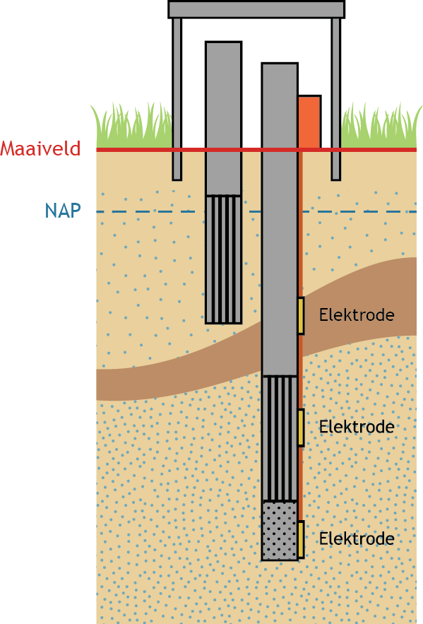
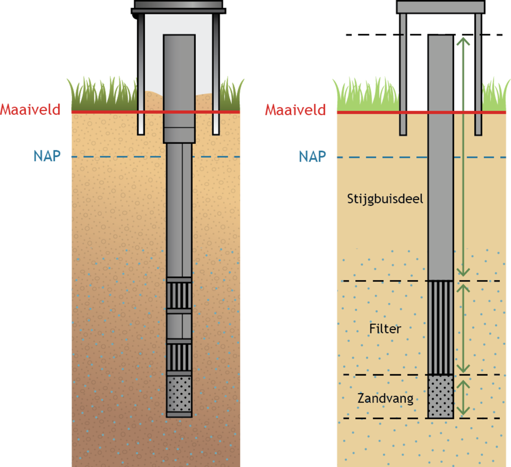
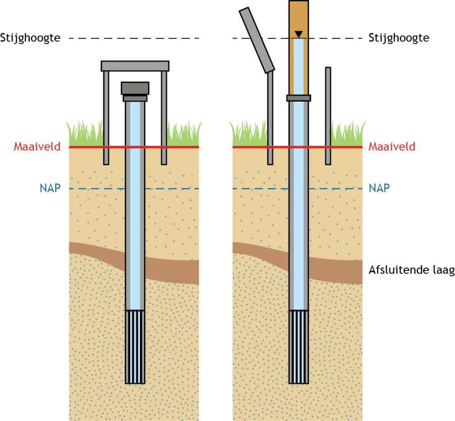
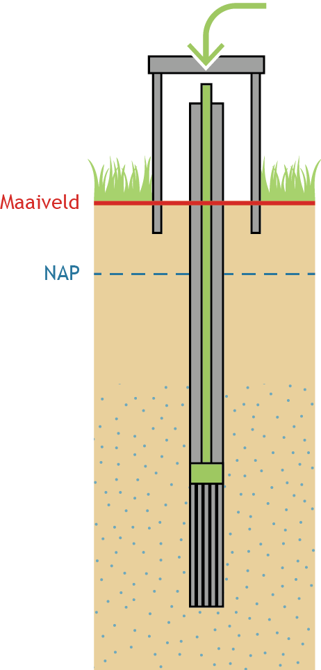
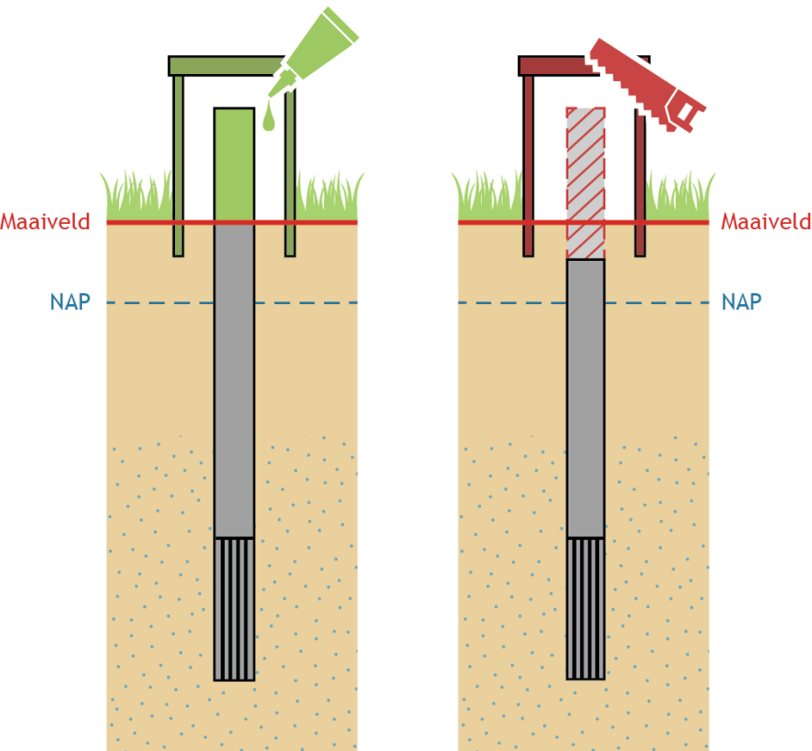
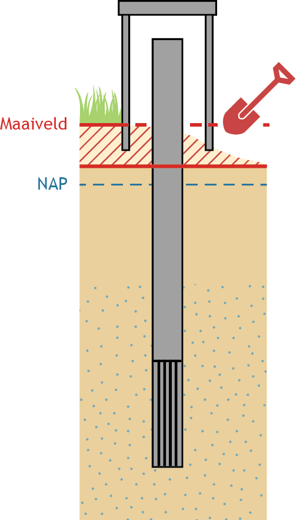
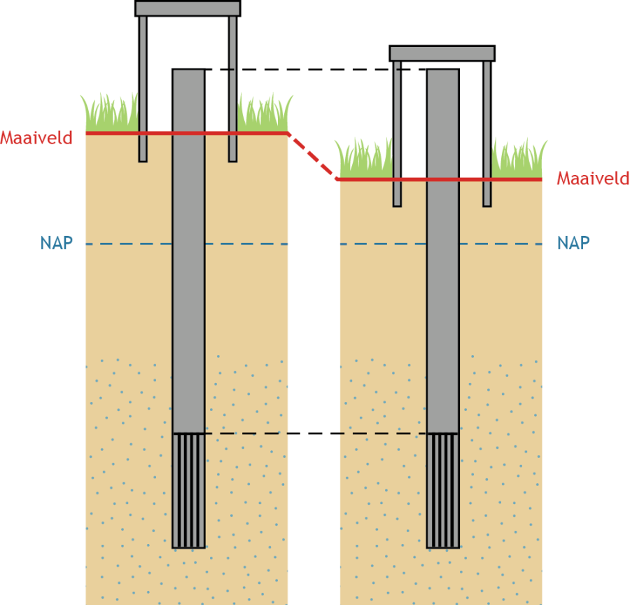
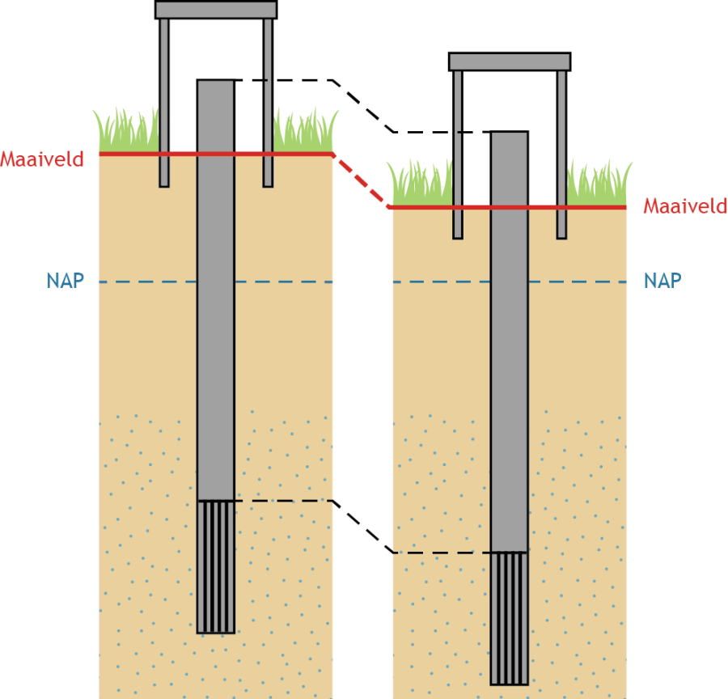

[h2 is vereist vanwege ReSpec]: #
<h2>Grondwatermonitoringput</h2>

# Inleiding
De catalogus voor de grondwatermonitoringput beschrijft de gegevens die in de registratie ondergrond zijn opgenomen van putten die in het publieke domein worden gebruikt voor het monitoren van de hoeveelheid grondwater en de kwaliteit ervan.

## Grondwatermonitoringput
Een grondwatermonitoringput is een constructie die op een specifieke locatie in of net buiten Nederland is ingericht en die in een monitoringnet wordt gebruikt. De constructie wordt gewoonlijk gerealiseerd in een gat dat gemaakt is door in de ondergrond te boren. Veelal bestaat een put uit een samenstel van buizen dat aan het oppervlak wordt beschermd tegen invloeden van buitenaf (<a href="#Grondwatermonitoringput twee monitoringbuizen">Figuur 3</a>). Via de buizen wordt het grondwater dat zich op een bepaalde diepte bevindt ontsloten. Het deel van de buis waardoor het grondwater binnen kan komen is het filter. Een filter fungeert als meetpunt in een grondwatermonitoringnet. Aan een buis kunnen een of meer geo-ohmkabels zijn bevestigd. Dat zijn kabels die voorzien zijn van elektroden die gebruikt worden om bijvoorbeeld het zoutgehalte van het water te kunnen bepalen.

<figure id="Grondwatermonitoringput twee monitoringbuizen">
	
	<figcaption>
		Schematische weergave van een grondwatermonitoringput met twee monitoringbuizen; de verticaal gearceerde delen zijn de filters.
	</figcaption>
</figure>
   
De opbouw van een put varieert en de monitoringdiepte is daarbij een factor van belang. Wordt de put gebruikt voor de monitoring van het grondwater in het bovenste deel van de ondergrond, dan bestaat hij vaak uit niet meer dan een buis die aan de bovenzijde met een dop is afgesloten. Voor het ontsluiten van diep grondwater worden soms honderden meters diepe gaten geboord en dat is een relatief kostbare operatie. Dergelijke putten kunnen tientallen monitoringbuizen bevatten. Elk van die buizen ontsluit grondwater op een andere diepte. De ruimte tussen de buizen is met een bepaald materiaal opgevuld om het geheel te verstevigen en aan de bovenzijde wordt de put afgesloten met een beschermconstructie. Zoals de naam al aangeeft dient de beschermconstructie om de put te beschermen tegen beschadiging of andere ongewenste invloeden. De constructie kan boven het maaiveld uitsteken, zoals in <a href="#Grondwatermonitoringput twee monitoringbuizen">Figuur 3</a>, maar ook min of meer samenvallen met het maaiveld. Voor het laatste wordt in de gebouwde omgeving vaak gekozen.

Een grondwatermonitoringput is in de basisregistratie ondergrond opgenomen wanneer ten minste een van de filters of elektroden een meetpunt is in een grondwatermonitoringnet dat onder de basisregistratie ondergrond valt.

## Put met voorgeschiedenis
De grondwatermonitoringput is een registratieobject met materiële geschiedenis. Voordat de put in de registratie ondergrond is opgenomen kan hij al een zekere geschiedenis achter de rug hebben. Een dergelijke grondwatermonitoringput wordt een put met voorgeschiedenis genoemd.

De geschiedenis van een grondwater-monitoringput is een reeks van gebeurtenissen die elkaar netjes moeten opvolgen in de tijd. In principe geldt de eis dat de precieze datum van een gebeurtenis moet worden vastgelegd, maar die eis kan niet met terugwerkende kracht gelden voor putten die al voor de invoering van de BRO bestonden. Wanneer een gebeurtenis in het verleden ligt, moet de basisregistratie er rekening mee houden dat de datum niet precies is vastgelegd en bijvoorbeeld alleen het jaar bekend is. Het deel van de geschiedenis die dateert van voor de registratie, de voorgeschiedenis, mag daarom een zekere onvolledigheid kennen.
In de terminologie van de gegevensdefinitie heeft een put met voorgeschiedenis als bijzonderheid dat de datums in Putgeschiedenis het domein OnvolledigeDatum kunnen hebben.

In een eerdere versie van de GMW catalogus waren bijzondere regels opgenomen voor een put met voorgeschiedenis. Sturend daarbij was een bijzonder recht dat een dataleverancier gedurende beperkte tijd kon hebben om putten met voorgeschiedenis aan te bieden. Dat recht was gekoppeld aan conversietrajecten die doorlopen moeten worden om putten met al bestaande geschiedenis aan te leveren. Wanneer een dataleverancier dit recht had én wou uitoefenen bij zijn levering, diende hij dit kenbaar te maken door het optionele transactiegegeven 'onder voorrecht' aan te leveren met waarde 'ja'.

Om het registreren van putten waarvan niet alle gegevens bekend zijn te stimuleren, is na de initiële implementatie gekozen om alle dataleveranciers het recht toe te kennen om putten met voorgeschiedenis aan te mogen bieden.
Vervolgens is gekozen om ook de regels voor het aanleveren van een put met voorgeschiedenis te vereenvoudigen. De bijzondere regels die specificeerden wanneer een OnvolledigeDatum gebruikt mocht worden voor de datums van de Putgeschiedenis, zijn komen vervangen door een regel die bepaalt dat OnvolledigeDatum alleen gebruikt mag worden bij putten die vallen onder het IMBRO/A kwaliteitsregime. Verder is het afgeleide attribuut 'met voorgeschiedenis', waarnaar werd gerefereerd in deze bijzondere regels, verwijderd uit de gegevensdefinitie.

Met het verwijderen van het attribuut 'met voorgeschiedenis' en de bijzondere regels die daaraan refereerden, is ook de functionele waarde van het transactiegegeven 'onder voorrecht' komen te vervallen. Dit transactiegegeven was immers exclusief voor GMW van toepassing.

# Belangrijkste entiteiten

## Grondwatermonitoringput
Deze entiteit draagt de naam van het registratieobject zelf en bevat onder meer de gegevens die de grondwatermonitoringsput identificeren, allerlei administratieve gegevens, gegevens die de constructie globaal karakteriseren (aantal buizen, beschermconstructie) en gegevens die nodig zijn om de gevolgen van eventuele maaiveldveranderingen goed te kunnen vastleggen (maaiveld stabiel, putstabiliteit).

## Registratiegeschiedenis
De registratiegeschiedenis van een grondwatermonitoringput geeft de essentie van de geschiedenis van het object in de registratie ondergrond, de zgn. formele geschiedenis. De registratiegeschiedenis vertelt bijvoorbeeld wanneer voor het eerst gegevens van het object zijn geregistreerd en of er na de start van de registratie correcties zijn doorgevoerd.
		
## Monitoringbuis
De constructie van een put is in de basisregistratie ondergrond teruggebracht tot haar essentie, en dat geldt ook voor de monitoringbuis. In werkelijkheid kan een buis bestaan uit een heleboel delen die wat materiaal, diameter en functie betreft verschillen. Het model dat de basisregistratie hanteert is simpel en beschrijft de buis als opgebouwd uit maximaal drie functionele delen (<a href="#Put met buis zoals in veld en zoals in BRO">Figuur 4</a>).

<figure id="Put met buis zoals in veld en zoals in BRO">
	
	<figcaption>
		Voorbeeld van een put met één buis in het veld (links) en hoe die in de BRO (rechts) wordt vastgelegd.
	</figcaption>
</figure>

In de meeste gevallen bestaat een buis uit een filter met daarboven een stijgbuisdeel; in sommige gevallen zit onder het filter nog een derde deel, de zandvang. Ieder deel van de buis heeft een bepaalde lengte.

Het filter is het belangrijkste onderdeel van de buis en fungeert als meetpunt in een grondwatermonitoringnet. Via het filter kan het grondwater de buis in stromen. In het stijgbuisdeel kan het grondwater vrijelijk bewegen tenzij de buis is afgesloten met een drukdop (<a href="#Monitoringbuis met drukdop en opzetstuk">Figuur 5</a>). Een drukdop wordt gebruikt wanneer de buis zou kunnen overstromen doordat het water onder druk staat. Wanneer de grondwaterstand bepaald moet worden, wordt in die gevallen vaak een opzetstuk gebruikt.

De zandvang dient om sediment op te vangen dat door het filter naar binnen komt.

<figure id="Monitoringbuis met drukdop en opzetstuk">
	
	<figcaption>
		Monitoringbuis voorzien van een drukdop (links), en gebruik van een opzetstuk voor het uitvoeren van een grondwaterstandmeting (rechts).
	</figcaption>
</figure>

Voor de monitoring van ondiep grondwater zijn buizen met een afwijkende opbouw in gebruik, en in gebruik geweest.

In het verleden zijn monitoringbuizen gebruikt die uit beton bestonden en geen filteropeningen hadden. Een dergelijke buis was eigenlijk alleen een stijgbuis en werd zo in het boorgat gehangen dat het water aan de onderzijde kon instromen. Zulke buizen zijn niet meer in gebruik. Ook waren er buizen in gebruik die over de gehele lengte uit filter bestaan. Dergelijke buizen worden nog steeds gebruikt.

Om de twee afwijkende buizen in het model te passen wordt toegestaan dat het filter, resp. de stijgbuis de lengte nul heeft.

De aard van het materiaal waaruit een buis bestaat en het materiaal dat gebruikt is om de buis in de put op zijn plaats te houden, het toegepast materiaal, worden vastgelegd omdat het van belang kan zijn bij het beoordelen van de bruikbaarheid van de meetpunten in de put voor de monitoring van de kwaliteit van het grondwater.

## Geo-ohmkabel
In bepaalde delen van Nederland worden bij inrichting van de put soms geo-ohmkabels aan een buis bevestigd. Dat zijn kabels die voorzien zijn van elektroden en een meetkastje. De kabels worden traditioneel gebruikt om het zoutgehalte van het water te kunnen monitoren. Vroeger werden zij daarom wel zoutwachters genoemd. De elektroden vormen per paar een meetpunt.

## Ingeplaatst deel
Wanneer een stijgbuisdeel lekkage vertoont kan de eigenaar van de put ervoor kiezen een nieuw stijgbuisdeel in de bestaande buis te plaatsen; dat nieuwe deel wordt kortweg ingeplaatst deel genoemd.

<figure id="Inplaatsen van een stijgbuisdeel">
	
	<figcaption>
		Inplaatsen van een stijgbuisdeel.
	</figcaption>
</figure>

## Putgeschiedenis
De putgeschiedenis geeft aan welke gebeurtenissen hebben plaatsgevonden tussen het inrichten en het opruimen van de put. Er zijn 13 tussentijdse gebeurtenissen geïdentificeerd die van belang zijn voor het registratieobject:

1. Het eigendom van de put is op een andere organisatie overgegaan.

2. Het uitvoeren van het onderhoud van de put is op een andere organisatie overgegaan.

3. In een bestaande monitoringbuis is een nieuw stijgbuisdeel geplaatst (<a href="#Inplaatsen van een stijgbuisdeel">Figuur 6</a>).

4. De put wordt voorzien van een beschermconstructie of de bestaande beschermconstructie wordt vervangen door een ander type.

5. De toestand die aangeeft of de monitoringbuis gebruikt kan worden voor monitoring, is veranderd.

6. De toestand die aangeeft of de elektrode gebruikt kan worden voor monitoring, is veranderd.

7. Een monitoringbuis is langer gemaakt (<a href="#Oplengen en inkorten van monitoringbuis">Figuur 7</a>, links); deze verandering kan gepaard gaan met het aanbrengen of vervangen van een beschermconstructie.

8. Een monitoringbuis is korter gemaakt (<a href="#Oplengen en inkorten van monitoringbuis">Figuur 7</a>, rechts); deze verandering kan gepaard gaan met het aanbrengen of vervangen van een beschermconstructie.

<figure id="Oplengen en inkorten van monitoringbuis">
	
	<figcaption>
		Het oplengen (links) en inkorten (rechts) van een monitoringbuis.
	</figcaption>
</figure>

9. De positie van het maaiveld is opnieuw bepaald omdat de mens ter plekke heeft ingegrepen (<a href="#Verandering van maaiveldpositie">Figuur 8</a>), bijvoorbeeld door het bovenste deel van de bodem weg te graven.

<figure id="Verandering van maaiveldpositie">
	
	<figcaption>
		Verandering van maaiveldpositie door direct ingrijpen van de mens.
	</figcaption>
</figure>

In gebieden waar de positie van het maaiveld, door indirect ingrijpen van de mens of als direct gevolg van natuurlijke processen onderhevig is aan veranderingen, is het van belang te weten wat de maaiveldveranderingen zijn en in hoeverre de put met deze maaiveldveranderingen meebeweegt. Daling komt het meest voor en de oorzaak van daling is divers. Men kan denken aan natuurlijke zetting, veenoxidatie, zetting als gevolg van de verlaging van het polderpeil en compactie van gesteente op grote diepte als gevolg van delfstofwinning. Stijging is uitzonderlijk en meestal een gevolg van wateropname door veen.

10. De positie van het maaiveld is opnieuw bepaald, omdat de put in een gebied ligt waar de positie van het maaiveld aan verandering onderhevig is; het is echter niet nodig de posities van de buizen opnieuw te bepalen omdat de put is verankerd (<a href="#Maaiveld daalt put stabiel">Figuur 9</a>).

<figure id="Maaiveld daalt put stabiel">
	
	<figcaption>
		Het maaiveld in het gebied daalt, maar de positie van de put t.o.v. NAP verandert niet. Het attribuut 'maaiveld stabiel' heeft als waarde 'nee', het attribuut 'putstabiliteit' heeft de waarde 'stabielNAP'.
	</figcaption>
</figure>

11. De posities van het maaiveld en de posities van de buizen zijn opnieuw bepaald, omdat de put in een gebied ligt waar de positie van het maaiveld veranderlijk is en de put meebeweegt (<a href="#Maaiveld daalt put daalt">Figuur 10</a>).

<figure id="Maaiveld daalt put daalt">
	
	<figcaption>
		Het maaiveld in het gebied daalt en de positie van de put t.o.v. NAP daalt mee. Het attribuut 'maaiveld stabiel' heeft als waarde 'nee', het attribuut 'putstabiliteit' heeft de waarde 'instabiel'.
	</figcaption>
</figure>

In de huidige praktijk laten meetnetbeheerders (bronhouders) vaak met zekere regelmaat (na)meetrondes uitvoeren bij hun monitoringputten. Met zo’n (na)meetronde willen ze de actuele (meest recent gemeten) maaiveldpositie en/of de positie van de bovenkant van de monitoringbuis vastleggen, ongeacht het feit of überhaupt sprake is van een positieverandering t.o.v. de vorige in- of nameting en ongeacht wat de oorzaak is van die positieverandering (natuurlijke processen, direct ingrijpen door de mens, meetonnauwkeurigheid). Wanneer resultaten uit deze (na)meetrondes niet passen onder de hierboven beschreven gebeurtenissen blijven onderstaande twee gebeurtenissen als mogelijkheid over.

12. In de (na)meetronde is alleen de maaiveldpositie van de put opnieuw gemeten. Deze wordt geregistreerd, ongeacht het feit of er sprake is van een positieverandering.

13. In de (na)meetronde is de positie bovenkant buis en optioneel ook de maaiveldpositie van de put opnieuw gemeten. Deze word(t)(en) geregistreerd, ongeacht het feit of er sprake is van een positieverandering.

## Verkenning
Een grondwatermonitoringput kan gerelateerd zijn aan één of meerdere verkenningen, dat is een booronderzoek (BHR) of een sondeeronderzoek (CPT) uit het domein bodem- en grondonderzoek. Met het vastleggen van de gerelateerde verkenningen kan een gebruiker makkelijker achterhalen wat bijvoorbeeld de opbouw en samenstelling van de ondergrond is op de plaats van de grondwatermonitoringput, hoe diep er geboord  is of welk aanvulmateriaal rondom de put gebruikt is.

Het gaat specifiek om de verkenningen die direct gerelateerd zijn aan de inrichting van de grondwatermonitoringput, en dat zijn de booronderzoeken gerelateerd aan het boorgat waar de put in is ingericht of de sondering waarmee de put de grond is ingedrukt.

Er kunnen meerdere verkenningen zijn. Het is bijvoorbeeld denkbaar dat een booronderzoek vanuit meerdere vakgebieden wordt geproduceerd.

# INSPIRE

Het doel van de Europese kaderrichtlijn <a href="https://inspire.ec.europa.eu/" target="_blank">INSPIRE</a> is het harmoniseren en openbaar maken van ruimtelijke gegevens van overheidsorganisaties ten behoeve van het milieubeleid. Het registratieobject grondwatermonitoringput is in het <a href="https://www.inspireaanmerking.nl/aanmerkingsregister" target="_blank">INSPIRE aanmerkingsregister</a> voor de INSPIRE Thema's Geologie en Milieubewakingsvoorzieningen. Om deze reden moeten de gegevens in het registratieobject geschikt gemaakt worden voor uitwisseling volgens de INSPIRE-standaard. Dit wordt ge&iuml;mplementeerd middels een mapping van het gegevensmodel van het registratieobject grondwatermonitoringput op het gegevensmodel van deze INSPIRE thema's. Bij het INSPIRE Thema Geologie wordt hierbij uitgegaan van het applicatie schema van Hydrogeologie. De inhoud van deze mapping is geen onderdeel van deze catalogus.
